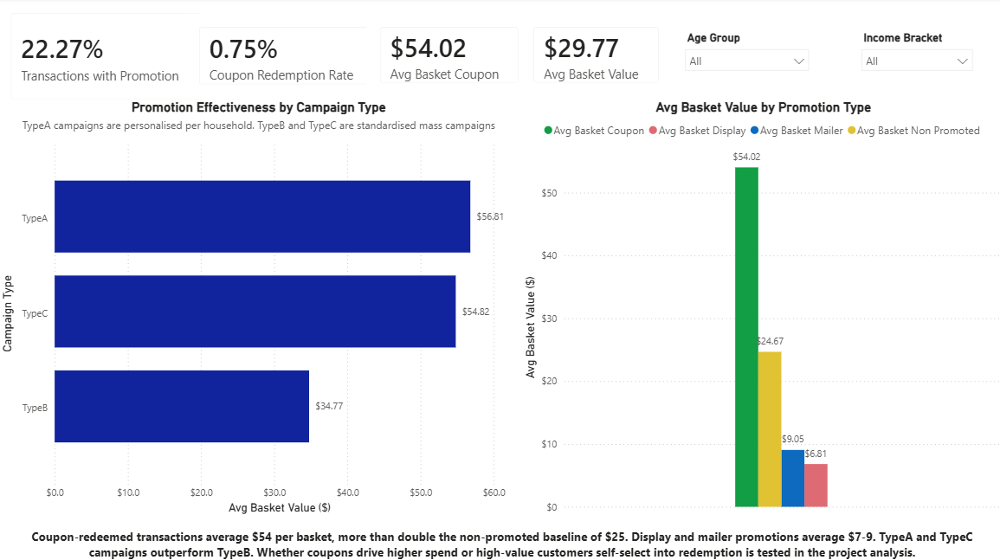
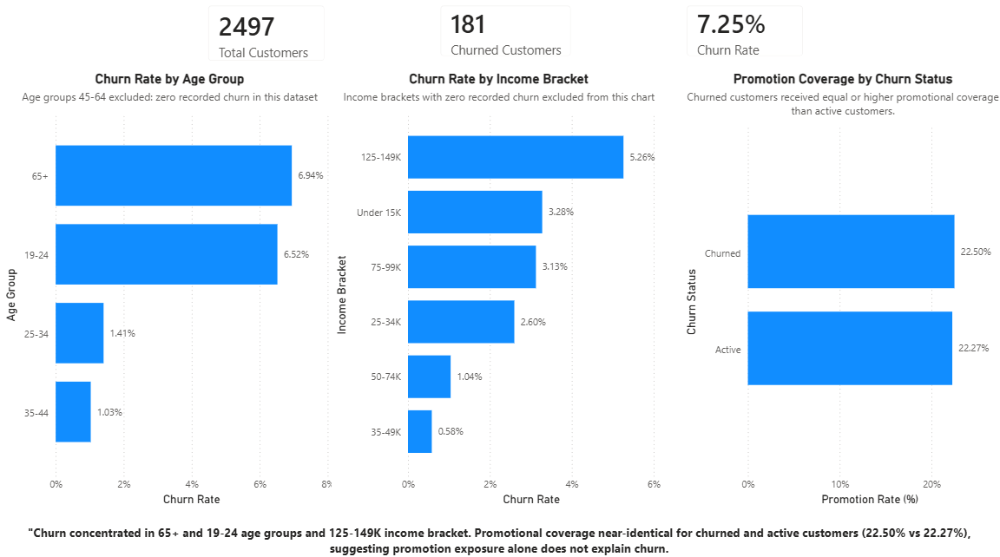

# Retail Promotion and Churn Analysis

A commercial retail analytics project using Dunnhumby "The Complete Journey" dataset to analyse customer segments and promotional strategies, ending with a concrete budget reallocation recommendation.

**Business Question:** How should a retailer reallocate promotional spend to maximise repeat purchasing and long-term customer value?

## Executive Summary

Built an end-to-end modern analytics workflow that ingests retail data into BigQuery, transforms it using dbt with automated data quality testing, and delivers business recommendations through an interactive Power BI dashboard.

The analysis found personalised coupon campaigns generated substantially higher basket values than mass-market promotions, while promotional exposure alone did not explain customer churn, leading to targeted budget reallocation recommendations.

## Overview

This project analyses two years of real retail transaction data covering household demographics, purchase history, coupon redemptions, and campaign exposure. The analysis identifies which customer segments generate the greatest post-promotion revenue lift and which segments churn regardless of promotional activity, producing a data-driven recommendation on where to increase and reduce promotional investment.

The project follows a full modern analytics stack: Python ingestion pipeline, cloud data warehousing in BigQuery, dbt transformation layers with automated testing, and an interactive Power BI dashboard with DAX measures.

## Analytical Questions

1. Which customer segments generate the greatest revenue lift following a promotion?
2. Do promotions accelerate repeat purchasing beyond a customer's baseline inter-purchase frequency?
3. Which segments churn regardless of promotional activity, and what does this mean for spend allocation?
4. Where should the retailer reallocate promotional budget to maximise long-term customer value?

## Data

**Source:** Dunnhumby "The Complete Journey" — real retail transaction data from a US grocery retailer covering approximately 2,500 households over two years.

**Tables:**
- `transaction_data` — line-level purchase records including spend, discounts, and basket identifiers
- `causal_data` — store-level promotional display and mailer activity by product and week
- `hh_demographic` — household demographics including age, income, household size, and marital status
- `coupon` — products included in each campaign coupon
- `coupon_redempt` — household-level coupon redemption records
- `campaign_desc` — campaign type and date range
- `campaign_table` — households targeted by each campaign
- `product` — product master including department, brand, and commodity

## Methodology

**Long-term value proxy:** Post-promotion revenue within an 8-week window compared to each customer's historical baseline spend.

**Promotion effectiveness definition:** A promotion is effective if the customer generated above-baseline revenue AND returned faster than their average inter-purchase gap within 8 weeks post-promotion.

**Churn definition:** A household with no recorded transaction for 12+ weeks following their last purchase.

## Tech Stack

- Python (ingestion and validation pipeline)
- Google BigQuery (cloud data warehouse)
- SQL (CTEs, window functions, star schema modelling)
- dbt Core (transformation layer -- staging, intermediate, and marts models with automated testing)
- GitHub Actions (CI -- automated dbt test runs on every push)
- Power BI (Power Query and DAX -- interactive dashboard)

## Project Structure

The repository follows a layered analytics workflow from ingestion through transformation to reporting.

```
07-retail-promotion-churn-analysis/
├── data/
│ └── raw/ # Raw CSVs — gitignored
├── ingestion/
│ └── ingest.py # Python ingestion and validation script
├── dbt_retail/
│ ├── models/
│ │ ├── staging/ # One-to-one with raw tables, light cleaning
│ │ ├── intermediate/ # Joins and business logic
│ │ └── marts/ # Final tables for Power BI
│ ├── tests/ # dbt data quality tests
│ └── dbt_project.yml # dbt project configuration
├── analysis/
│ └── hypothesis_test.py # Chi-square test on repeat purchase rates
├── PowerBI/ # Dashboard screenshots
├── docs/ # Ingestion logs and supporting documentation
└── README.md
```

## Skills Demonstrated

**Data Engineering**
- Python ingestion pipeline with schema validation, null checks, and duplicate detection
- Cloud data warehousing with Google BigQuery
- dbt staging, intermediate, and marts layer architecture
- GitHub Actions CI pipeline with automated dbt testing

**Analytics Engineering**
- SQL at scale -- CTEs, window functions, star schema modelling
- 14 dbt schema tests for data quality validation
- DAX measure development in Power BI

**Analytics**
- Customer segmentation and cohort analysis
- Promotion effectiveness analysis
- Churn analysis
- Statistical hypothesis testing (chi-square)
- Commercial data storytelling with a business recommendation

## Limitations

- Dataset covers approximately 2,500 frequent shoppers at a single US grocery retailer over two years. Findings may not generalise to other retail contexts.
- Only 801 of 2,497 households have demographic records. Churn analysis by age and income is limited to this subset.
- Zero churn recorded for age groups 45-64, likely reflecting sparse demographic coverage rather than genuine zero churn in those segments.
- Coupon effectiveness analysis is based on 2,318 redemption events -- a small sample relative to 2.6 million total transactions. Near-universal promotion coverage (via display and mailer) limits the non-promoted comparison group to 18 customers.
- The dashboard coupon redemption rate of 0.75% reflects transaction line items associated with a coupon redemption, not unique redemption events. 2,318 redemption events across 2,597,664 transaction line items equates to approximately 0.09% at the event level. The higher figure results from one redemption joining to multiple line items within the same basket.
- Basket value differences between promoted and non-promoted customers may reflect self-selection rather than causal promotion effects. A controlled experiment would be required to confirm causality.
- The 8-week post-promotion window is a pragmatic choice. Different window lengths may produce different results.
- Promotion type chart in the dashboard does not support cross-filtering due to DAX measure architecture.

## Dashboard Preview

### Promotion Effectiveness


### Churn Analysis


[View Interactive Dashboard](https://app.powerbi.com/view?r=eyJrIjoiZTc3ZDgzNjctZTk3Mi00MWY4LTg0ZDEtYzMxNGIzZTJjZjZhIiwidCI6IjgzMzEwYTYxLWIyNzktNGNiMS1hNGIzLWVlMGEyNTI5ODVmZCJ9&embedImagePlaceholder=true&pageName=5f973117ebb3c400dbc3)

## Business Recommendation

Based on analysis of 2,597,664 transactions across 2,497 households over two years:

**1. Invest more in targeted coupon campaigns, particularly TypeA and TypeC.**
Coupon-redeemed transactions are associated with average basket values of $54, more than double the non-promoted baseline of $25. TypeA (personalised) and TypeC campaigns consistently generate higher basket values than TypeB. Whether this reflects coupon effectiveness or self-selection by high-value customers requires controlled experimentation to confirm.

**2. Reconsider mass-market display and mailer spend.**
Display and mailer promotions are associated with average basket values of $7-9 -- well below the non-promoted baseline. These promotions appear to attract small, targeted purchases rather than full shopping trips.

**3. Focus promotional spend on active customer segments.**
7.25% of customers churned, concentrated in the 65+ and 19-24 age groups and the 125-149K income bracket. Promotional coverage was near-identical for churned and active customers (22.50% vs 22.27%), suggesting promotions did not prevent churn. Preventative targeting of at-risk segments before churn occurs is recommended over continued spend on already-churned customers.

**4. Statistical note.**
A chi-square test found a statistically significant difference in repeat purchase rate between promoted and non-promoted customers (chi2=10.69, p=0.0011). However, the non-promoted group contained only 18 customers, limiting the interpretability of this result due to near-universal promotion coverage in the dataset.

## Key Takeaway

The analysis suggests promotional budget should shift away from broad mass-market campaigns toward targeted, personalised promotions. However, observational data cannot establish causality, making controlled experimentation the recommended next step before implementing large-scale budget changes.