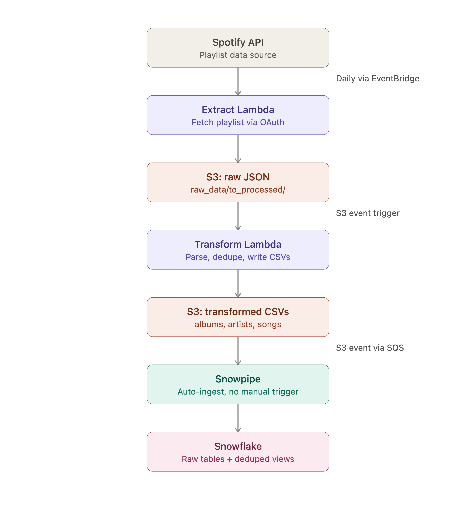

# Spotify Snowflake Pipeline

An end-to-end ETL pipeline extracting listening data from the Spotify API, loading it through AWS into Snowflake with fully automated ingestion via Snowpipe.

**Key Result:** Built a fully automated Extract-Transform-Load pipeline using AWS Lambda, S3, and Snowflake Snowpipe. New playlist data flows from the Spotify API into query-ready Snowflake tables with zero manual intervention, verified end-to-end by triggering a live run and confirming row counts increased purely through automated ingestion.

## Overview

This project builds a serverless ETL pipeline: a scheduled AWS Lambda function extracts playlist data from the Spotify API via OAuth, a second Lambda transforms the raw JSON into structured album, artist, and song datasets, and Snowflake's Snowpipe automatically ingests the transformed files into Snowflake tables as soon as they land in S3, with no manual `COPY INTO` required after initial setup.

This project is scoped as a data engineering and pipeline automation exercise rather than an analytics project. The underlying dataset, a personal Spotify playlist, doesn't have the scale or business-question depth to justify a BI or dashboard layer, so the project's scope ends at Load, with a data-quality layer (deduplicated views) added on top of the raw tables.

## Architecture

## Data & Methodology

### Data Source
- Spotify Web API, accessed via `spotipy` using the Authorization Code OAuth flow (Client Credentials flow was deprecated by Spotify in Feb 2026, requiring Premium and user authentication instead)

### Pipeline Architecture

**1. Extract** (`extract_lambda.py`, Lambda #1: `spotify_api_data_extract`)
- Authenticates via a stored refresh token for server-to-server access, with no browser interaction needed after initial bootstrap
- Fetches playlist tracks from the Spotify API
- Writes raw JSON to `s3://etl-pipeline-spotify-vivek/raw_data/to_processed/`
- Triggered daily via EventBridge

**2. Transform** (`transform_lambda.py`, Lambda #2: `spotify_transformation_load_function`)
- Triggered automatically by an S3 event notification when new raw JSON lands
- Parses raw JSON into three normalised datasets: albums, artists, songs
- Deduplicates albums and artists within each batch
- Writes transformed CSVs to `s3://etl-pipeline-spotify-vivek/transformed_data/{albums,artists,songs}/`
- Archives processed raw files from `to_processed/` to `processed/` for idempotency

**3. Load** (Snowpipe, fully automated)
- A Snowflake Storage Integration establishes IAM role-based trust with AWS, with no static credentials stored in Snowflake
- Three Snowpipes (`albums_pipe`, `artists_pipe`, `songs_pipe`) watch their respective S3 prefixes via S3 event notifications routed through SQS
- New transformed files are auto-ingested into `tblAlbum`, `tblArtist`, `tblSongs` within seconds of landing in S3, with no manual trigger required

### Key Decisions

- **Storage Integration over static credentials:** chose IAM role-based trust (STORAGE_AWS_ROLE_ARN plus an external ID handshake) over embedding AWS access keys directly in Snowflake, since it avoids long-lived secrets and scopes access to exactly one S3 path.
- **SQS as the notification layer:** S3 event notifications route through SQS rather than triggering Snowpipe directly, since Snowpipe polls its queue rather than being invoked. SQS provides a durable buffer with at-least-once delivery, decoupling when a file lands from when it gets ingested, and lets multiple pipes share one queue.
- **Deduplication handled via views, not at ingestion:** Snowpipe only supports `COPY INTO`, not `MERGE`, so raw tables accumulate duplicate rows on repeated loads, for example an album reappearing across multiple playlist extracts. Rather than complicating the ingestion layer, deduplication is handled by three views (`vw_album_deduped`, `vw_artist_deduped`, `vw_songs_deduped`) that self-correct on every query with zero manual maintenance.

## Key Findings

**Full automation confirmed:** Triggered a live end-to-end test by manually invoking the Extract Lambda. Without any manual intervention, data flowed automatically through the full chain, extract to transform to load, confirming the automated pipeline works as designed.

**Two real data quality issues found and fixed during verification:**

The Spotify API paginates results, and the original extract logic only captured the first page, silently truncating any playlist beyond that limit. Fixed by looping through all available pages before writing to S3.

Separately, the Snowpipe `COPY INTO` definitions had no explicit file format specified, causing Snowflake to fall back to default CSV parsing rules. Track or album titles containing both a comma and an embedded quotation mark were misparsed and silently dropped, since `ON_ERROR = 'CONTINUE'` skips failed rows without raising a visible error. Fixed by defining an explicit file format with correct field enclosure handling.

**Deduplication logic validated on a live case:** Added a song to the source playlist as a test case, then triggered repeated pipeline runs. The song appeared multiple times in the raw table, a direct consequence of Snowpipe's append-only `COPY INTO` model, while the corresponding deduplication view consistently collapsed it to a single row, confirming the dedup logic works correctly on real data, not just a clean hypothetical.

Following successful verification, the EventBridge daily automation trigger was disabled to prevent further unattended runs.