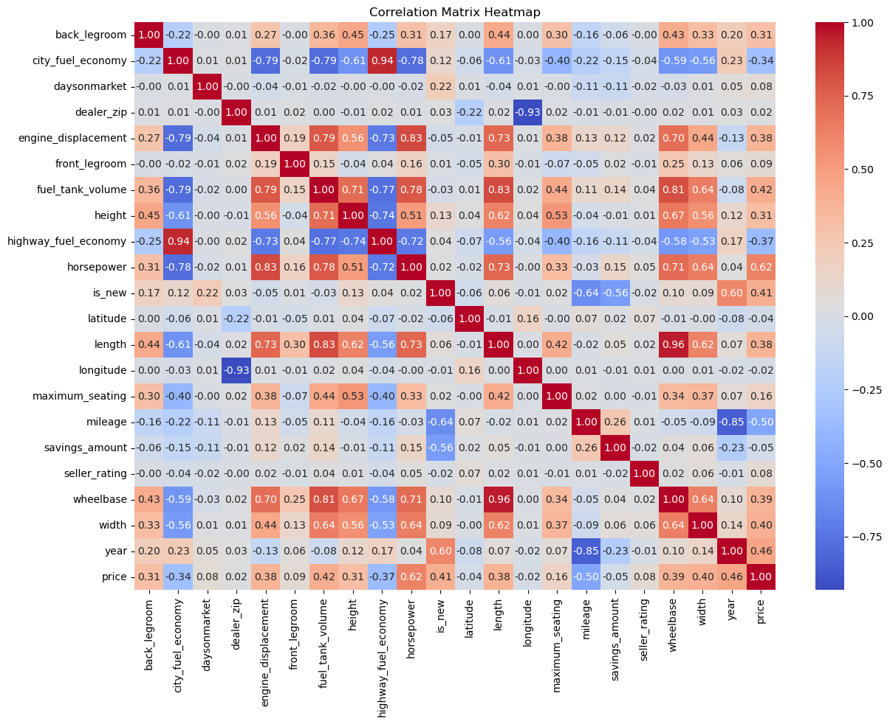
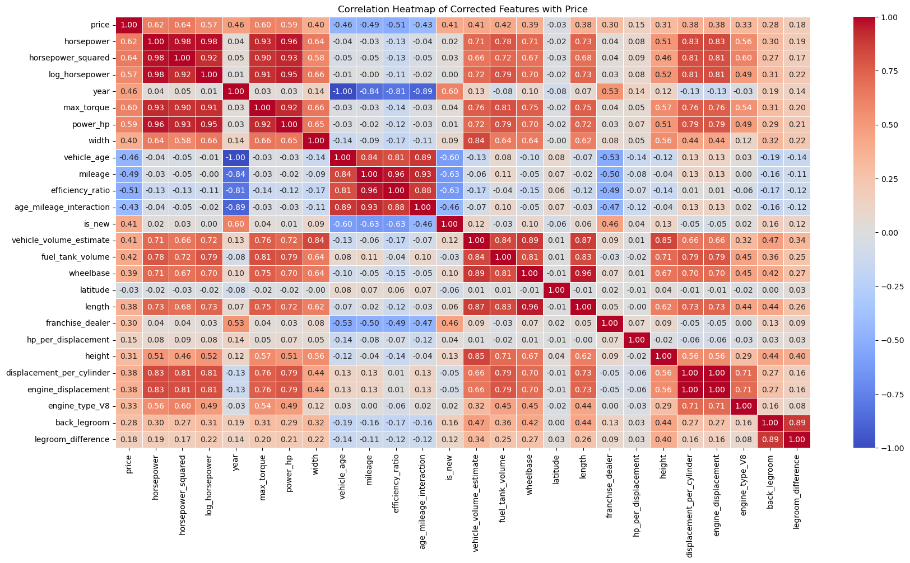
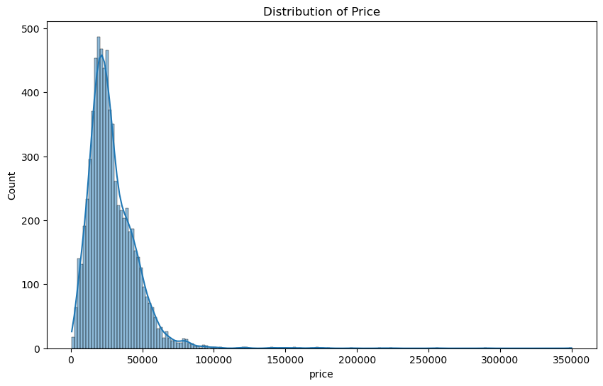
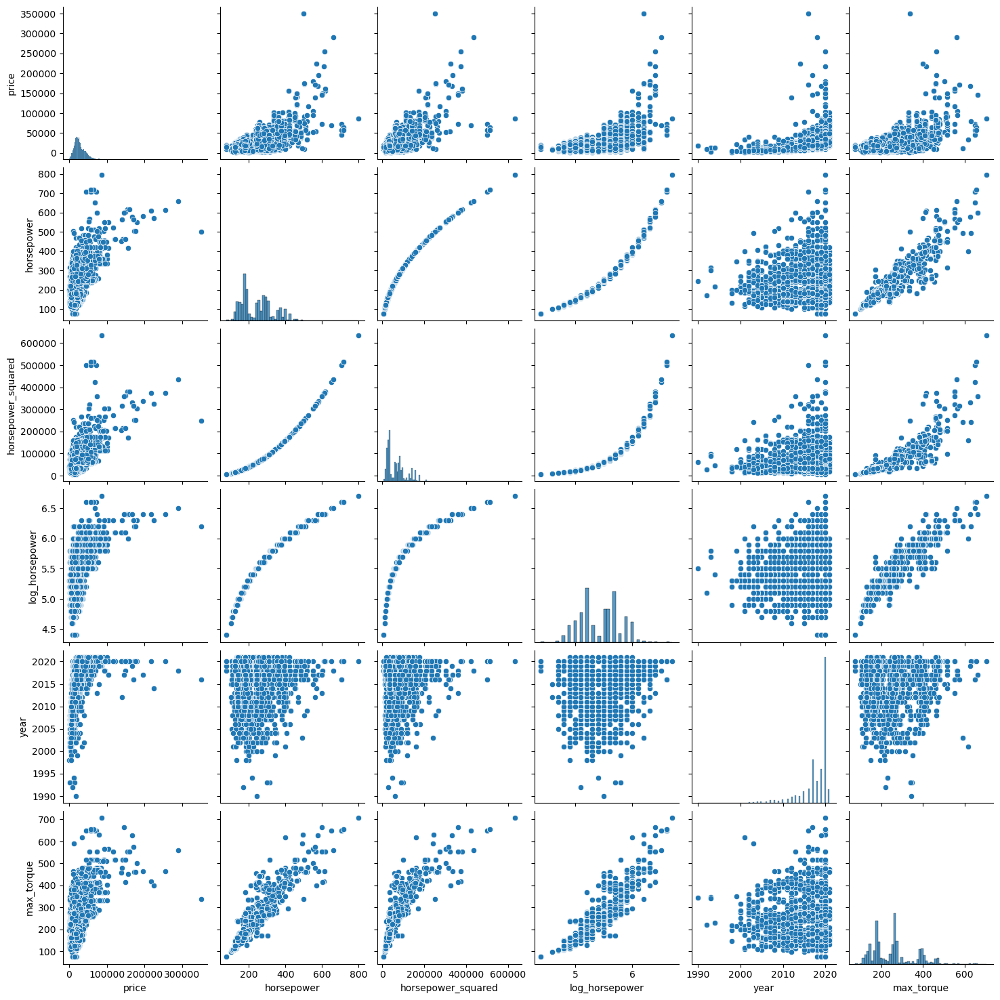
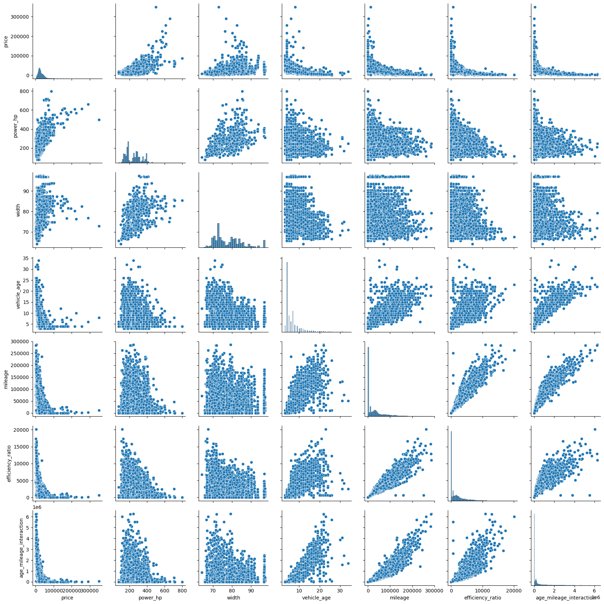
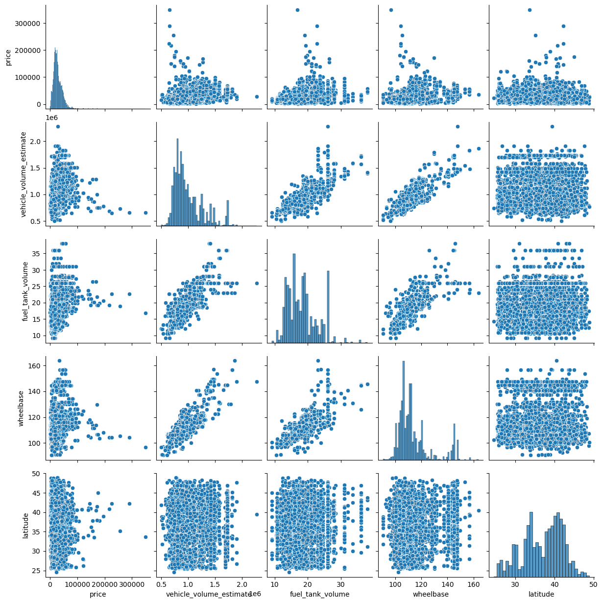

### __BUSA8001 Group Assignment - Predicting Used Car Sale Prices__

--- 

**Kaggle Competition Ends:** Friday, 31 May 2024 @ 3:00pm (Week 13)  
**Assignment Due Date on iLearn:** Friday, 31 May 2024 @ 11.59pm (Week 13)  

**Overview:**   

- In the group assignment you will form a team of 3 students and participate in a forecasting competition on Kaggle
- The goal is to predict prices of used cars based on car characteristics and regression models

**Instructions:** 

- Form a team of 3 students 
- Each team member needs to join [https://www.kaggle.com](https://www.kaggle.com/)  
- Choose a team leader and form a team on Kaggle [https://www.kaggle.com/t/ff5fb5beaeb14f7686df98fef9d1c0bc](https://www.kaggle.com/t/ff5fb5beaeb14f7686df98fef9d1c0bc)
    - Team leader to click on `team` and join and invite other 2 team members to join
    - Your **team's name must start** with our unit code, for instance you could have a team called BUSA8001_masterful_geniuses
- All team members should work on all the tasks however   
    - Each team member will be responsible for one of the 3 tasks listed below    
- **Your predictions must be generated by a model you develop here** 
    - You will receive a mark of **zero** if your code is not able produce the forecasts you submit to Kaggle 

**Competition Rankings**

The rankings for the competition are determined through two different leaderboards:

- **Public Leaderboard Ranking**: Available during the competition, these rankings are calculated based on 50% of the test dataset, which includes 1,500 observations. This allows participants to see how they are performing while the competition is still ongoing.
- **Final Leaderboard Ranking**: These rankings are recalculated from the other 50% of the test dataset, which consists of the remaining 1,500 observations, and are revealed 5 minutes after the competition concludes. This final evaluation determines the ultimate standings of the competition.


**Marks**: 

- Total Marks: 40
- Your individual mark will consist of:  
    - 50% x overall assignment mark + 45% x mark for the task that you are responsible for + 5% x mark received from your teammates for your effort in group work 
- 1 mark: Ranking in the top 5 positions on the **final** leaderboard for your unit 
- 3 marks: Reaching the 1st place in your unit according to the **final** leaderboard ranking


**Submissions:**  

1. On Kaggle: submit your team's forecast in order to be ranked by Kaggle
    - Limit of 20 submission per day
2. On iLearn **only team leader to submit** the assignment Jupyter notebook re-named to your team's name on Kaggle   
    - The Jupyter notebook must contain team members names/ID numbers, and the group name Kaggle
    - One 15 minute video recording of your work 
        - 5 marks will be deducted from each Task for which there is no video presentation or if you don't follow the above instructions
3. On iLearn each student needs to submit a file with their teammates' names, ID number and a mark for their group effort (out of 100%)
    - You don't need to score yourself

---
---

**Fill out the following information**

- Team Name on Kaggle: `(BUSA8001_Data_wizards)`
- Team Leader and Team Member 1: `(Task 2)`
- Team Member 2: `(Task 1)`
- Team Member 3: `(Task 3)`

---

## Task 1: Problem Description and Initial Data Analysis

1. Based on the Competition Overview, datasets and additional information provided on Kaggle, along with insights gained from personal research of the topic, write **Problem Description** (about 500 words) focusing on the sections listed below: 
- Forecasting Problem - explain what we are trying to do and how it could be used in the real world, e.g. who and how may benefit from it (3 marks)    
- Evaluation Criteria - discuss the criteria that  is used to assess forecasting performance in detail (3 marks)     
- Categorise the variables provided in the dataset according to their type; Hint: similar to what we had in Programming Task 1 (2 marks)  
- Missing Values - only explain what you find for both the training and test datasets at this stage (2 marks)
- Provide and discuss some interesting *univariate* summary statistics and distributions in the training dataset  (2 marks)       
- Other Hints:
    - You should **not** discuss any specific predictive algorithms at this stage
    - Minimise the number of cells you use to enhance presentation and readability

**Total Marks: 12**   

Student in charge of this task: `(Team Member 2)`


```python
#Task 1 code here, insert more cells if required
# import library
import pandas as pd
import warnings
warnings.filterwarnings('ignore')
# Load the training and test datasets
train_data = pd.read_csv("train.csv")
test_data = pd.read_csv("test.csv")
```


```python
train_data.head()
```


<div>
<style scoped>
    .dataframe tbody tr th:only-of-type {
        vertical-align: middle;
    }

    .dataframe tbody tr th {
        vertical-align: top;
    }

    .dataframe thead th {
        text-align: right;
    }
</style>
<table border="1" class="dataframe">
  <thead>
    <tr style="text-align: right;">
      <th></th>
      <th>vin</th>
      <th>back_legroom</th>
      <th>body_type</th>
      <th>city</th>
      <th>city_fuel_economy</th>
      <th>daysonmarket</th>
      <th>dealer_zip</th>
      <th>engine_displacement</th>
      <th>engine_type</th>
      <th>exterior_color</th>
      <th>...</th>
      <th>savings_amount</th>
      <th>seller_rating</th>
      <th>torque</th>
      <th>transmission</th>
      <th>transmission_display</th>
      <th>wheel_system</th>
      <th>wheelbase</th>
      <th>width</th>
      <th>year</th>
      <th>price</th>
    </tr>
  </thead>
  <tbody>
    <tr>
      <th>0</th>
      <td>2HGFC2F60LH543004</td>
      <td>37.4 in</td>
      <td>Sedan</td>
      <td>Indio</td>
      <td>30.0</td>
      <td>189</td>
      <td>92203</td>
      <td>2000.0</td>
      <td>I4</td>
      <td>Cosmic Blue Metallic</td>
      <td>...</td>
      <td>0.0</td>
      <td>4.666667</td>
      <td>138 lb-ft @ 4,200 RPM</td>
      <td>CVT</td>
      <td>Continuously Variable Transmission</td>
      <td>FWD</td>
      <td>106.3 in</td>
      <td>70.8 in</td>
      <td>2020</td>
      <td>21605.0</td>
    </tr>
    <tr>
      <th>1</th>
      <td>3VW2B7AJ7HM347446</td>
      <td>38.1 in</td>
      <td>Sedan</td>
      <td>Houston</td>
      <td>28.0</td>
      <td>12</td>
      <td>77074</td>
      <td>1400.0</td>
      <td>I4</td>
      <td>NaN</td>
      <td>...</td>
      <td>148.0</td>
      <td>4.250000</td>
      <td>184 lb-ft @ 1,600 RPM</td>
      <td>A</td>
      <td>Automatic</td>
      <td>FWD</td>
      <td>104.4 in</td>
      <td>70 in</td>
      <td>2017</td>
      <td>11991.0</td>
    </tr>
    <tr>
      <th>2</th>
      <td>WBAJA5C36HG897684</td>
      <td>36.5 in</td>
      <td>Sedan</td>
      <td>Vista</td>
      <td>24.0</td>
      <td>10</td>
      <td>92081</td>
      <td>2000.0</td>
      <td>I4</td>
      <td>Dark Graphite Metallic</td>
      <td>...</td>
      <td>617.0</td>
      <td>4.416667</td>
      <td>258 lb-ft @ 1,500 RPM</td>
      <td>A</td>
      <td>Automatic</td>
      <td>RWD</td>
      <td>117.1 in</td>
      <td>83.7 in</td>
      <td>2017</td>
      <td>31974.0</td>
    </tr>
    <tr>
      <th>3</th>
      <td>2GKFLWEK3F6333294</td>
      <td>39.9 in</td>
      <td>SUV / Crossover</td>
      <td>Ft Myers</td>
      <td>20.0</td>
      <td>2</td>
      <td>33905</td>
      <td>2400.0</td>
      <td>I4</td>
      <td>Onyx Black</td>
      <td>...</td>
      <td>1170.0</td>
      <td>NaN</td>
      <td>272 lb-ft @ 4,800 RPM</td>
      <td>A</td>
      <td>Automatic</td>
      <td>AWD</td>
      <td>112.5 in</td>
      <td>72.8 in</td>
      <td>2015</td>
      <td>14550.0</td>
    </tr>
    <tr>
      <th>4</th>
      <td>5N1AT2MV0LC786510</td>
      <td>37.9 in</td>
      <td>SUV / Crossover</td>
      <td>Avon</td>
      <td>25.0</td>
      <td>195</td>
      <td>46123</td>
      <td>2500.0</td>
      <td>I4</td>
      <td>Magnetic Black Pearl</td>
      <td>...</td>
      <td>NaN</td>
      <td>3.734940</td>
      <td>175 lb-ft @ 4,400 RPM</td>
      <td>CVT</td>
      <td>Continuously Variable Transmission</td>
      <td>AWD</td>
      <td>106.5 in</td>
      <td>72.4 in</td>
      <td>2020</td>
      <td>23500.0</td>
    </tr>
  </tbody>
</table>
<p>5 rows × 39 columns</p>
</div>


```python
test_data.head()
```


<div>
<style scoped>
    .dataframe tbody tr th:only-of-type {
        vertical-align: middle;
    }

    .dataframe tbody tr th {
        vertical-align: top;
    }

    .dataframe thead th {
        text-align: right;
    }
</style>
<table border="1" class="dataframe">
  <thead>
    <tr style="text-align: right;">
      <th></th>
      <th>vin</th>
      <th>back_legroom</th>
      <th>body_type</th>
      <th>city</th>
      <th>city_fuel_economy</th>
      <th>daysonmarket</th>
      <th>dealer_zip</th>
      <th>engine_displacement</th>
      <th>engine_type</th>
      <th>exterior_color</th>
      <th>...</th>
      <th>power</th>
      <th>savings_amount</th>
      <th>seller_rating</th>
      <th>torque</th>
      <th>transmission</th>
      <th>transmission_display</th>
      <th>wheel_system</th>
      <th>wheelbase</th>
      <th>width</th>
      <th>year</th>
    </tr>
  </thead>
  <tbody>
    <tr>
      <th>0</th>
      <td>5J8YD4H05LL032532</td>
      <td>36.6 in</td>
      <td>SUV / Crossover</td>
      <td>Escondido</td>
      <td>19.0</td>
      <td>50</td>
      <td>92029</td>
      <td>3500.0</td>
      <td>V6</td>
      <td>Platinum White Pearl</td>
      <td>...</td>
      <td>290 hp @ 6,200 RPM</td>
      <td>0.0</td>
      <td>5.000000</td>
      <td>267 lb-ft @ 4,700 RPM</td>
      <td>A</td>
      <td>9-Speed Automatic</td>
      <td>AWD</td>
      <td>111 in</td>
      <td>77.7 in</td>
      <td>2020</td>
    </tr>
    <tr>
      <th>1</th>
      <td>KNAE45LC8K6050784</td>
      <td>36.4 in</td>
      <td>Sedan</td>
      <td>Minnetonka</td>
      <td>17.0</td>
      <td>39</td>
      <td>55305</td>
      <td>3300.0</td>
      <td>V6</td>
      <td>Aurora Black</td>
      <td>...</td>
      <td>365 hp @ 6,000 RPM</td>
      <td>707.0</td>
      <td>4.538462</td>
      <td>376 lb-ft @ 1,300 RPM</td>
      <td>A</td>
      <td>8-Speed Automatic</td>
      <td>AWD</td>
      <td>114.4 in</td>
      <td>73.6 in</td>
      <td>2019</td>
    </tr>
    <tr>
      <th>2</th>
      <td>5XYZGDABXCG149606</td>
      <td>36.8 in</td>
      <td>SUV / Crossover</td>
      <td>Albuquerque</td>
      <td>20.0</td>
      <td>60</td>
      <td>87110</td>
      <td>2400.0</td>
      <td>I4</td>
      <td>Pacific Blue Pearl</td>
      <td>...</td>
      <td>175 hp @ 6,000 RPM</td>
      <td>868.0</td>
      <td>3.333333</td>
      <td>169 lb-ft @ 3,750 RPM</td>
      <td>A</td>
      <td>6-Speed Automatic</td>
      <td>AWD</td>
      <td>106.3 in</td>
      <td>74.4 in</td>
      <td>2012</td>
    </tr>
    <tr>
      <th>3</th>
      <td>1G1ZE5ST6HF197903</td>
      <td>38.1 in</td>
      <td>Sedan</td>
      <td>Faribault</td>
      <td>27.0</td>
      <td>2</td>
      <td>55021</td>
      <td>1500.0</td>
      <td>I4</td>
      <td>Cajun Red Tintcoat</td>
      <td>...</td>
      <td>160 hp @ 5,700 RPM</td>
      <td>25.0</td>
      <td>4.725490</td>
      <td>184 lb-ft @ 2,500 RPM</td>
      <td>A</td>
      <td>6-Speed Automatic</td>
      <td>FWD</td>
      <td>111.4 in</td>
      <td>73 in</td>
      <td>2017</td>
    </tr>
    <tr>
      <th>4</th>
      <td>KL4MMDSL6LB106699</td>
      <td>36 in</td>
      <td>SUV / Crossover</td>
      <td>Laurel</td>
      <td>30.0</td>
      <td>141</td>
      <td>39440</td>
      <td>1300.0</td>
      <td>I3</td>
      <td>WHITE</td>
      <td>...</td>
      <td>150 hp @ 5,600 RPM</td>
      <td>0.0</td>
      <td>4.900000</td>
      <td>174 lb-ft @ 1,500 RPM</td>
      <td>A</td>
      <td>Automatic</td>
      <td>FWD</td>
      <td>102.2 in</td>
      <td>71.4 in</td>
      <td>2020</td>
    </tr>
  </tbody>
</table>
<p>5 rows × 38 columns</p>
</div>


```python
# Basic Information of Data set
from IPython.display import display, HTML
display(HTML("<h2>Train Data Info</h2>"))

print(train_data.info())
print(train_data.select_dtypes(include=['bool']).info())

display(HTML("<h2>Test Data Info</h2>"))

print(test_data.info())
print(test_data.select_dtypes(include=['bool']).info())

# Summary statistics of numeric columns in both Train and Test datasets

train_numeric_summary = train_data.describe()
test_numeric_summary = test_data.describe()

display(HTML("<h2>Summary Stats for train_data numeric columns</h2>"))
print(train_numeric_summary)

#Printing the Summary Stats

display(HTML("<h2>Summary Stats for test_data numeric columns</h2>"))
print(test_numeric_summary)

# Categorical columns unique values in Train & Test Datasets

train_categorical_summary = train_data.select_dtypes(include=['object','bool']).nunique()
test_categorical_summary = test_data.select_dtypes(include=['object','bool']).nunique()

#Printing the Unique values

display(HTML("<h2>Unique Values of categorical coumns Train Dataset</h2>"))
print(train_categorical_summary)

display(HTML("<h2>Categorical columns Test Dataset Unique Values</h2>"))
print(test_categorical_summary)

# Checking Missing Values in both Train and Test Datasets

print("\nTrain dataset missing values:\n", train_data.isnull().sum())
print("\nTest dataset missing values:\n", test_data.isnull().sum())
```


<h2>Train Data Info</h2>


    <class 'pandas.core.frame.DataFrame'>
    RangeIndex: 7000 entries, 0 to 6999
    Data columns (total 39 columns):
     #   Column                Non-Null Count  Dtype  
    ---  ------                --------------  -----  
     0   vin                   7000 non-null   object 
     1   back_legroom          6997 non-null   object 
     2   body_type             7000 non-null   object 
     3   city                  7000 non-null   object 
     4   city_fuel_economy     7000 non-null   float64
     5   daysonmarket          7000 non-null   int64  
     6   dealer_zip            7000 non-null   int64  
     7   engine_displacement   7000 non-null   float64
     8   engine_type           7000 non-null   object 
     9   exterior_color        6890 non-null   object 
     10  franchise_dealer      6916 non-null   object 
     11  front_legroom         6997 non-null   object 
     12  fuel_tank_volume      6997 non-null   object 
     13  fuel_type             7000 non-null   object 
     14  height                6997 non-null   object 
     15  highway_fuel_economy  7000 non-null   float64
     16  horsepower            7000 non-null   float64
     17  interior_color        6195 non-null   object 
     18  is_new                7000 non-null   bool   
     19  latitude              6866 non-null   float64
     20  length                6997 non-null   object 
     21  listed_date           7000 non-null   object 
     22  listing_color         7000 non-null   object 
     23  longitude             7000 non-null   float64
     24  make_name             7000 non-null   object 
     25  maximum_seating       6997 non-null   object 
     26  mileage               6718 non-null   float64
     27  model_name            7000 non-null   object 
     28  power                 6992 non-null   object 
     29  savings_amount        6892 non-null   float64
     30  seller_rating         6900 non-null   float64
     31  torque                7000 non-null   object 
     32  transmission          6925 non-null   object 
     33  transmission_display  6925 non-null   object 
     34  wheel_system          6998 non-null   object 
     35  wheelbase             6997 non-null   object 
     36  width                 6997 non-null   object 
     37  year                  7000 non-null   int64  
     38  price                 7000 non-null   float64
    dtypes: bool(1), float64(10), int64(3), object(25)
    memory usage: 2.0+ MB
    None
    <class 'pandas.core.frame.DataFrame'>
    RangeIndex: 7000 entries, 0 to 6999
    Data columns (total 1 columns):
     #   Column  Non-Null Count  Dtype
    ---  ------  --------------  -----
     0   is_new  7000 non-null   bool 
    dtypes: bool(1)
    memory usage: 7.0 KB
    None


<h2>Test Data Info</h2>


    <class 'pandas.core.frame.DataFrame'>
    RangeIndex: 3000 entries, 0 to 2999
    Data columns (total 38 columns):
     #   Column                Non-Null Count  Dtype  
    ---  ------                --------------  -----  
     0   vin                   3000 non-null   object 
     1   back_legroom          2975 non-null   object 
     2   body_type             3000 non-null   object 
     3   city                  3000 non-null   object 
     4   city_fuel_economy     2651 non-null   float64
     5   daysonmarket          3000 non-null   int64  
     6   dealer_zip            3000 non-null   int64  
     7   engine_displacement   2973 non-null   float64
     8   engine_type           2941 non-null   object 
     9   exterior_color        2955 non-null   object 
     10  franchise_dealer      2961 non-null   object 
     11  front_legroom         2975 non-null   object 
     12  fuel_tank_volume      2975 non-null   object 
     13  fuel_type             2955 non-null   object 
     14  height                2975 non-null   object 
     15  highway_fuel_economy  2651 non-null   float64
     16  horsepower            2973 non-null   float64
     17  interior_color        2621 non-null   object 
     18  is_new                3000 non-null   bool   
     19  latitude              2959 non-null   float64
     20  length                2975 non-null   object 
     21  listed_date           3000 non-null   object 
     22  listing_color         3000 non-null   object 
     23  longitude             3000 non-null   float64
     24  make_name             3000 non-null   object 
     25  maximum_seating       2975 non-null   object 
     26  mileage               2851 non-null   float64
     27  model_name            3000 non-null   object 
     28  power                 2675 non-null   object 
     29  savings_amount        2958 non-null   float64
     30  seller_rating         2971 non-null   float64
     31  torque                2635 non-null   object 
     32  transmission          2941 non-null   object 
     33  transmission_display  2941 non-null   object 
     34  wheel_system          2991 non-null   object 
     35  wheelbase             2975 non-null   object 
     36  width                 2975 non-null   object 
     37  year                  3000 non-null   int64  
    dtypes: bool(1), float64(9), int64(3), object(25)
    memory usage: 870.2+ KB
    None
    <class 'pandas.core.frame.DataFrame'>
    RangeIndex: 3000 entries, 0 to 2999
    Data columns (total 1 columns):
     #   Column  Non-Null Count  Dtype
    ---  ------  --------------  -----
     0   is_new  3000 non-null   bool 
    dtypes: bool(1)
    memory usage: 3.1 KB
    None


<h2>Summary Stats for train_data numeric columns</h2>


           city_fuel_economy  daysonmarket    dealer_zip  engine_displacement  \
    count        7000.000000   7000.000000   7000.000000          7000.000000   
    mean           21.497429     75.878571  50472.137714          2881.928571   
    std             4.857918    105.594450  27196.771983          1206.612725   
    min            10.000000      0.000000   1089.000000          1000.000000   
    25%            18.000000     15.000000  30047.000000          2000.000000   
    50%            21.000000     36.000000  47893.000000          2500.000000   
    75%            25.000000     80.000000  76457.000000          3500.000000   
    max            70.000000   1259.000000  99362.000000          6800.000000   
    
           highway_fuel_economy   horsepower     latitude    longitude  \
    count           7000.000000  7000.000000  6866.000000  7000.000000   
    mean              28.661714   245.218429    36.957835   -90.594488   
    std                5.658987    87.436127     5.027006    13.826897   
    min               13.000000    78.000000    24.571900  -123.205000   
    25%               24.000000   174.000000    33.484625   -96.951600   
    50%               28.000000   243.000000    37.808200   -86.972800   
    75%               33.000000   300.000000    40.925750   -80.704600   
    max               75.000000   797.000000    48.861600   -67.997400   
    
                 mileage  savings_amount  seller_rating         year  \
    count    6718.000000     6892.000000    6900.000000  7000.000000   
    mean    31088.643049      551.306152       4.274146  2017.746857   
    std     44033.494511      929.364379       0.517830     3.608016   
    min         0.000000        0.000000       1.000000  1990.000000   
    25%         6.000000        0.000000       4.000000  2017.000000   
    50%     11454.000000        0.000000       4.355556  2019.000000   
    75%     43428.250000      834.000000       4.615385  2020.000000   
    max    285788.000000    12596.000000       5.000000  2021.000000   
    
                   price  
    count    7000.000000  
    mean    28851.277693  
    std     17582.731720  
    min       650.000000  
    25%     17986.500000  
    50%     25387.000000  
    75%     36992.000000  
    max    350000.000000  


<h2>Summary Stats for test_data numeric columns</h2>


           city_fuel_economy  daysonmarket    dealer_zip  engine_displacement  \
    count        2651.000000   3000.000000   3000.000000          2973.000000   
    mean           22.683516     74.610333  50280.890000          2929.599731   
    std             8.920645    110.337488  27327.831958          1316.273445   
    min             8.000000      0.000000    960.000000           700.000000   
    25%            18.000000     14.000000  30046.250000          2000.000000   
    50%            21.000000     34.000000  46634.500000          2500.000000   
    75%            26.000000     78.000000  76461.500000          3500.000000   
    max           127.000000   2067.000000  99362.000000          8100.000000   
    
           highway_fuel_economy   horsepower     latitude    longitude  \
    count           2651.000000  2973.000000  2959.000000  3000.000000   
    mean              29.477178   247.533804    36.908882   -90.483999   
    std                7.894573    91.302276     5.075352    13.939231   
    min               11.000000    74.000000    18.398800  -123.197000   
    25%               25.000000   174.000000    33.473100   -96.846050   
    50%               29.000000   241.000000    37.762100   -86.642600   
    75%               33.000000   303.000000    40.972500   -80.627175   
    max              111.000000   797.000000    48.565800   -66.158200   
    
                 mileage  savings_amount  seller_rating         year  
    count    2851.000000     2958.000000    2971.000000  3000.000000  
    mean    30992.608909      533.943881       4.278028  2017.795000  
    std     44558.728273      921.614844       0.516131     3.564063  
    min         0.000000        0.000000       1.000000  1995.000000  
    25%         6.000000        0.000000       4.055556  2017.000000  
    50%      8767.000000        0.000000       4.363636  2020.000000  
    75%     42979.500000      787.000000       4.611111  2020.000000  
    max    286963.000000     8058.000000       5.000000  2021.000000  


<h2>Unique Values of categorical coumns Train Dataset</h2>


    vin                     7000
    back_legroom             141
    body_type                  9
    city                    1969
    engine_type               21
    exterior_color          1277
    franchise_dealer           2
    front_legroom             76
    fuel_tank_volume         114
    fuel_type                  5
    height                   259
    interior_color          1010
    is_new                     2
    length                   430
    listed_date              466
    listing_color             14
    make_name                 45
    maximum_seating           11
    model_name               414
    power                    609
    torque                   622
    transmission               4
    transmission_display      18
    wheel_system               5
    wheelbase                237
    width                    203
    dtype: int64


<h2>Categorical columns Test Dataset Unique Values</h2>


    vin                     3000
    back_legroom             137
    body_type                  9
    city                    1327
    engine_type               21
    exterior_color           794
    franchise_dealer           2
    front_legroom             70
    fuel_tank_volume         114
    fuel_type                  6
    height                   262
    interior_color           560
    is_new                     2
    length                   392
    listed_date              362
    listing_color             14
    make_name                 46
    maximum_seating           10
    model_name               392
    power                    482
    torque                   464
    transmission               4
    transmission_display      25
    wheel_system               5
    wheelbase                232
    width                    198
    dtype: int64
    
    Train dataset missing values:
     vin                       0
    back_legroom              3
    body_type                 0
    city                      0
    city_fuel_economy         0
    daysonmarket              0
    dealer_zip                0
    engine_displacement       0
    engine_type               0
    exterior_color          110
    franchise_dealer         84
    front_legroom             3
    fuel_tank_volume          3
    fuel_type                 0
    height                    3
    highway_fuel_economy      0
    horsepower                0
    interior_color          805
    is_new                    0
    latitude                134
    length                    3
    listed_date               0
    listing_color             0
    longitude                 0
    make_name                 0
    maximum_seating           3
    mileage                 282
    model_name                0
    power                     8
    savings_amount          108
    seller_rating           100
    torque                    0
    transmission             75
    transmission_display     75
    wheel_system              2
    wheelbase                 3
    width                     3
    year                      0
    price                     0
    dtype: int64
    
    Test dataset missing values:
     vin                       0
    back_legroom             25
    body_type                 0
    city                      0
    city_fuel_economy       349
    daysonmarket              0
    dealer_zip                0
    engine_displacement      27
    engine_type              59
    exterior_color           45
    franchise_dealer         39
    front_legroom            25
    fuel_tank_volume         25
    fuel_type                45
    height                   25
    highway_fuel_economy    349
    horsepower               27
    interior_color          379
    is_new                    0
    latitude                 41
    length                   25
    listed_date               0
    listing_color             0
    longitude                 0
    make_name                 0
    maximum_seating          25
    mileage                 149
    model_name                0
    power                   325
    savings_amount           42
    seller_rating            29
    torque                  365
    transmission             59
    transmission_display     59
    wheel_system              9
    wheelbase                25
    width                    25
    year                      0
    dtype: int64


`(Task 1, Text Here - insert more cells as required)`

# Problem Description and Initial Data Analysis

## Forecasting Problem
The primary goal of the competition is to predict the prices of vehicles listed for sale using various car attributes. Accurate price predictions are critical for both sellers, who aim to price their vehicles competitively to facilitate quick sales without undervaluing, and buyers, who seek to understand the fair market value for informed purchasing decisions. Developing a model capable of forecasting car prices based on their features is essential for establishing market transparency and ensuring that pricing aligns with the vehicle's features and condition.

## Evaluation Criteria
The effectiveness of the models will be assessed using the Root Mean Squared Error (RMSE). This metric quantifies the average magnitude of the errors between the predicted values and the actual prices. A lower RMSE value indicates a more accurate model, which means that the predictions are close to the actual data.

## Types of Variables/Features
The dataset encompasses a diverse range of features categorized into numeric, ordinal, and nominal types, each playing a unique role in the modeling process:

- **Numeric Features (15):** Quantitative variables such as 'city_fuel_economy', 'daysonmarket', 'dealer_zip', 'engine_displacement', 'highway_fuel_economy', 'horsepower', 'latitude', 'longitude', 'mileage', 'savings_amount', 'seller_rating', 'year', and 'price' measure specific numerical aspects of the vehicles.

- **Ordinal Features (9):** Variables like 'back_legroom', 'body_type', 'front_legroom', 'height', 'length', 'wheelbase', and 'width' possess a clear ordering or ranking, providing a scale of measurement without a fixed zero point.

- **Nominal Features (9):** Categorical variables such as 'vin', 'city', 'engine_type', 'exterior_color', 'fuel_type', 'interior_color', 'make_name', 'model_name', and 'transmission' represent categories without any numeric significance or inherent order.

## Data Summary and Main Characteristics
The training dataset contains 7,000 entries with 39 variables, and the test dataset includes 3,000 entries with 38 variables. These datasets encapsulate detailed features ranging from engine specifications and body type to geographical details and fuel economy. The key target variable across these datasets is 'price', which denotes the vehicle's listed price.

## Missing Values
Significant missing values are observed in both datasets across several key features, such as 'interior_color', 'city_fuel_economy', and 'engine_displacement', among others. Effective handling of these missing values is crucial for the development of a robust predictive model.

## Conclusion
The task at hand involves a detailed analysis of the relationship between various vehicle attributes and their listed prices. The challenge lies in effectively managing missing data, understanding the nature and type of the variables, and applying suitable forecasting techniques to make accurate price predictions. This analysis not only aids in enhancing model performance but also contributes to making the automotive market more transparent and equitable for all participants.

---

## Task 2: Data Cleaning, Missing Observations and Feature Engineering
- In this task you need to follow a set of instructions/questions listed below.
- Make sure you explain each answer carefully both in Markdown text, as well as on your video.

**Total Marks: 12**

Student in charge of this task: `(Team Member 1)`

**Task 2, Question 1**: Clean **all** numerical features so that they can be used in training algorithms. For instance, back_legroom feature is in object format containing both numerical values and text. Extract numerical values (equivalently eliminate the text) so that the numerical values can be used as a regular feature.  
(2 marks)


```python
## Task 2, Question 1 Code Here
import numpy as np
import pandas as pd

# Lists of column types
numerical_cols = ['city_fuel_economy', 'daysonmarket', 'dealer_zip',
                  'engine_displacement', 'highway_fuel_economy', 'horsepower',
                  'latitude', 'longitude', 'mileage', 'savings_amount', 'seller_rating',
                  'year']

numerical_cols_object = ['maximum_seating', 'back_legroom', 'front_legroom', 'fuel_tank_volume',
                         'height', 'length', 'wheelbase', 'width']

object_cols = ['body_type', 'city', 'engine_type', 'exterior_color', 'listed_date',
               'fuel_type', 'interior_color', 'listing_color',
               'make_name', 'maximum_seating', 'model_name',
               'transmission', 'transmission_display', 'wheel_system']

bool_columns = ['franchise_dealer','is_new']

# Cleaning the columns
for col in numerical_cols_object:
    # Extract numerical values using regex and convert to float
    train_data[col] = train_data[col].str.extract(r'([\d,]+\.\d+|\d+,|\d+)')[0].str.replace(',', '', regex=True).astype(float)
    test_data[col] = test_data[col].str.extract(r'([\d,]+\.\d+|\d+,|\d+)')[0].str.replace(',', '', regex=True).astype(float)

# Check for missing values in the cleaned columns
missing_values_train = train_data[numerical_cols_object].isnull().sum()
missing_values_test = test_data[numerical_cols_object].isnull().sum()
print("Missing values in train data columns after cleaning:")
print(missing_values_train)

print("\nMissing values in test data columns after cleaning:")
print(missing_values_test)

# Check for missing values in all columns
combined_cols = numerical_cols + numerical_cols_object + object_cols 
print("\nMissing values in combined columns:")
print(train_data[combined_cols].isnull().sum())
```

    Missing values in train data columns after cleaning:
    maximum_seating       3
    back_legroom        124
    front_legroom        37
    fuel_tank_volume      3
    height                3
    length                3
    wheelbase             3
    width                 3
    dtype: int64
    
    Missing values in test data columns after cleaning:
    maximum_seating      25
    back_legroom        104
    front_legroom        47
    fuel_tank_volume     25
    height               25
    length               25
    wheelbase            25
    width                25
    dtype: int64
    
    Missing values in combined columns:
    city_fuel_economy         0
    daysonmarket              0
    dealer_zip                0
    engine_displacement       0
    highway_fuel_economy      0
    horsepower                0
    latitude                134
    longitude                 0
    mileage                 282
    savings_amount          108
    seller_rating           100
    year                      0
    maximum_seating           3
    back_legroom            124
    front_legroom            37
    fuel_tank_volume          3
    height                    3
    length                    3
    wheelbase                 3
    width                     3
    body_type                 0
    city                      0
    engine_type               0
    exterior_color          110
    listed_date               0
    fuel_type                 0
    interior_color          805
    listing_color             0
    make_name                 0
    maximum_seating           3
    model_name                0
    transmission             75
    transmission_display     75
    wheel_system              2
    dtype: int64


`(Task 2, Question 1 Text Here - insert more cells as required)`

### Explanation of Task 2, Question 1: Cleaning Numerical Features

The primary objective of this task is to prepare numerical data for model training by extracting numerical values from features currently stored in an object format. Many machine learning algorithms require numerical input; therefore, cleaning data to ensure it is in a suitable format is a critical initial step.

#### Process
1. **Identifying Numerical Columns Stored as Objects**: We start by identifying which columns that are expected to contain numerical values are currently formatted as strings (objects). These include:
   - `maximum_seating`
   - `back_legroom`
   - `front_legroom`
   - `fuel_tank_volume`
   - `height`
   - `length`
   - `wheelbase`
   - `width`

2. **Regular Expression Extraction**: For each of these columns, we employ a regular expression to extract numbers. The pattern `r'([\d,]+\.\d+|\d+,|\d+)'` is used to capture numbers that may include commas as thousand separators and may have a decimal part. This caters to various formats like "5", "3,200", or "12.5".

3. **Replacing Commas and Type Conversion**: After extracting the numerical part, any commas are removed to avoid errors in numerical conversion. The extracted strings are then converted to a float type to maintain any decimals. This is crucial for accurate representation of measurements and quantities.

4. **Checking for Missing Values**: Post-extraction and conversion, we check for missing values in these columns for both training and testing datasets. Missing values are crucial to identify as they can affect model performance. Advanced techniques may later be employed to impute or handle these missing values depending on their volume and significance.

#### Output Analysis
- **Missing Values Summary**:
  - Training Data: Missing values vary across features, with `back_legroom` having the highest at 124 missing entries.
  - Testing Data: A similar trend is observed, with `back_legroom` again having the most missing values at 104.
  
  This indicates a potential issue in data collection for these features or possibly that these values are genuinely unavailable for certain entries.

- **Next Steps**:
  - Address missing data through imputation or removal depending on the context and importance of each feature.
  - Validate the correctness of the extracted numerical values through a sample review or by applying descriptive statistics to understand distributions and identify possible outliers.

#### Conclusion
The cleaning process is vital for preparing the dataset for subsequent modeling stages. Ensuring that numerical data is correctly formatted and free from non-numerical characters allows for better performance and more reliable results from machine learning algorithms. Further, identifying and handling missing values early in the data preparation stage helps in refining the model's training process, leading to more accurate predictions.

**Task 2, Question 2** Create at least 5 new features from the existing numerical variables which contain multiple items of information, for example you could extract maximum torque and torque rpm from the torque variable.  
(2 marks)


```python
## Task 2, Question 2 Code Here
```


```python
import matplotlib.pyplot as plt
import seaborn as sns

# Compute the correlation matrix
corr_matrix = train_data.corr()

# Display the correlation matrix
print("Correlation Matrix:")
print(corr_matrix)

# Visualize the correlation matrix
plt.figure(figsize=(14, 10))
sns.heatmap(corr_matrix, annot=True, cmap='coolwarm', fmt=".2f")
plt.title("Correlation Matrix Heatmap")
plt.show()
```

    Correlation Matrix:
                          back_legroom  city_fuel_economy  daysonmarket  \
    back_legroom              1.000000          -0.216050     -0.004910   
    city_fuel_economy        -0.216050           1.000000      0.009100   
    daysonmarket             -0.004910           0.009100      1.000000   
    dealer_zip                0.012916           0.012221     -0.001690   
    engine_displacement       0.270544          -0.786615     -0.042120   
    front_legroom            -0.002794          -0.018164     -0.010008   
    fuel_tank_volume          0.360553          -0.785898     -0.024061   
    height                    0.453743          -0.609244     -0.000297   
    highway_fuel_economy     -0.248330           0.935456     -0.001814   
    horsepower                0.305621          -0.780514     -0.019047   
    is_new                    0.165702           0.117263      0.217801   
    latitude                  0.001782          -0.057017      0.007027   
    length                    0.440425          -0.607848     -0.035593   
    longitude                 0.003374          -0.028306      0.005568   
    maximum_seating           0.303371          -0.399764     -0.003747   
    mileage                  -0.157726          -0.215958     -0.108745   
    savings_amount           -0.060281          -0.145439     -0.114863   
    seller_rating            -0.000973          -0.040692     -0.020614   
    wheelbase                 0.426459          -0.594541     -0.033002   
    width                     0.326503          -0.564140      0.012517   
    year                      0.201766           0.227818      0.053241   
    price                     0.312468          -0.340206      0.079114   
    
                          dealer_zip  engine_displacement  front_legroom  \
    back_legroom            0.012916             0.270544      -0.002794   
    city_fuel_economy       0.012221            -0.786615      -0.018164   
    daysonmarket           -0.001690            -0.042120      -0.010008   
    dealer_zip              1.000000             0.008123       0.021442   
    engine_displacement     0.008123             1.000000       0.190191   
    front_legroom           0.021442             0.190191       1.000000   
    fuel_tank_volume        0.002896             0.787875       0.154193   
    height                 -0.012467             0.555269      -0.043192   
    highway_fuel_economy    0.020515            -0.727095       0.041868   
    horsepower              0.011354             0.834753       0.163209   
    is_new                  0.026937            -0.054147       0.007218   
    latitude               -0.218975            -0.011806      -0.045487   
    length                  0.017830             0.731138       0.301823   
    longitude              -0.931771             0.006207      -0.007826   
    maximum_seating         0.017821             0.376397      -0.073042   
    mileage                -0.013240             0.129529      -0.054526   
    savings_amount         -0.008058             0.119402       0.021908   
    seller_rating          -0.004548             0.016296      -0.006481   
    wheelbase               0.017927             0.701362       0.254475   
    width                   0.012663             0.443793       0.127743   
    year                    0.027765            -0.126079       0.055779   
    price                   0.022747             0.378950       0.086337   
    
                          fuel_tank_volume    height  highway_fuel_economy  \
    back_legroom                  0.360553  0.453743             -0.248330   
    city_fuel_economy            -0.785898 -0.609244              0.935456   
    daysonmarket                 -0.024061 -0.000297             -0.001814   
    dealer_zip                    0.002896 -0.012467              0.020515   
    engine_displacement           0.787875  0.555269             -0.727095   
    front_legroom                 0.154193 -0.043192              0.041868   
    fuel_tank_volume              1.000000  0.706565             -0.768794   
    height                        0.706565  1.000000             -0.737859   
    highway_fuel_economy         -0.768794 -0.737859              1.000000   
    horsepower                    0.781894  0.508856             -0.724482   
    is_new                       -0.033195  0.128875              0.042497   
    latitude                      0.007505  0.036538             -0.073042   
    length                        0.830570  0.620431             -0.558813   
    longitude                     0.017039  0.039639             -0.038063   
    maximum_seating               0.441508  0.528381             -0.397814   
    mileage                       0.112189 -0.043582             -0.157554   
    savings_amount                0.136749 -0.006656             -0.114382   
    seller_rating                 0.039609  0.014349             -0.041650   
    wheelbase                     0.813287  0.666142             -0.581737   
    width                         0.640072  0.557390             -0.531254   
    year                         -0.076604  0.118456              0.172344   
    price                         0.416076  0.314406             -0.371216   
    
                          horsepower  ...    length  longitude  maximum_seating  \
    back_legroom            0.305621  ...  0.440425   0.003374         0.303371   
    city_fuel_economy      -0.780514  ... -0.607848  -0.028306        -0.399764   
    daysonmarket           -0.019047  ... -0.035593   0.005568        -0.003747   
    dealer_zip              0.011354  ...  0.017830  -0.931771         0.017821   
    engine_displacement     0.834753  ...  0.731138   0.006207         0.376397   
    front_legroom           0.163209  ...  0.301823  -0.007826        -0.073042   
    fuel_tank_volume        0.781894  ...  0.830570   0.017039         0.441508   
    height                  0.508856  ...  0.620431   0.039639         0.528381   
    highway_fuel_economy   -0.724482  ... -0.558813  -0.038063        -0.397814   
    horsepower              1.000000  ...  0.731122  -0.001177         0.333015   
    is_new                  0.021140  ...  0.062649  -0.007018         0.021554   
    latitude               -0.024088  ... -0.013023   0.159085        -0.002980   
    length                  0.731122  ...  1.000000   0.000914         0.419460   
    longitude              -0.001177  ...  0.000914   1.000000         0.002455   
    maximum_seating         0.333015  ...  0.419460   0.002455         1.000000   
    mileage                -0.027161  ... -0.016172   0.007511         0.018929   
    savings_amount          0.146972  ...  0.051665  -0.010739         0.002888   
    seller_rating           0.048206  ...  0.016824   0.008446        -0.008417   
    wheelbase               0.712953  ...  0.959450   0.002471         0.341585   
    width                   0.640033  ...  0.622637   0.008562         0.372904   
    year                    0.037607  ...  0.065088  -0.017708         0.068511   
    price                   0.618147  ...  0.382183  -0.024511         0.160556   
    
                           mileage  savings_amount  seller_rating  wheelbase  \
    back_legroom         -0.157726       -0.060281      -0.000973   0.426459   
    city_fuel_economy    -0.215958       -0.145439      -0.040692  -0.594541   
    daysonmarket         -0.108745       -0.114863      -0.020614  -0.033002   
    dealer_zip           -0.013240       -0.008058      -0.004548   0.017927   
    engine_displacement   0.129529        0.119402       0.016296   0.701362   
    front_legroom        -0.054526        0.021908      -0.006481   0.254475   
    fuel_tank_volume      0.112189        0.136749       0.039609   0.813287   
    height               -0.043582       -0.006656       0.014349   0.666142   
    highway_fuel_economy -0.157554       -0.114382      -0.041650  -0.581737   
    horsepower           -0.027161        0.146972       0.048206   0.712953   
    is_new               -0.635803       -0.557323      -0.018404   0.095627   
    latitude              0.066842        0.018127       0.073902  -0.014216   
    length               -0.016172        0.051665       0.016824   0.959450   
    longitude             0.007511       -0.010739       0.008446   0.002471   
    maximum_seating       0.018929        0.002888      -0.008417   0.341585   
    mileage               1.000000        0.256813       0.006186  -0.049913   
    savings_amount        0.256813        1.000000      -0.018119   0.041810   
    seller_rating         0.006186       -0.018119       1.000000   0.021311   
    wheelbase            -0.049913        0.041810       0.021311   1.000000   
    width                -0.085649        0.064819       0.055235   0.635310   
    year                 -0.847288       -0.231667      -0.014883   0.095227   
    price                -0.503161       -0.048105       0.084440   0.386060   
    
                             width      year     price  
    back_legroom          0.326503  0.201766  0.312468  
    city_fuel_economy    -0.564140  0.227818 -0.340206  
    daysonmarket          0.012517  0.053241  0.079114  
    dealer_zip            0.012663  0.027765  0.022747  
    engine_displacement   0.443793 -0.126079  0.378950  
    front_legroom         0.127743  0.055779  0.086337  
    fuel_tank_volume      0.640072 -0.076604  0.416076  
    height                0.557390  0.118456  0.314406  
    highway_fuel_economy -0.531254  0.172344 -0.371216  
    horsepower            0.640033  0.037607  0.618147  
    is_new                0.087543  0.601673  0.407299  
    latitude             -0.001895 -0.084237 -0.035163  
    length                0.622637  0.065088  0.382183  
    longitude             0.008562 -0.017708 -0.024511  
    maximum_seating       0.372904  0.068511  0.160556  
    mileage              -0.085649 -0.847288 -0.503161  
    savings_amount        0.064819 -0.231667 -0.048105  
    seller_rating         0.055235 -0.014883  0.084440  
    wheelbase             0.635310  0.095227  0.386060  
    width                 1.000000  0.140529  0.398228  
    year                  0.140529  1.000000  0.462949  
    price                 0.398228  0.462949  1.000000  
    
    [22 rows x 22 columns]


    

    


```python
from datetime import datetime
import pandas as pd
import numpy as np
import re

# Domain-Driven Features

# 1. Vehicle age
current_year = datetime.now().year
train_data['vehicle_age'] = current_year - train_data['year']
test_data['vehicle_age'] = current_year - test_data['year']

# 2. Calculating the combined fuel efficiency
train_data['average_fuel_efficiency'] = ((train_data['city_fuel_economy'] + train_data['highway_fuel_economy']) / 2).round(1)
test_data['average_fuel_efficiency'] = ((test_data['city_fuel_economy'] + test_data['highway_fuel_economy']) / 2).round(1)

# 3. Calculating the fuel efficiency as a ratio
train_data['efficiency_ratio'] = (train_data['mileage'] / train_data['fuel_tank_volume']).round(1)
test_data['efficiency_ratio'] = (test_data['mileage'] / test_data['fuel_tank_volume']).round(1)

# 4. Calculating the total vehicle dimensions
train_data['vehicle_volume_estimate'] = (train_data['length'] * train_data['width'] * train_data['height']).round(1) 
test_data['vehicle_volume_estimate'] = (test_data['length'] * test_data['width'] * test_data['height']).round(1)

# 5. Calculating the aspect ratio
train_data['width_to_height_ratio'] = (train_data['width'] / train_data['height']).round(1) 
test_data['width_to_height_ratio'] = (test_data['width'] / test_data['height']).round(1) 

# Interaction Features

# 1. Age and mileage interaction
train_data['age_mileage_interaction'] = (train_data['vehicle_age'] * train_data['mileage']).round(1) 
test_data['age_mileage_interaction'] = (test_data['vehicle_age'] * test_data['mileage']).round(1)

# 2. Wheelbase to width ratio
train_data['wheelbase_width_ratio'] = (train_data['wheelbase'] / train_data['width']).round(1)
test_data['wheelbase_width_ratio'] = (test_data['wheelbase'] / test_data['width']).round(1)

# 3. Ratio of back to front legroom
train_data['legroom_difference'] = (train_data['back_legroom'] / train_data['front_legroom']).round(1)
test_data['legroom_difference'] = (test_data['back_legroom'] / test_data['front_legroom']).round(1)

# Transformation Features

# 1. Log transformation of horsepower
train_data['log_horsepower'] = (np.log1p(train_data['horsepower'])).round(1)  # log1p to handle zero and negative values
test_data['log_horsepower'] = (np.log1p(test_data['horsepower'])).round(1)

# 2. Square of horsepower
train_data['horsepower_squared'] = train_data['horsepower'] ** 2
test_data['horsepower_squared'] = test_data['horsepower'] ** 2

# Feature Extraction

# 1. From torque column
train_data['max_torque'] = train_data['torque'].str.extract('(\d+)').astype(float)
train_data['torque_rpm'] = train_data['torque'].str.extract('@ (\d+)').astype(float)

test_data['max_torque'] = test_data['torque'].str.extract('(\d+)').astype(float)
test_data['torque_rpm'] = test_data['torque'].str.extract('@ (\d+)').astype(float)

# 1. From power column
train_data['power_hp'] = train_data['power'].str.extract('(\d+)').astype(float)
train_data['power_rpm'] = train_data['power'].str.extract('@ (\d+)').astype(float)

test_data['power_hp'] = test_data['power'].str.extract('(\d+)').astype(float)
test_data['power_rpm'] = test_data['power'].str.extract('@ (\d+)').astype(float)

# Additional Suggested Features

# 1. Engine displacement per assumed cylinder (assuming 4 cylinders)
train_data['displacement_per_cylinder'] = (train_data['engine_displacement'] / 4).round(1)
test_data['displacement_per_cylinder'] = (test_data['engine_displacement'] / 4).round(1)

# 2. Horsepower relative to engine displacement
train_data['hp_per_displacement'] = (train_data['horsepower'] / train_data['engine_displacement']).round(1)
test_data['hp_per_displacement'] = (test_data['horsepower'] / test_data['engine_displacement']).round(1)

# 3. Fuel efficiency relative to engine displacement
train_data['efficiency_per_displacement'] = (train_data['average_fuel_efficiency'] / train_data['engine_displacement']).round(1)
test_data['efficiency_per_displacement'] = (test_data['average_fuel_efficiency'] / test_data['engine_displacement']).round(1)


# New Features added to Existing Numerical Variables

numerical_cols.extend(['vehicle_age', 'average_fuel_efficiency', 'efficiency_ratio', 'vehicle_volume_estimate',
                       'width_to_height_ratio', 'age_mileage_interaction', 'wheelbase_width_ratio', 'legroom_difference',
                       'log_horsepower', 'horsepower_squared', 'max_torque', 'torque_lbft_val', 'torque_rpm',
                      'power_hp', 'power_rpm', 'displacement_per_cylinder', 'hp_per_displacement',
                      'efficiency_per_displacement'])

# Print the new features
print("New Features in Train Data:")
print(train_data[['vehicle_age', 'average_fuel_efficiency', 'efficiency_ratio', 'vehicle_volume_estimate',
                       'width_to_height_ratio', 'age_mileage_interaction', 'wheelbase_width_ratio', 'legroom_difference',
                       'log_horsepower', 'horsepower_squared', 'torque_rpm','power_hp', 'power_rpm', 
                  'displacement_per_cylinder', 'hp_per_displacement','efficiency_per_displacement']].head())

print("\nNew Features in Test Data:")
print(test_data[['vehicle_age', 'average_fuel_efficiency', 'efficiency_ratio', 'vehicle_volume_estimate',
                       'width_to_height_ratio', 'age_mileage_interaction', 'wheelbase_width_ratio', 'legroom_difference',
                       'log_horsepower', 'horsepower_squared', 'torque_rpm','power_hp', 'power_rpm', 
                  'displacement_per_cylinder', 'hp_per_displacement','efficiency_per_displacement']].head())

```

    New Features in Train Data:
       vehicle_age  average_fuel_efficiency  efficiency_ratio  \
    0            4                     34.0               0.0   
    1            7                     33.0            4332.9   
    2            7                     29.0            2051.9   
    3            9                     24.5            4048.9   
    4            4                     28.5               NaN   
    
       vehicle_volume_estimate  width_to_height_ratio  age_mileage_interaction  \
    0                 720488.4                    1.3                      0.0   
    1                 733933.2                    1.2                 439789.0   
    2                 947962.8                    1.4                 258538.0   
    3                 894376.4                    1.1                 655920.0   
    4                 889629.5                    1.1                      NaN   
    
       wheelbase_width_ratio  legroom_difference  log_horsepower  \
    0                    1.5                 0.9             5.1   
    1                    1.5                 0.9             5.0   
    2                    1.4                 0.9             5.5   
    3                    1.5                 1.0             5.2   
    4                    1.5                 0.9             5.1   
    
       horsepower_squared  torque_rpm  power_hp  power_rpm  \
    0             24964.0         4.0     158.0        6.0   
    1             22500.0         1.0     150.0        5.0   
    2             61504.0         1.0     248.0        5.0   
    3             33124.0         4.0     301.0        6.0   
    4             28900.0         4.0     170.0        6.0   
    
       displacement_per_cylinder  hp_per_displacement  efficiency_per_displacement  
    0                      500.0                  0.1                          0.0  
    1                      350.0                  0.1                          0.0  
    2                      500.0                  0.1                          0.0  
    3                      600.0                  0.1                          0.0  
    4                      625.0                  0.1                          0.0  
    
    New Features in Test Data:
       vehicle_age  average_fuel_efficiency  efficiency_ratio  \
    0            4                     22.0               0.0   
    1            5                     21.0            1496.5   
    2           12                     22.5            8380.6   
    3            7                     31.5            2831.6   
    4            4                     31.0               0.4   
    
       vehicle_volume_estimate  width_to_height_ratio  age_mileage_interaction  \
    0                1027495.5                    1.2                      0.0   
    1                 771329.5                    1.3                 118975.0   
    2                 930029.0                    1.1                1810212.0   
    3                 814890.2                    1.3                 257677.0   
    4                 784453.2                    1.1                     20.0   
    
       wheelbase_width_ratio  legroom_difference  log_horsepower  \
    0                    1.4                 0.9             5.7   
    1                    1.6                 0.9             5.9   
    2                    1.4                 0.9             5.2   
    3                    1.5                 0.9             5.1   
    4                    1.4                 0.9             5.0   
    
       horsepower_squared  torque_rpm  power_hp  power_rpm  \
    0             84100.0         4.0     290.0        6.0   
    1            133225.0         1.0     365.0        6.0   
    2             30625.0         3.0     175.0        6.0   
    3             25600.0         2.0     160.0        5.0   
    4             22500.0         1.0     150.0        5.0   
    
       displacement_per_cylinder  hp_per_displacement  efficiency_per_displacement  
    0                      875.0                  0.1                          0.0  
    1                      825.0                  0.1                          0.0  
    2                      600.0                  0.1                          0.0  
    3                      375.0                  0.1                          0.0  
    4                      325.0                  0.1                          0.0  


`(Task 2, Question 2 Text Here - insert more cells as required)`
### Explanation of Task 2, Question 2: Creating New Features

#### Objective
The aim of this task is to create new features from existing numerical variables, enhancing the dataset to potentially improve model accuracy and provide deeper insights. These features are derived by transforming, combining, or decomposing existing data.

#### Process and New Feature Descriptions
1. **Vehicle Age**: Calculated as the difference between the current year and the year a vehicle was manufactured. This feature provides insights into the potential wear and depreciation of the vehicle.

2. **Average Fuel Efficiency**: This is the average of `city_fuel_economy` and `highway_fuel_economy`, providing a more holistic view of a vehicle's fuel efficiency across different driving conditions.

3. **Efficiency Ratio**: Calculated as the ratio of `mileage` to `fuel_tank_volume`. This feature gives an idea of how many miles a vehicle can travel per unit of fuel, which can be a critical factor for efficiency assessments.

4. **Vehicle Volume Estimate**: Represents the product of `length`, `width`, and `height`, giving a volumetric estimate of the vehicle's size. Larger vehicles might have different usage and performance characteristics compared to smaller ones.

5. **Width to Height Ratio**: This ratio can provide insights into the vehicle’s stability and design aesthetics. A lower ratio might indicate a taller, potentially more top-heavy vehicle.

6. **Age and Mileage Interaction**: The product of `vehicle_age` and `mileage` combines two aspects of vehicle wear and usage, potentially identifying vehicles that might require more maintenance.

7. **Wheelbase to Width Ratio**: A measure that can influence vehicle stability and handling characteristics.

8. **Legroom Difference**: The ratio of `back_legroom` to `front_legroom` gives an idea of space distribution inside the vehicle, which might appeal to buyers with specific space requirements.

9. **Log of Horsepower**: The logarithm of `horsepower` can help in normalizing this variable, potentially reducing the effect of outliers in regression models.

10. **Horsepower Squared**: Squaring `horsepower` can emphasize the effect of power on a vehicle’s performance characteristics in predictive models.

11. **Extraction from Torque and Power Columns**: Features like `max_torque` and `torque_rpm` extracted from a composite `torque` string can provide separate insights into engine performance at different engine speeds.

12. **Displacement Per Cylinder**: Assuming a standard four-cylinder engine, this feature divides the `engine_displacement` by four, potentially standardizing engine size across different vehicle types.

13. **Horsepower Per Displacement**: This ratio can indicate how efficiently an engine produces power relative to its size, a key performance indicator.

14. **Fuel Efficiency Per Displacement**: This ratio could help identify how fuel efficiency varies with engine size, important for understanding performance in larger or smaller engines.

#### Conclusion
These newly created features enrich the dataset by providing multiple dimensions of analysis that were not initially available. By transforming, combining, and decomposing the data, we can uncover patterns that might be critical for predictive modeling and insights. Such features can be particularly useful in models predicting vehicle prices, usage patterns, or performance characteristics.


**Task 2, Question 3**: Impute the missing values for all features in both the training and test datasets.   
(3 marks)


```python
## Task 2, Question 3 Code Here

print("\nTrain dataset missing values:\n", train_data.isnull().sum())
print("\nTest dataset missing values:\n", test_data.isnull().sum())
```

    
    Train dataset missing values:
     vin                              0
    back_legroom                   124
    body_type                        0
    city                             0
    city_fuel_economy                0
    daysonmarket                     0
    dealer_zip                       0
    engine_displacement              0
    engine_type                      0
    exterior_color                 110
    franchise_dealer                84
    front_legroom                   37
    fuel_tank_volume                 3
    fuel_type                        0
    height                           3
    highway_fuel_economy             0
    horsepower                       0
    interior_color                 805
    is_new                           0
    latitude                       134
    length                           3
    listed_date                      0
    listing_color                    0
    longitude                        0
    make_name                        0
    maximum_seating                  3
    mileage                        282
    model_name                       0
    power                            8
    savings_amount                 108
    seller_rating                  100
    torque                           0
    transmission                    75
    transmission_display            75
    wheel_system                     2
    wheelbase                        3
    width                            3
    year                             0
    price                            0
    vehicle_age                      0
    average_fuel_efficiency          0
    efficiency_ratio               285
    vehicle_volume_estimate          3
    width_to_height_ratio            3
    age_mileage_interaction        282
    wheelbase_width_ratio            3
    legroom_difference             124
    log_horsepower                   0
    horsepower_squared               0
    max_torque                       0
    torque_rpm                       0
    power_hp                         8
    power_rpm                        8
    displacement_per_cylinder        0
    hp_per_displacement              0
    efficiency_per_displacement      0
    dtype: int64
    
    Test dataset missing values:
     vin                              0
    back_legroom                   104
    body_type                        0
    city                             0
    city_fuel_economy              349
    daysonmarket                     0
    dealer_zip                       0
    engine_displacement             27
    engine_type                     59
    exterior_color                  45
    franchise_dealer                39
    front_legroom                   47
    fuel_tank_volume                25
    fuel_type                       45
    height                          25
    highway_fuel_economy           349
    horsepower                      27
    interior_color                 379
    is_new                           0
    latitude                        41
    length                          25
    listed_date                      0
    listing_color                    0
    longitude                        0
    make_name                        0
    maximum_seating                 25
    mileage                        149
    model_name                       0
    power                          325
    savings_amount                  42
    seller_rating                   29
    torque                         365
    transmission                    59
    transmission_display            59
    wheel_system                     9
    wheelbase                       25
    width                           25
    year                             0
    vehicle_age                      0
    average_fuel_efficiency        349
    efficiency_ratio               173
    vehicle_volume_estimate         25
    width_to_height_ratio           25
    age_mileage_interaction        149
    wheelbase_width_ratio           25
    legroom_difference             104
    log_horsepower                  27
    horsepower_squared              27
    max_torque                     365
    torque_rpm                     365
    power_hp                       325
    power_rpm                      325
    displacement_per_cylinder       27
    hp_per_displacement             27
    efficiency_per_displacement    376
    dtype: int64


```python
# 1. Numerical Features

# Exclude 'price' column for test data processing
numerical_cols_train = train_data.select_dtypes(include=[np.number]).columns.tolist()
numerical_cols_test = [col for col in numerical_cols_train if col != 'price']

# Calculate median values from train_data
median_values_train = train_data[numerical_cols_train].median()

for col in numerical_cols_train:
    train_data[col].fillna(median_values_train[col], inplace=True)
    
for col in numerical_cols_test:
    test_data[col].fillna(median_values_train[col], inplace=True)

# 2. Categorical Features
categorical_cols = train_data.select_dtypes(exclude=[np.number, bool]).columns.tolist()

# Calculate mode values from train_data
mode_values_train = train_data[categorical_cols].mode().iloc[0]

for col in categorical_cols:
    # Use mode from train_data for both train_data and test_data
    train_data[col].fillna(mode_values_train[col], inplace=True)
    test_data[col].fillna(mode_values_train[col], inplace=True)

# 3. Boolean Features
boolean_cols = train_data.select_dtypes(include=[bool]).columns.tolist()

# Calculate mode values from train_data
mode_values_train_bool = train_data[boolean_cols].mode().iloc[0]

for col in boolean_cols:
    # Use mode from train_data for both train_data and test_data
    train_data[col].fillna(mode_values_train_bool[col], inplace=True)
    test_data[col].fillna(mode_values_train_bool[col], inplace=True)

# Check if any missing values remain
missing_values_train_final = train_data.isnull().sum().sum()
missing_values_test_final = test_data.isnull().sum().sum()

print(f"Remaining missing values in train data: {missing_values_train_final}")
print(f"Remaining missing values in test data: {missing_values_test_final}")

```

    Remaining missing values in train data: 0
    Remaining missing values in test data: 0


```python
print("\nTrain dataset missing values:\n", train_data.isnull().sum())
print("\nTest dataset missing values:\n", test_data.isnull().sum())
```

    
    Train dataset missing values:
     vin                            0
    back_legroom                   0
    body_type                      0
    city                           0
    city_fuel_economy              0
    daysonmarket                   0
    dealer_zip                     0
    engine_displacement            0
    engine_type                    0
    exterior_color                 0
    franchise_dealer               0
    front_legroom                  0
    fuel_tank_volume               0
    fuel_type                      0
    height                         0
    highway_fuel_economy           0
    horsepower                     0
    interior_color                 0
    is_new                         0
    latitude                       0
    length                         0
    listed_date                    0
    listing_color                  0
    longitude                      0
    make_name                      0
    maximum_seating                0
    mileage                        0
    model_name                     0
    power                          0
    savings_amount                 0
    seller_rating                  0
    torque                         0
    transmission                   0
    transmission_display           0
    wheel_system                   0
    wheelbase                      0
    width                          0
    year                           0
    price                          0
    vehicle_age                    0
    average_fuel_efficiency        0
    efficiency_ratio               0
    vehicle_volume_estimate        0
    width_to_height_ratio          0
    age_mileage_interaction        0
    wheelbase_width_ratio          0
    legroom_difference             0
    log_horsepower                 0
    horsepower_squared             0
    max_torque                     0
    torque_rpm                     0
    power_hp                       0
    power_rpm                      0
    displacement_per_cylinder      0
    hp_per_displacement            0
    efficiency_per_displacement    0
    dtype: int64
    
    Test dataset missing values:
     vin                            0
    back_legroom                   0
    body_type                      0
    city                           0
    city_fuel_economy              0
    daysonmarket                   0
    dealer_zip                     0
    engine_displacement            0
    engine_type                    0
    exterior_color                 0
    franchise_dealer               0
    front_legroom                  0
    fuel_tank_volume               0
    fuel_type                      0
    height                         0
    highway_fuel_economy           0
    horsepower                     0
    interior_color                 0
    is_new                         0
    latitude                       0
    length                         0
    listed_date                    0
    listing_color                  0
    longitude                      0
    make_name                      0
    maximum_seating                0
    mileage                        0
    model_name                     0
    power                          0
    savings_amount                 0
    seller_rating                  0
    torque                         0
    transmission                   0
    transmission_display           0
    wheel_system                   0
    wheelbase                      0
    width                          0
    year                           0
    vehicle_age                    0
    average_fuel_efficiency        0
    efficiency_ratio               0
    vehicle_volume_estimate        0
    width_to_height_ratio          0
    age_mileage_interaction        0
    wheelbase_width_ratio          0
    legroom_difference             0
    log_horsepower                 0
    horsepower_squared             0
    max_torque                     0
    torque_rpm                     0
    power_hp                       0
    power_rpm                      0
    displacement_per_cylinder      0
    hp_per_displacement            0
    efficiency_per_displacement    0
    dtype: int64


`(Task 2, Question 3 Text Here - insert more cells as required)`
### Explanation of Task 2, Question 3: Imputing Missing Values

#### Objective
The goal of this task is to address the missing values in both the training and testing datasets. Missing data can lead to biases in model training, reduced statistical power, and ultimately, less reliable outcomes. Properly handling these missing values is crucial for the robustness of machine learning models.

#### Process
To address missing values, different strategies were employed based on the type of data:

1. **Numerical Features**:
   - **Median Imputation**: For numerical features, missing values were imputed using the median of each feature from the training dataset. The median is chosen because it is less sensitive to outliers compared to the mean.
   - This strategy ensures that the central tendency of the feature is maintained without being skewed by outliers.

2. **Categorical Features**:
   - **Mode Imputation**: Missing values in categorical features were filled with the mode of each feature from the training dataset. The mode is the most frequently occurring value, which makes it a reasonable estimate for missing categorical data.
   - Using the training mode for both datasets ensures consistency in data treatment across different subsets.

3. **Boolean Features**:
   - **Mode Imputation**: Similar to categorical features, boolean values were imputed using the mode of the training data. This approach is appropriate as boolean features typically represent binary conditions, making the mode a logical choice for imputation.

#### Implementation
The code checks for missing values in both datasets initially, then fills these values as described:

- **For Numerical Features**: Each column's missing entries are filled with the median value calculated from the training set. This is done separately for each dataset to ensure that test data does not influence training data statistics.
  
- **For Categorical and Boolean Features**: Missing entries are filled using the mode of the training dataset. This ensures that the categories are consistent and the most common values are used for imputation.

#### Validation
After imputing missing values, the datasets are checked again to ensure no missing values remain. This verification step is crucial to confirm that all missing data have been appropriately handled before proceeding with further analysis or model training.

#### Conclusion
Properly handling missing values is a fundamental step in pre-processing data for predictive modeling. By applying median and mode imputation strategies, we ensure that our datasets are complete without introducing significant biases. This approach helps in maintaining the integrity of the data, leading to more reliable and robust outcomes from subsequent analyses.


**Task 2, Question 4**: Encode all categorical variables appropriately as discussed in class. 

- Where multiple values are given for an observation encode the observation as 'other'. 
- Where a categorical feature contains more than 5 unique values, map the features into 5 most frequent values + 'other' and then encode appropriately. For instance, map colours into 5 basic colours + 'other': [red, yellow, green, blue, purple, other] and then encode.  
(2 marks)


```python
## Task 2, Question 4 Code Here
import pandas as pd
from sklearn.preprocessing import OneHotEncoder

# Handle Multiple Values for an Observation
def handle_multiple_values(df):
    for col in df.select_dtypes(include=['object']).columns:
        df[col] = df[col].apply(lambda x: 'other' if ',' in str(x) else x)
    return df

train_data = handle_multiple_values(train_data)
test_data = handle_multiple_values(test_data)

# Identify categorical columns with more than 5 unique values in the training dataset
categorical_cols_with_more_than_5_values = [
    col for col in train_data.select_dtypes(include=['object']).columns if train_data[col].nunique() > 5
]

# Remove specific columns from the list
cols_to_remove = ['vin', 'power', 'torque']
for col_to_remove in cols_to_remove:
    if col_to_remove in categorical_cols_with_more_than_5_values:
        categorical_cols_with_more_than_5_values.remove(col_to_remove)

# Define a function to map categories to the 5 most frequent values + 'other'
def map_to_top_5_and_other(df, col_name):
    top_5 = df[col_name].value_counts().head(5).index
    df[col_name] = df[col_name].apply(lambda x: x if x in top_5 else 'other')
    return df

# Apply the function to both the training and test datasets
for col in categorical_cols_with_more_than_5_values:
    train_data = map_to_top_5_and_other(train_data, col)
    test_data = map_to_top_5_and_other(test_data, col)

# Initialize and apply one-hot encoding
encoder = OneHotEncoder(drop='first', sparse=False, handle_unknown="ignore")
encoded_data_train = encoder.fit_transform(train_data[categorical_cols_with_more_than_5_values])
encoded_data_test = encoder.transform(test_data[categorical_cols_with_more_than_5_values])

# Get one-hot encoded column names
encoded_cols = encoder.get_feature_names_out(categorical_cols_with_more_than_5_values)

# Add encoded columns to the original dataframes
train_data[encoded_cols] = encoded_data_train
test_data[encoded_cols] = encoded_data_test

# Drop the original categorical columns
train_data.drop(categorical_cols_with_more_than_5_values, axis=1, inplace=True)
test_data.drop(categorical_cols_with_more_than_5_values, axis=1, inplace=True)

```


```python
train_data.head()
```


<div>
<style scoped>
    .dataframe tbody tr th:only-of-type {
        vertical-align: middle;
    }

    .dataframe tbody tr th {
        vertical-align: top;
    }

    .dataframe thead th {
        text-align: right;
    }
</style>
<table border="1" class="dataframe">
  <thead>
    <tr style="text-align: right;">
      <th></th>
      <th>vin</th>
      <th>back_legroom</th>
      <th>city_fuel_economy</th>
      <th>daysonmarket</th>
      <th>dealer_zip</th>
      <th>engine_displacement</th>
      <th>franchise_dealer</th>
      <th>front_legroom</th>
      <th>fuel_tank_volume</th>
      <th>fuel_type</th>
      <th>...</th>
      <th>model_name_CR-V</th>
      <th>model_name_F-150</th>
      <th>model_name_Rogue</th>
      <th>model_name_Silverado 1500</th>
      <th>model_name_other</th>
      <th>transmission_display_8-Speed Automatic</th>
      <th>transmission_display_9-Speed Automatic</th>
      <th>transmission_display_Automatic</th>
      <th>transmission_display_Continuously Variable Transmission</th>
      <th>transmission_display_other</th>
    </tr>
  </thead>
  <tbody>
    <tr>
      <th>0</th>
      <td>2HGFC2F60LH543004</td>
      <td>37.4</td>
      <td>30.0</td>
      <td>189</td>
      <td>92203</td>
      <td>2000.0</td>
      <td>True</td>
      <td>42.3</td>
      <td>12.4</td>
      <td>Gasoline</td>
      <td>...</td>
      <td>0.0</td>
      <td>0.0</td>
      <td>0.0</td>
      <td>0.0</td>
      <td>1.0</td>
      <td>0.0</td>
      <td>0.0</td>
      <td>0.0</td>
      <td>1.0</td>
      <td>0.0</td>
    </tr>
    <tr>
      <th>1</th>
      <td>3VW2B7AJ7HM347446</td>
      <td>38.1</td>
      <td>28.0</td>
      <td>12</td>
      <td>77074</td>
      <td>1400.0</td>
      <td>True</td>
      <td>41.2</td>
      <td>14.5</td>
      <td>Gasoline</td>
      <td>...</td>
      <td>0.0</td>
      <td>0.0</td>
      <td>0.0</td>
      <td>0.0</td>
      <td>1.0</td>
      <td>0.0</td>
      <td>0.0</td>
      <td>1.0</td>
      <td>0.0</td>
      <td>0.0</td>
    </tr>
    <tr>
      <th>2</th>
      <td>WBAJA5C36HG897684</td>
      <td>36.5</td>
      <td>24.0</td>
      <td>10</td>
      <td>92081</td>
      <td>2000.0</td>
      <td>True</td>
      <td>41.4</td>
      <td>18.0</td>
      <td>Gasoline</td>
      <td>...</td>
      <td>0.0</td>
      <td>0.0</td>
      <td>0.0</td>
      <td>0.0</td>
      <td>1.0</td>
      <td>0.0</td>
      <td>0.0</td>
      <td>1.0</td>
      <td>0.0</td>
      <td>0.0</td>
    </tr>
    <tr>
      <th>3</th>
      <td>2GKFLWEK3F6333294</td>
      <td>39.9</td>
      <td>20.0</td>
      <td>2</td>
      <td>33905</td>
      <td>2400.0</td>
      <td>False</td>
      <td>41.2</td>
      <td>18.0</td>
      <td>Gasoline</td>
      <td>...</td>
      <td>0.0</td>
      <td>0.0</td>
      <td>0.0</td>
      <td>0.0</td>
      <td>1.0</td>
      <td>0.0</td>
      <td>0.0</td>
      <td>1.0</td>
      <td>0.0</td>
      <td>0.0</td>
    </tr>
    <tr>
      <th>4</th>
      <td>5N1AT2MV0LC786510</td>
      <td>37.9</td>
      <td>25.0</td>
      <td>195</td>
      <td>46123</td>
      <td>2500.0</td>
      <td>True</td>
      <td>43.0</td>
      <td>14.5</td>
      <td>Gasoline</td>
      <td>...</td>
      <td>0.0</td>
      <td>0.0</td>
      <td>1.0</td>
      <td>0.0</td>
      <td>0.0</td>
      <td>0.0</td>
      <td>0.0</td>
      <td>0.0</td>
      <td>1.0</td>
      <td>0.0</td>
    </tr>
  </tbody>
</table>
<p>5 rows × 96 columns</p>
</div>


```python
test_data.head()
```


<div>
<style scoped>
    .dataframe tbody tr th:only-of-type {
        vertical-align: middle;
    }

    .dataframe tbody tr th {
        vertical-align: top;
    }

    .dataframe thead th {
        text-align: right;
    }
</style>
<table border="1" class="dataframe">
  <thead>
    <tr style="text-align: right;">
      <th></th>
      <th>vin</th>
      <th>back_legroom</th>
      <th>city_fuel_economy</th>
      <th>daysonmarket</th>
      <th>dealer_zip</th>
      <th>engine_displacement</th>
      <th>franchise_dealer</th>
      <th>front_legroom</th>
      <th>fuel_tank_volume</th>
      <th>fuel_type</th>
      <th>...</th>
      <th>model_name_CR-V</th>
      <th>model_name_F-150</th>
      <th>model_name_Rogue</th>
      <th>model_name_Silverado 1500</th>
      <th>model_name_other</th>
      <th>transmission_display_8-Speed Automatic</th>
      <th>transmission_display_9-Speed Automatic</th>
      <th>transmission_display_Automatic</th>
      <th>transmission_display_Continuously Variable Transmission</th>
      <th>transmission_display_other</th>
    </tr>
  </thead>
  <tbody>
    <tr>
      <th>0</th>
      <td>5J8YD4H05LL032532</td>
      <td>36.6</td>
      <td>19.0</td>
      <td>50</td>
      <td>92029</td>
      <td>3500.0</td>
      <td>True</td>
      <td>41.4</td>
      <td>19.5</td>
      <td>Gasoline</td>
      <td>...</td>
      <td>0.0</td>
      <td>0.0</td>
      <td>0.0</td>
      <td>0.0</td>
      <td>1.0</td>
      <td>0.0</td>
      <td>1.0</td>
      <td>0.0</td>
      <td>0.0</td>
      <td>0.0</td>
    </tr>
    <tr>
      <th>1</th>
      <td>KNAE45LC8K6050784</td>
      <td>36.4</td>
      <td>17.0</td>
      <td>39</td>
      <td>55305</td>
      <td>3300.0</td>
      <td>True</td>
      <td>42.6</td>
      <td>15.9</td>
      <td>Gasoline</td>
      <td>...</td>
      <td>0.0</td>
      <td>0.0</td>
      <td>0.0</td>
      <td>0.0</td>
      <td>1.0</td>
      <td>1.0</td>
      <td>0.0</td>
      <td>0.0</td>
      <td>0.0</td>
      <td>0.0</td>
    </tr>
    <tr>
      <th>2</th>
      <td>5XYZGDABXCG149606</td>
      <td>36.8</td>
      <td>20.0</td>
      <td>60</td>
      <td>87110</td>
      <td>2400.0</td>
      <td>False</td>
      <td>42.6</td>
      <td>18.0</td>
      <td>Gasoline</td>
      <td>...</td>
      <td>0.0</td>
      <td>0.0</td>
      <td>0.0</td>
      <td>0.0</td>
      <td>1.0</td>
      <td>0.0</td>
      <td>0.0</td>
      <td>0.0</td>
      <td>0.0</td>
      <td>0.0</td>
    </tr>
    <tr>
      <th>3</th>
      <td>1G1ZE5ST6HF197903</td>
      <td>38.1</td>
      <td>27.0</td>
      <td>2</td>
      <td>55021</td>
      <td>1500.0</td>
      <td>True</td>
      <td>42.0</td>
      <td>13.0</td>
      <td>Gasoline</td>
      <td>...</td>
      <td>0.0</td>
      <td>0.0</td>
      <td>0.0</td>
      <td>0.0</td>
      <td>1.0</td>
      <td>0.0</td>
      <td>0.0</td>
      <td>0.0</td>
      <td>0.0</td>
      <td>0.0</td>
    </tr>
    <tr>
      <th>4</th>
      <td>KL4MMDSL6LB106699</td>
      <td>36.0</td>
      <td>30.0</td>
      <td>141</td>
      <td>39440</td>
      <td>1300.0</td>
      <td>True</td>
      <td>40.9</td>
      <td>13.2</td>
      <td>Gasoline</td>
      <td>...</td>
      <td>0.0</td>
      <td>0.0</td>
      <td>0.0</td>
      <td>0.0</td>
      <td>1.0</td>
      <td>0.0</td>
      <td>0.0</td>
      <td>1.0</td>
      <td>0.0</td>
      <td>0.0</td>
    </tr>
  </tbody>
</table>
<p>5 rows × 95 columns</p>
</div>


`(Task 2, Question 4 Text Here - insert more cells as required)`
### Explanation of Task 2, Question 4: Encoding Categorical Variables

#### Objective
The goal of this task is to appropriately encode categorical variables to prepare them for use in machine learning models. Proper encoding of categorical data is crucial because most machine learning algorithms can only handle numerical input.

#### Process
The encoding process involved several key steps, tailored to handle the specific characteristics of our dataset:

1. **Handling Multiple Values in Observations**:
   - Any observation in categorical columns containing multiple values (indicated by commas) was labeled as 'other'. This approach simplifies the categories by consolidating less common combinations into a single 'other' category, reducing model complexity and potential overfitting.

2. **Mapping Categories with Many Unique Values**:
   - For categorical features with more than 5 unique values, the approach was to consolidate these into the 5 most frequent values plus an 'other' category. This was done to maintain the most significant categories while reducing dimensionality.
   - Categories were mapped by computing the frequency of each category and retaining only the top 5. All other categories were grouped into 'other'.

3. **One-Hot Encoding**:
   - After restructuring the categorical data, One-Hot Encoding was applied. This method transforms each categorical feature with multiple categories into multiple binary features, each representing one category.
   - One-Hot Encoding was performed using `OneHotEncoder` from Scikit-Learn, which handles unknown categories by ignoring them, preventing errors during model training or predictions when encountering unseen categories.

#### Validation
- **Dataset Inspection**: After encoding, the datasets were inspected to ensure that the new binary features were correctly added and that the original categorical columns were successfully removed.

#### Conclusion
Encoding categorical variables by consolidating less common values and applying One-Hot Encoding simplifies the dataset and makes it more manageable for modeling. This approach helps in handling the "curse of dimensionality" by reducing the number of unique categories that the model needs to learn from, which can improve model performance and generalization.


**Task 2, Question 5**: Perform any other actions you think need to be done on the data before constructing predictive models, and clearly explain what you have done.   
(1 marks)


```python
train_data.head()

```


    ---------------------------------------------------------------------------

    NameError                                 Traceback (most recent call last)

    Cell In[1], line 1
    ----> 1 train_data.head()


    NameError: name 'train_data' is not defined


```python
train_data.head()
```

`(Task 2, Question 5 Text Here - insert more cells as required)`
### Explanation of Task 2, Question 5: Final Data Preparation for Predictive Modeling

#### Steps Taken:

1. **Data Inspection**:
   - We began by reviewing the initial rows of both the training and test datasets using the `head()` method. This step helped us to quickly gauge the structure and format of the data, understand feature transformations, and review the encoding processes applied.

2. **Validation of Data Transformations**:
   - Examination of the datasets confirmed the successful application of several important transformations:
     - Categorical variables were converted using one-hot encoding.
     - Missing values were addressed across the datasets.
     - New features were introduced based on insights from domain knowledge and identified correlations.

3. **Identification and Handling of Redundant Features**:
   - We identified that the 'vin' (Vehicle Identification Number) is included in the datasets. Typically, this identifier does not contribute to the predictive capabilities of models as it is unique to each vehicle. While it has been retained temporarily for identification, it would likely be excluded during the actual modeling to streamline the feature set.

4. **Consistency Checks**:
   - Ensuring that both datasets exhibit consistency in the number and sequence of features is crucial. This check is vital to guarantee that models trained on the training set are fully applicable to the test set without any modifications.

#### Conclusion

The datasets are now well-prepared for the next steps in the modeling process. All features have been numerically encoded, and any potential inconsistencies have been addressed. Moving forward into the modeling phase, we might re-evaluate and adjust the data preparation techniques based on the initial outcomes of the models and further analysis.

**Task 2, Question 6**: Perform some EDA to measure the relationship between the features and the target and carefully explain your findings. 
(2 marks)


```python
## Task 2, Question 6 Code Here
# Set the display option to show all rows
pd.set_option('display.max_rows', None)

# Calculate the correlation of every column with 'price'
correlation_with_price = train_data.corr()['price']

# Define a function to interpret the correlation values
def interpret_correlation(correlation_value):
    if abs(correlation_value) > 0.7:
        return "Very strong relationship"
    elif abs(correlation_value) > 0.5:
        return "Strong relationship"
    elif abs(correlation_value) > 0.3:
        return "Moderate relationship"
    elif abs(correlation_value) > 0.1:
        return "Weak relationship"
    else:
        return "Very weak relationship"

# Calculate and interpret the correlation of every column with 'price'
correlation_interpretation = correlation_with_price.apply(interpret_correlation)

# Combine the correlation values and their interpretation
correlation_details = pd.DataFrame({
    'Correlation with price': correlation_with_price,
    'Interpretation': correlation_interpretation
})

# Sort the correlation_details DataFrame based on 'Correlation with price' in descending order
correlation_details = correlation_details.sort_values(by='Correlation with price', ascending=False)

correlation_details

```


<div>
<style scoped>
    .dataframe tbody tr th:only-of-type {
        vertical-align: middle;
    }

    .dataframe tbody tr th {
        vertical-align: top;
    }

    .dataframe thead th {
        text-align: right;
    }
</style>
<table border="1" class="dataframe">
  <thead>
    <tr style="text-align: right;">
      <th></th>
      <th>Correlation with price</th>
      <th>Interpretation</th>
    </tr>
  </thead>
  <tbody>
    <tr>
      <th>price</th>
      <td>1.000000</td>
      <td>Very strong relationship</td>
    </tr>
    <tr>
      <th>horsepower_squared</th>
      <td>0.638327</td>
      <td>Strong relationship</td>
    </tr>
    <tr>
      <th>horsepower</th>
      <td>0.618147</td>
      <td>Strong relationship</td>
    </tr>
    <tr>
      <th>max_torque</th>
      <td>0.602940</td>
      <td>Strong relationship</td>
    </tr>
    <tr>
      <th>power_hp</th>
      <td>0.594721</td>
      <td>Strong relationship</td>
    </tr>
    <tr>
      <th>log_horsepower</th>
      <td>0.572916</td>
      <td>Strong relationship</td>
    </tr>
    <tr>
      <th>year</th>
      <td>0.462949</td>
      <td>Moderate relationship</td>
    </tr>
    <tr>
      <th>fuel_tank_volume</th>
      <td>0.415965</td>
      <td>Moderate relationship</td>
    </tr>
    <tr>
      <th>vehicle_volume_estimate</th>
      <td>0.414653</td>
      <td>Moderate relationship</td>
    </tr>
    <tr>
      <th>is_new</th>
      <td>0.407299</td>
      <td>Moderate relationship</td>
    </tr>
    <tr>
      <th>width</th>
      <td>0.398241</td>
      <td>Moderate relationship</td>
    </tr>
    <tr>
      <th>wheelbase</th>
      <td>0.386045</td>
      <td>Moderate relationship</td>
    </tr>
    <tr>
      <th>length</th>
      <td>0.382111</td>
      <td>Moderate relationship</td>
    </tr>
    <tr>
      <th>engine_displacement</th>
      <td>0.378950</td>
      <td>Moderate relationship</td>
    </tr>
    <tr>
      <th>displacement_per_cylinder</th>
      <td>0.378950</td>
      <td>Moderate relationship</td>
    </tr>
    <tr>
      <th>engine_type_V8</th>
      <td>0.329618</td>
      <td>Moderate relationship</td>
    </tr>
    <tr>
      <th>height</th>
      <td>0.314227</td>
      <td>Moderate relationship</td>
    </tr>
    <tr>
      <th>franchise_dealer</th>
      <td>0.295939</td>
      <td>Weak relationship</td>
    </tr>
    <tr>
      <th>back_legroom</th>
      <td>0.276545</td>
      <td>Weak relationship</td>
    </tr>
    <tr>
      <th>body_type_Pickup Truck</th>
      <td>0.237773</td>
      <td>Weak relationship</td>
    </tr>
    <tr>
      <th>transmission_display_8-Speed Automatic</th>
      <td>0.180139</td>
      <td>Weak relationship</td>
    </tr>
    <tr>
      <th>legroom_difference</th>
      <td>0.175904</td>
      <td>Weak relationship</td>
    </tr>
    <tr>
      <th>maximum_seating</th>
      <td>0.160738</td>
      <td>Weak relationship</td>
    </tr>
    <tr>
      <th>model_name_F-150</th>
      <td>0.160117</td>
      <td>Weak relationship</td>
    </tr>
    <tr>
      <th>engine_type_V6</th>
      <td>0.159624</td>
      <td>Weak relationship</td>
    </tr>
    <tr>
      <th>transmission_display_Automatic</th>
      <td>0.155075</td>
      <td>Weak relationship</td>
    </tr>
    <tr>
      <th>hp_per_displacement</th>
      <td>0.145709</td>
      <td>Weak relationship</td>
    </tr>
    <tr>
      <th>model_name_Silverado 1500</th>
      <td>0.098513</td>
      <td>Very weak relationship</td>
    </tr>
    <tr>
      <th>transmission_display_9-Speed Automatic</th>
      <td>0.095763</td>
      <td>Very weak relationship</td>
    </tr>
    <tr>
      <th>width_to_height_ratio</th>
      <td>0.094390</td>
      <td>Very weak relationship</td>
    </tr>
    <tr>
      <th>exterior_color_other</th>
      <td>0.091006</td>
      <td>Very weak relationship</td>
    </tr>
    <tr>
      <th>seller_rating</th>
      <td>0.083494</td>
      <td>Very weak relationship</td>
    </tr>
    <tr>
      <th>daysonmarket</th>
      <td>0.079114</td>
      <td>Very weak relationship</td>
    </tr>
    <tr>
      <th>make_name_other</th>
      <td>0.077569</td>
      <td>Very weak relationship</td>
    </tr>
    <tr>
      <th>interior_color_Jet Black</th>
      <td>0.077349</td>
      <td>Very weak relationship</td>
    </tr>
    <tr>
      <th>front_legroom</th>
      <td>0.076466</td>
      <td>Very weak relationship</td>
    </tr>
    <tr>
      <th>wheelbase_width_ratio</th>
      <td>0.075330</td>
      <td>Very weak relationship</td>
    </tr>
    <tr>
      <th>interior_color_other</th>
      <td>0.074035</td>
      <td>Very weak relationship</td>
    </tr>
    <tr>
      <th>listing_color_UNKNOWN</th>
      <td>0.063673</td>
      <td>Very weak relationship</td>
    </tr>
    <tr>
      <th>body_type_SUV / Crossover</th>
      <td>0.062694</td>
      <td>Very weak relationship</td>
    </tr>
    <tr>
      <th>engine_type_other</th>
      <td>0.058612</td>
      <td>Very weak relationship</td>
    </tr>
    <tr>
      <th>make_name_Ford</th>
      <td>0.049949</td>
      <td>Very weak relationship</td>
    </tr>
    <tr>
      <th>listing_color_WHITE</th>
      <td>0.047217</td>
      <td>Very weak relationship</td>
    </tr>
    <tr>
      <th>interior_color_Black (Ebony)</th>
      <td>0.044286</td>
      <td>Very weak relationship</td>
    </tr>
    <tr>
      <th>dealer_zip</th>
      <td>0.022747</td>
      <td>Very weak relationship</td>
    </tr>
    <tr>
      <th>listed_date_other</th>
      <td>0.017081</td>
      <td>Very weak relationship</td>
    </tr>
    <tr>
      <th>city_other</th>
      <td>0.011585</td>
      <td>Very weak relationship</td>
    </tr>
    <tr>
      <th>exterior_color_Summit White</th>
      <td>0.008186</td>
      <td>Very weak relationship</td>
    </tr>
    <tr>
      <th>city_San Antonio</th>
      <td>0.004746</td>
      <td>Very weak relationship</td>
    </tr>
    <tr>
      <th>listed_date_2020-09-05</th>
      <td>-0.001289</td>
      <td>Very weak relationship</td>
    </tr>
    <tr>
      <th>make_name_Jeep</th>
      <td>-0.003241</td>
      <td>Very weak relationship</td>
    </tr>
    <tr>
      <th>city_Miami</th>
      <td>-0.004493</td>
      <td>Very weak relationship</td>
    </tr>
    <tr>
      <th>city_Tampa</th>
      <td>-0.005820</td>
      <td>Very weak relationship</td>
    </tr>
    <tr>
      <th>listed_date_2020-09-04</th>
      <td>-0.006029</td>
      <td>Very weak relationship</td>
    </tr>
    <tr>
      <th>city_Houston</th>
      <td>-0.009183</td>
      <td>Very weak relationship</td>
    </tr>
    <tr>
      <th>listed_date_2020-09-03</th>
      <td>-0.011436</td>
      <td>Very weak relationship</td>
    </tr>
    <tr>
      <th>listed_date_2020-09-02</th>
      <td>-0.017815</td>
      <td>Very weak relationship</td>
    </tr>
    <tr>
      <th>longitude</th>
      <td>-0.024511</td>
      <td>Very weak relationship</td>
    </tr>
    <tr>
      <th>power_rpm</th>
      <td>-0.026693</td>
      <td>Very weak relationship</td>
    </tr>
    <tr>
      <th>listing_color_GRAY</th>
      <td>-0.027809</td>
      <td>Very weak relationship</td>
    </tr>
    <tr>
      <th>latitude</th>
      <td>-0.034155</td>
      <td>Very weak relationship</td>
    </tr>
    <tr>
      <th>model_name_CR-V</th>
      <td>-0.039623</td>
      <td>Very weak relationship</td>
    </tr>
    <tr>
      <th>savings_amount</th>
      <td>-0.046095</td>
      <td>Very weak relationship</td>
    </tr>
    <tr>
      <th>body_type_Minivan</th>
      <td>-0.046132</td>
      <td>Very weak relationship</td>
    </tr>
    <tr>
      <th>exterior_color_White</th>
      <td>-0.053654</td>
      <td>Very weak relationship</td>
    </tr>
    <tr>
      <th>model_name_Rogue</th>
      <td>-0.053721</td>
      <td>Very weak relationship</td>
    </tr>
    <tr>
      <th>listing_color_other</th>
      <td>-0.057142</td>
      <td>Very weak relationship</td>
    </tr>
    <tr>
      <th>engine_type_V6 Flex Fuel Vehicle</th>
      <td>-0.066976</td>
      <td>Very weak relationship</td>
    </tr>
    <tr>
      <th>body_type_other</th>
      <td>-0.069931</td>
      <td>Very weak relationship</td>
    </tr>
    <tr>
      <th>listing_color_SILVER</th>
      <td>-0.070092</td>
      <td>Very weak relationship</td>
    </tr>
    <tr>
      <th>interior_color_Black (Charcoal)</th>
      <td>-0.073878</td>
      <td>Very weak relationship</td>
    </tr>
    <tr>
      <th>exterior_color_Gray</th>
      <td>-0.074238</td>
      <td>Very weak relationship</td>
    </tr>
    <tr>
      <th>make_name_Honda</th>
      <td>-0.079593</td>
      <td>Very weak relationship</td>
    </tr>
    <tr>
      <th>exterior_color_Silver</th>
      <td>-0.085778</td>
      <td>Very weak relationship</td>
    </tr>
    <tr>
      <th>torque_rpm</th>
      <td>-0.087568</td>
      <td>Very weak relationship</td>
    </tr>
    <tr>
      <th>make_name_Nissan</th>
      <td>-0.123148</td>
      <td>Weak relationship</td>
    </tr>
    <tr>
      <th>transmission_display_other</th>
      <td>-0.128057</td>
      <td>Weak relationship</td>
    </tr>
    <tr>
      <th>transmission_display_Continuously Variable Transmission</th>
      <td>-0.145215</td>
      <td>Weak relationship</td>
    </tr>
    <tr>
      <th>interior_color_Gray</th>
      <td>-0.146456</td>
      <td>Weak relationship</td>
    </tr>
    <tr>
      <th>model_name_other</th>
      <td>-0.154995</td>
      <td>Weak relationship</td>
    </tr>
    <tr>
      <th>body_type_Sedan</th>
      <td>-0.238533</td>
      <td>Weak relationship</td>
    </tr>
    <tr>
      <th>engine_type_I4</th>
      <td>-0.330155</td>
      <td>Moderate relationship</td>
    </tr>
    <tr>
      <th>city_fuel_economy</th>
      <td>-0.340206</td>
      <td>Moderate relationship</td>
    </tr>
    <tr>
      <th>average_fuel_efficiency</th>
      <td>-0.362759</td>
      <td>Moderate relationship</td>
    </tr>
    <tr>
      <th>highway_fuel_economy</th>
      <td>-0.371216</td>
      <td>Moderate relationship</td>
    </tr>
    <tr>
      <th>age_mileage_interaction</th>
      <td>-0.429524</td>
      <td>Moderate relationship</td>
    </tr>
    <tr>
      <th>vehicle_age</th>
      <td>-0.462949</td>
      <td>Moderate relationship</td>
    </tr>
    <tr>
      <th>mileage</th>
      <td>-0.485552</td>
      <td>Moderate relationship</td>
    </tr>
    <tr>
      <th>efficiency_ratio</th>
      <td>-0.510742</td>
      <td>Strong relationship</td>
    </tr>
    <tr>
      <th>efficiency_per_displacement</th>
      <td>NaN</td>
      <td>Very weak relationship</td>
    </tr>
  </tbody>
</table>
</div>


```python
# Given the correlation details

selected_features = [
    # Strongly Correlated Features
    "horsepower", "horsepower_squared", "log_horsepower", "year", "max_torque",
    "power_hp", "width", "vehicle_age", "mileage", "efficiency_ratio", "age_mileage_interaction",
    
    # Moderately Correlated Features
    "is_new", "vehicle_volume_estimate", "fuel_tank_volume", "wheelbase", "latitude",
    
    # Weakly Correlated Features
    "length", "franchise_dealer", "hp_per_displacement", "height", 
    "displacement_per_cylinder", "engine_displacement", "engine_type_V8", "back_legroom",
    "legroom_difference",
    
  ]
```


```python
import matplotlib.pyplot as plt
import seaborn as sns

# Extracting the correlation values of the corrected features with 'price'
correlation_matrix = train_data[['price'] + selected_features].corr()

# Plotting the heatmap
plt.figure(figsize=(20, 10))
sns.heatmap(correlation_matrix, annot=True, cmap='coolwarm', linewidths=0.5, fmt=".2f")
plt.title('Correlation Heatmap of Corrected Features with Price')
plt.show()
```


    

    


```python
# Histogram for Target Variable (price)

import matplotlib.pyplot as plt
import seaborn as sns

# Histogram of the 'price' column
plt.figure(figsize=(10, 6))
sns.histplot(train_data['price'], kde=True)
plt.title('Distribution of Price')
plt.show()
```


    

    


```python
import seaborn as sns
import matplotlib.pyplot as plt

# Create a pairplot
sns.pairplot(train_data[["price", "horsepower", "horsepower_squared", "log_horsepower", "year", "max_torque"]])


# Show the plot
plt.show()
```


    

    


```python
import seaborn as sns
import matplotlib.pyplot as plt

# Create a pairplot
sns.pairplot(train_data[["price", "power_hp", "width", "vehicle_age", "mileage", "efficiency_ratio", "age_mileage_interaction"]])


# Show the plot
plt.show()
```


    

    


```python
import seaborn as sns
import matplotlib.pyplot as plt

# Create a pairplot
sns.pairplot(train_data[["price", "vehicle_volume_estimate", "fuel_tank_volume", "wheelbase", "latitude",]])


# Show the plot
plt.show()
```


    

    


```python
print(train_data.info())

print(test_data.info())
```

    <class 'pandas.core.frame.DataFrame'>
    RangeIndex: 7000 entries, 0 to 6999
    Data columns (total 96 columns):
     #   Column                                                   Non-Null Count  Dtype  
    ---  ------                                                   --------------  -----  
     0   vin                                                      7000 non-null   object 
     1   back_legroom                                             7000 non-null   float64
     2   city_fuel_economy                                        7000 non-null   float64
     3   daysonmarket                                             7000 non-null   int64  
     4   dealer_zip                                               7000 non-null   int64  
     5   engine_displacement                                      7000 non-null   float64
     6   franchise_dealer                                         7000 non-null   bool   
     7   front_legroom                                            7000 non-null   float64
     8   fuel_tank_volume                                         7000 non-null   float64
     9   fuel_type                                                7000 non-null   object 
     10  height                                                   7000 non-null   float64
     11  highway_fuel_economy                                     7000 non-null   float64
     12  horsepower                                               7000 non-null   float64
     13  is_new                                                   7000 non-null   bool   
     14  latitude                                                 7000 non-null   float64
     15  length                                                   7000 non-null   float64
     16  longitude                                                7000 non-null   float64
     17  maximum_seating                                          7000 non-null   float64
     18  mileage                                                  7000 non-null   float64
     19  power                                                    7000 non-null   object 
     20  savings_amount                                           7000 non-null   float64
     21  seller_rating                                            7000 non-null   float64
     22  torque                                                   7000 non-null   object 
     23  transmission                                             7000 non-null   object 
     24  wheel_system                                             7000 non-null   object 
     25  wheelbase                                                7000 non-null   float64
     26  width                                                    7000 non-null   float64
     27  year                                                     7000 non-null   int64  
     28  price                                                    7000 non-null   float64
     29  vehicle_age                                              7000 non-null   int64  
     30  average_fuel_efficiency                                  7000 non-null   float64
     31  efficiency_ratio                                         7000 non-null   float64
     32  vehicle_volume_estimate                                  7000 non-null   float64
     33  width_to_height_ratio                                    7000 non-null   float64
     34  age_mileage_interaction                                  7000 non-null   float64
     35  wheelbase_width_ratio                                    7000 non-null   float64
     36  legroom_difference                                       7000 non-null   float64
     37  log_horsepower                                           7000 non-null   float64
     38  horsepower_squared                                       7000 non-null   float64
     39  max_torque                                               7000 non-null   float64
     40  torque_rpm                                               7000 non-null   float64
     41  power_hp                                                 7000 non-null   float64
     42  power_rpm                                                7000 non-null   float64
     43  displacement_per_cylinder                                7000 non-null   float64
     44  hp_per_displacement                                      7000 non-null   float64
     45  efficiency_per_displacement                              7000 non-null   float64
     46  body_type_Minivan                                        7000 non-null   float64
     47  body_type_Pickup Truck                                   7000 non-null   float64
     48  body_type_SUV / Crossover                                7000 non-null   float64
     49  body_type_Sedan                                          7000 non-null   float64
     50  body_type_other                                          7000 non-null   float64
     51  city_Houston                                             7000 non-null   float64
     52  city_Miami                                               7000 non-null   float64
     53  city_San Antonio                                         7000 non-null   float64
     54  city_Tampa                                               7000 non-null   float64
     55  city_other                                               7000 non-null   float64
     56  engine_type_I4                                           7000 non-null   float64
     57  engine_type_V6                                           7000 non-null   float64
     58  engine_type_V6 Flex Fuel Vehicle                         7000 non-null   float64
     59  engine_type_V8                                           7000 non-null   float64
     60  engine_type_other                                        7000 non-null   float64
     61  exterior_color_Gray                                      7000 non-null   float64
     62  exterior_color_Silver                                    7000 non-null   float64
     63  exterior_color_Summit White                              7000 non-null   float64
     64  exterior_color_White                                     7000 non-null   float64
     65  exterior_color_other                                     7000 non-null   float64
     66  interior_color_Black (Charcoal)                          7000 non-null   float64
     67  interior_color_Black (Ebony)                             7000 non-null   float64
     68  interior_color_Gray                                      7000 non-null   float64
     69  interior_color_Jet Black                                 7000 non-null   float64
     70  interior_color_other                                     7000 non-null   float64
     71  listed_date_2020-09-02                                   7000 non-null   float64
     72  listed_date_2020-09-03                                   7000 non-null   float64
     73  listed_date_2020-09-04                                   7000 non-null   float64
     74  listed_date_2020-09-05                                   7000 non-null   float64
     75  listed_date_other                                        7000 non-null   float64
     76  listing_color_GRAY                                       7000 non-null   float64
     77  listing_color_SILVER                                     7000 non-null   float64
     78  listing_color_UNKNOWN                                    7000 non-null   float64
     79  listing_color_WHITE                                      7000 non-null   float64
     80  listing_color_other                                      7000 non-null   float64
     81  make_name_Ford                                           7000 non-null   float64
     82  make_name_Honda                                          7000 non-null   float64
     83  make_name_Jeep                                           7000 non-null   float64
     84  make_name_Nissan                                         7000 non-null   float64
     85  make_name_other                                          7000 non-null   float64
     86  model_name_CR-V                                          7000 non-null   float64
     87  model_name_F-150                                         7000 non-null   float64
     88  model_name_Rogue                                         7000 non-null   float64
     89  model_name_Silverado 1500                                7000 non-null   float64
     90  model_name_other                                         7000 non-null   float64
     91  transmission_display_8-Speed Automatic                   7000 non-null   float64
     92  transmission_display_9-Speed Automatic                   7000 non-null   float64
     93  transmission_display_Automatic                           7000 non-null   float64
     94  transmission_display_Continuously Variable Transmission  7000 non-null   float64
     95  transmission_display_other                               7000 non-null   float64
    dtypes: bool(2), float64(84), int64(4), object(6)
    memory usage: 5.0+ MB
    None
    <class 'pandas.core.frame.DataFrame'>
    RangeIndex: 3000 entries, 0 to 2999
    Data columns (total 95 columns):
     #   Column                                                   Non-Null Count  Dtype  
    ---  ------                                                   --------------  -----  
     0   vin                                                      3000 non-null   object 
     1   back_legroom                                             3000 non-null   float64
     2   city_fuel_economy                                        3000 non-null   float64
     3   daysonmarket                                             3000 non-null   int64  
     4   dealer_zip                                               3000 non-null   int64  
     5   engine_displacement                                      3000 non-null   float64
     6   franchise_dealer                                         3000 non-null   bool   
     7   front_legroom                                            3000 non-null   float64
     8   fuel_tank_volume                                         3000 non-null   float64
     9   fuel_type                                                3000 non-null   object 
     10  height                                                   3000 non-null   float64
     11  highway_fuel_economy                                     3000 non-null   float64
     12  horsepower                                               3000 non-null   float64
     13  is_new                                                   3000 non-null   bool   
     14  latitude                                                 3000 non-null   float64
     15  length                                                   3000 non-null   float64
     16  longitude                                                3000 non-null   float64
     17  maximum_seating                                          3000 non-null   float64
     18  mileage                                                  3000 non-null   float64
     19  power                                                    3000 non-null   object 
     20  savings_amount                                           3000 non-null   float64
     21  seller_rating                                            3000 non-null   float64
     22  torque                                                   3000 non-null   object 
     23  transmission                                             3000 non-null   object 
     24  wheel_system                                             3000 non-null   object 
     25  wheelbase                                                3000 non-null   float64
     26  width                                                    3000 non-null   float64
     27  year                                                     3000 non-null   int64  
     28  vehicle_age                                              3000 non-null   int64  
     29  average_fuel_efficiency                                  3000 non-null   float64
     30  efficiency_ratio                                         3000 non-null   float64
     31  vehicle_volume_estimate                                  3000 non-null   float64
     32  width_to_height_ratio                                    3000 non-null   float64
     33  age_mileage_interaction                                  3000 non-null   float64
     34  wheelbase_width_ratio                                    3000 non-null   float64
     35  legroom_difference                                       3000 non-null   float64
     36  log_horsepower                                           3000 non-null   float64
     37  horsepower_squared                                       3000 non-null   float64
     38  max_torque                                               3000 non-null   float64
     39  torque_rpm                                               3000 non-null   float64
     40  power_hp                                                 3000 non-null   float64
     41  power_rpm                                                3000 non-null   float64
     42  displacement_per_cylinder                                3000 non-null   float64
     43  hp_per_displacement                                      3000 non-null   float64
     44  efficiency_per_displacement                              3000 non-null   float64
     45  body_type_Minivan                                        3000 non-null   float64
     46  body_type_Pickup Truck                                   3000 non-null   float64
     47  body_type_SUV / Crossover                                3000 non-null   float64
     48  body_type_Sedan                                          3000 non-null   float64
     49  body_type_other                                          3000 non-null   float64
     50  city_Houston                                             3000 non-null   float64
     51  city_Miami                                               3000 non-null   float64
     52  city_San Antonio                                         3000 non-null   float64
     53  city_Tampa                                               3000 non-null   float64
     54  city_other                                               3000 non-null   float64
     55  engine_type_I4                                           3000 non-null   float64
     56  engine_type_V6                                           3000 non-null   float64
     57  engine_type_V6 Flex Fuel Vehicle                         3000 non-null   float64
     58  engine_type_V8                                           3000 non-null   float64
     59  engine_type_other                                        3000 non-null   float64
     60  exterior_color_Gray                                      3000 non-null   float64
     61  exterior_color_Silver                                    3000 non-null   float64
     62  exterior_color_Summit White                              3000 non-null   float64
     63  exterior_color_White                                     3000 non-null   float64
     64  exterior_color_other                                     3000 non-null   float64
     65  interior_color_Black (Charcoal)                          3000 non-null   float64
     66  interior_color_Black (Ebony)                             3000 non-null   float64
     67  interior_color_Gray                                      3000 non-null   float64
     68  interior_color_Jet Black                                 3000 non-null   float64
     69  interior_color_other                                     3000 non-null   float64
     70  listed_date_2020-09-02                                   3000 non-null   float64
     71  listed_date_2020-09-03                                   3000 non-null   float64
     72  listed_date_2020-09-04                                   3000 non-null   float64
     73  listed_date_2020-09-05                                   3000 non-null   float64
     74  listed_date_other                                        3000 non-null   float64
     75  listing_color_GRAY                                       3000 non-null   float64
     76  listing_color_SILVER                                     3000 non-null   float64
     77  listing_color_UNKNOWN                                    3000 non-null   float64
     78  listing_color_WHITE                                      3000 non-null   float64
     79  listing_color_other                                      3000 non-null   float64
     80  make_name_Ford                                           3000 non-null   float64
     81  make_name_Honda                                          3000 non-null   float64
     82  make_name_Jeep                                           3000 non-null   float64
     83  make_name_Nissan                                         3000 non-null   float64
     84  make_name_other                                          3000 non-null   float64
     85  model_name_CR-V                                          3000 non-null   float64
     86  model_name_F-150                                         3000 non-null   float64
     87  model_name_Rogue                                         3000 non-null   float64
     88  model_name_Silverado 1500                                3000 non-null   float64
     89  model_name_other                                         3000 non-null   float64
     90  transmission_display_8-Speed Automatic                   3000 non-null   float64
     91  transmission_display_9-Speed Automatic                   3000 non-null   float64
     92  transmission_display_Automatic                           3000 non-null   float64
     93  transmission_display_Continuously Variable Transmission  3000 non-null   float64
     94  transmission_display_other                               3000 non-null   float64
    dtypes: bool(2), float64(83), int64(4), object(6)
    memory usage: 2.1+ MB
    None


`(Task 2, Question 6 Text Here - insert more cells as required)`
### Explanation of Task 2, Question 6: Exploratory Data Analysis (EDA) on Feature Relationships

The main objective of this task was to conduct exploratory data analysis (EDA) to understand the relationships between various features and the target variable, `price`. This analysis helps in identifying features that are most influential in predicting the target and informs model selection and feature engineering.

#### Process and Findings

1. **Setting Display Options**:
   - To facilitate a detailed analysis, we adjusted display settings to ensure all correlation results could be viewed at once by setting the maximum rows displayed to `None`.

2. **Correlation Analysis**:
   - We calculated the correlation of all features with `price`. This step is crucial as it helps identify features that have a linear relationship with the target variable.
   - A function was defined to categorize the strength of these relationships based on the correlation coefficient. Categories ranged from "Very weak" to "Very strong".

3. **Interpretation of Correlation Values**:
   - **Strong Relationships**: Features like `horsepower`, `max_torque`, and their derived metrics (e.g., `horsepower_squared`, `log_horsepower`) showed strong correlations with `price`, suggesting a significant linear relationship.
   - **Moderate to Weak Relationships**: Features such as `year`, `vehicle_volume_estimate`, and `is_new` exhibited moderate correlations, indicating they might still be useful in predictive modeling but less influential than the stronger metrics.
   - **Very Weak Relationships**: Many features showed very weak relationships with `price`, indicating they are less likely to be useful in predictive models based on linear assumptions.

4. **Visual Analysis**:
   - Heatmaps and pair plots were utilized to visually assess the correlations and distributions of the strongly and moderately correlated features relative to `price`.
   - Histograms were generated for `price` to understand its distribution, which is crucial for determining the appropriate transformations and modeling techniques that might be required to address skewness or outliers.

#### Conclusion

From the correlation analysis and visual assessments, it was evident that engine power-related features and vehicle specifications like `horsepower` and `vehicle_age` are strongly correlated with `price`. These findings suggest focusing on these variables during the modeling process. Features with weak relationships might be excluded to simplify the model without sacrificing predictive power.

The EDA conducted provides a foundational understanding of the data's structure and relationships, which is instrumental in guiding further data preprocessing, feature engineering, and model development phases.


--- 
## Task 3: Fit and tune a forecasting model, submit predictions & win competition

Make sure you **clearly explain each step** you do both in Markdown and on the recoded video.   
*In this task you must not create any additional features and should only relly on the datasets constructed in Task 2.*

1. Build and explain at least 3 machine learning (ML) regression models taking into account the outcomes of Tasks 1 & 2 (3 marks)    
2. Fit the models and tune hyperparameters via cross-validation: make sure you comment and explain each step clearly (3 marks)   
3. Select your best algorithm, create predictions using the test dataset, and submit your predictions on Kaggle's competition page. Make sure you explain all the steps that led you to chose this algorithm both in the video presentation and in your written answer. (4 marks)   
4. Provide Kaggle ranking and score (screenshot your final submission) and comment (e.g. how could you improve your ranking?) (2 mark)   

- Hints:
    - To perform well you will need to iterate Tasks 2 and Task 3
    - Make sure your Python code works, so that a marker that can replicate your Kaggle submission and score.
    - You will receive the mark of zero if your code does not produce the forecasts uploaded to Kaggle 

**Total Marks: 12**

Student in charge of this task: `(Vivek)`


```python
#Task 3 code here
X_train = train_data
X_test = test_data

# Set y to the "price" column in df_train
y = train_data['price']

# Excluding the "price" column from X_train
X_train = train_data.drop('price', axis=1)

# Removing object columns from X_train and X_test
object_columns_to_remove = [col for col in X_train.columns if X_train[col].dtype == 'object']

X_train = X_train.drop(object_columns_to_remove, axis=1)
X_test = X_test.drop(object_columns_to_remove, axis=1)
```


```python
X_train.info()

X_test.info()
```

    <class 'pandas.core.frame.DataFrame'>
    RangeIndex: 7000 entries, 0 to 6999
    Data columns (total 89 columns):
     #   Column                                                   Non-Null Count  Dtype  
    ---  ------                                                   --------------  -----  
     0   back_legroom                                             7000 non-null   float64
     1   city_fuel_economy                                        7000 non-null   float64
     2   daysonmarket                                             7000 non-null   int64  
     3   dealer_zip                                               7000 non-null   int64  
     4   engine_displacement                                      7000 non-null   float64
     5   franchise_dealer                                         7000 non-null   bool   
     6   front_legroom                                            7000 non-null   float64
     7   fuel_tank_volume                                         7000 non-null   float64
     8   height                                                   7000 non-null   float64
     9   highway_fuel_economy                                     7000 non-null   float64
     10  horsepower                                               7000 non-null   float64
     11  is_new                                                   7000 non-null   bool   
     12  latitude                                                 7000 non-null   float64
     13  length                                                   7000 non-null   float64
     14  longitude                                                7000 non-null   float64
     15  maximum_seating                                          7000 non-null   float64
     16  mileage                                                  7000 non-null   float64
     17  savings_amount                                           7000 non-null   float64
     18  seller_rating                                            7000 non-null   float64
     19  wheelbase                                                7000 non-null   float64
     20  width                                                    7000 non-null   float64
     21  year                                                     7000 non-null   int64  
     22  vehicle_age                                              7000 non-null   int64  
     23  average_fuel_efficiency                                  7000 non-null   float64
     24  efficiency_ratio                                         7000 non-null   float64
     25  vehicle_volume_estimate                                  7000 non-null   float64
     26  width_to_height_ratio                                    7000 non-null   float64
     27  age_mileage_interaction                                  7000 non-null   float64
     28  wheelbase_width_ratio                                    7000 non-null   float64
     29  legroom_difference                                       7000 non-null   float64
     30  log_horsepower                                           7000 non-null   float64
     31  horsepower_squared                                       7000 non-null   float64
     32  max_torque                                               7000 non-null   float64
     33  torque_rpm                                               7000 non-null   float64
     34  power_hp                                                 7000 non-null   float64
     35  power_rpm                                                7000 non-null   float64
     36  displacement_per_cylinder                                7000 non-null   float64
     37  hp_per_displacement                                      7000 non-null   float64
     38  efficiency_per_displacement                              7000 non-null   float64
     39  body_type_Minivan                                        7000 non-null   float64
     40  body_type_Pickup Truck                                   7000 non-null   float64
     41  body_type_SUV / Crossover                                7000 non-null   float64
     42  body_type_Sedan                                          7000 non-null   float64
     43  body_type_other                                          7000 non-null   float64
     44  city_Houston                                             7000 non-null   float64
     45  city_Miami                                               7000 non-null   float64
     46  city_San Antonio                                         7000 non-null   float64
     47  city_Tampa                                               7000 non-null   float64
     48  city_other                                               7000 non-null   float64
     49  engine_type_I4                                           7000 non-null   float64
     50  engine_type_V6                                           7000 non-null   float64
     51  engine_type_V6 Flex Fuel Vehicle                         7000 non-null   float64
     52  engine_type_V8                                           7000 non-null   float64
     53  engine_type_other                                        7000 non-null   float64
     54  exterior_color_Gray                                      7000 non-null   float64
     55  exterior_color_Silver                                    7000 non-null   float64
     56  exterior_color_Summit White                              7000 non-null   float64
     57  exterior_color_White                                     7000 non-null   float64
     58  exterior_color_other                                     7000 non-null   float64
     59  interior_color_Black (Charcoal)                          7000 non-null   float64
     60  interior_color_Black (Ebony)                             7000 non-null   float64
     61  interior_color_Gray                                      7000 non-null   float64
     62  interior_color_Jet Black                                 7000 non-null   float64
     63  interior_color_other                                     7000 non-null   float64
     64  listed_date_2020-09-02                                   7000 non-null   float64
     65  listed_date_2020-09-03                                   7000 non-null   float64
     66  listed_date_2020-09-04                                   7000 non-null   float64
     67  listed_date_2020-09-05                                   7000 non-null   float64
     68  listed_date_other                                        7000 non-null   float64
     69  listing_color_GRAY                                       7000 non-null   float64
     70  listing_color_SILVER                                     7000 non-null   float64
     71  listing_color_UNKNOWN                                    7000 non-null   float64
     72  listing_color_WHITE                                      7000 non-null   float64
     73  listing_color_other                                      7000 non-null   float64
     74  make_name_Ford                                           7000 non-null   float64
     75  make_name_Honda                                          7000 non-null   float64
     76  make_name_Jeep                                           7000 non-null   float64
     77  make_name_Nissan                                         7000 non-null   float64
     78  make_name_other                                          7000 non-null   float64
     79  model_name_CR-V                                          7000 non-null   float64
     80  model_name_F-150                                         7000 non-null   float64
     81  model_name_Rogue                                         7000 non-null   float64
     82  model_name_Silverado 1500                                7000 non-null   float64
     83  model_name_other                                         7000 non-null   float64
     84  transmission_display_8-Speed Automatic                   7000 non-null   float64
     85  transmission_display_9-Speed Automatic                   7000 non-null   float64
     86  transmission_display_Automatic                           7000 non-null   float64
     87  transmission_display_Continuously Variable Transmission  7000 non-null   float64
     88  transmission_display_other                               7000 non-null   float64
    dtypes: bool(2), float64(83), int64(4)
    memory usage: 4.7 MB
    <class 'pandas.core.frame.DataFrame'>
    RangeIndex: 3000 entries, 0 to 2999
    Data columns (total 89 columns):
     #   Column                                                   Non-Null Count  Dtype  
    ---  ------                                                   --------------  -----  
     0   back_legroom                                             3000 non-null   float64
     1   city_fuel_economy                                        3000 non-null   float64
     2   daysonmarket                                             3000 non-null   int64  
     3   dealer_zip                                               3000 non-null   int64  
     4   engine_displacement                                      3000 non-null   float64
     5   franchise_dealer                                         3000 non-null   bool   
     6   front_legroom                                            3000 non-null   float64
     7   fuel_tank_volume                                         3000 non-null   float64
     8   height                                                   3000 non-null   float64
     9   highway_fuel_economy                                     3000 non-null   float64
     10  horsepower                                               3000 non-null   float64
     11  is_new                                                   3000 non-null   bool   
     12  latitude                                                 3000 non-null   float64
     13  length                                                   3000 non-null   float64
     14  longitude                                                3000 non-null   float64
     15  maximum_seating                                          3000 non-null   float64
     16  mileage                                                  3000 non-null   float64
     17  savings_amount                                           3000 non-null   float64
     18  seller_rating                                            3000 non-null   float64
     19  wheelbase                                                3000 non-null   float64
     20  width                                                    3000 non-null   float64
     21  year                                                     3000 non-null   int64  
     22  vehicle_age                                              3000 non-null   int64  
     23  average_fuel_efficiency                                  3000 non-null   float64
     24  efficiency_ratio                                         3000 non-null   float64
     25  vehicle_volume_estimate                                  3000 non-null   float64
     26  width_to_height_ratio                                    3000 non-null   float64
     27  age_mileage_interaction                                  3000 non-null   float64
     28  wheelbase_width_ratio                                    3000 non-null   float64
     29  legroom_difference                                       3000 non-null   float64
     30  log_horsepower                                           3000 non-null   float64
     31  horsepower_squared                                       3000 non-null   float64
     32  max_torque                                               3000 non-null   float64
     33  torque_rpm                                               3000 non-null   float64
     34  power_hp                                                 3000 non-null   float64
     35  power_rpm                                                3000 non-null   float64
     36  displacement_per_cylinder                                3000 non-null   float64
     37  hp_per_displacement                                      3000 non-null   float64
     38  efficiency_per_displacement                              3000 non-null   float64
     39  body_type_Minivan                                        3000 non-null   float64
     40  body_type_Pickup Truck                                   3000 non-null   float64
     41  body_type_SUV / Crossover                                3000 non-null   float64
     42  body_type_Sedan                                          3000 non-null   float64
     43  body_type_other                                          3000 non-null   float64
     44  city_Houston                                             3000 non-null   float64
     45  city_Miami                                               3000 non-null   float64
     46  city_San Antonio                                         3000 non-null   float64
     47  city_Tampa                                               3000 non-null   float64
     48  city_other                                               3000 non-null   float64
     49  engine_type_I4                                           3000 non-null   float64
     50  engine_type_V6                                           3000 non-null   float64
     51  engine_type_V6 Flex Fuel Vehicle                         3000 non-null   float64
     52  engine_type_V8                                           3000 non-null   float64
     53  engine_type_other                                        3000 non-null   float64
     54  exterior_color_Gray                                      3000 non-null   float64
     55  exterior_color_Silver                                    3000 non-null   float64
     56  exterior_color_Summit White                              3000 non-null   float64
     57  exterior_color_White                                     3000 non-null   float64
     58  exterior_color_other                                     3000 non-null   float64
     59  interior_color_Black (Charcoal)                          3000 non-null   float64
     60  interior_color_Black (Ebony)                             3000 non-null   float64
     61  interior_color_Gray                                      3000 non-null   float64
     62  interior_color_Jet Black                                 3000 non-null   float64
     63  interior_color_other                                     3000 non-null   float64
     64  listed_date_2020-09-02                                   3000 non-null   float64
     65  listed_date_2020-09-03                                   3000 non-null   float64
     66  listed_date_2020-09-04                                   3000 non-null   float64
     67  listed_date_2020-09-05                                   3000 non-null   float64
     68  listed_date_other                                        3000 non-null   float64
     69  listing_color_GRAY                                       3000 non-null   float64
     70  listing_color_SILVER                                     3000 non-null   float64
     71  listing_color_UNKNOWN                                    3000 non-null   float64
     72  listing_color_WHITE                                      3000 non-null   float64
     73  listing_color_other                                      3000 non-null   float64
     74  make_name_Ford                                           3000 non-null   float64
     75  make_name_Honda                                          3000 non-null   float64
     76  make_name_Jeep                                           3000 non-null   float64
     77  make_name_Nissan                                         3000 non-null   float64
     78  make_name_other                                          3000 non-null   float64
     79  model_name_CR-V                                          3000 non-null   float64
     80  model_name_F-150                                         3000 non-null   float64
     81  model_name_Rogue                                         3000 non-null   float64
     82  model_name_Silverado 1500                                3000 non-null   float64
     83  model_name_other                                         3000 non-null   float64
     84  transmission_display_8-Speed Automatic                   3000 non-null   float64
     85  transmission_display_9-Speed Automatic                   3000 non-null   float64
     86  transmission_display_Automatic                           3000 non-null   float64
     87  transmission_display_Continuously Variable Transmission  3000 non-null   float64
     88  transmission_display_other                               3000 non-null   float64
    dtypes: bool(2), float64(83), int64(4)
    memory usage: 2.0 MB


```python
from sklearn.preprocessing import StandardScaler

# Initialize the StandardScaler
scaler = StandardScaler()

# Fit and transform the training data
X_train_scaled = scaler.fit_transform(X_train)

# Transform the test data using the same scaler
X_test_scaled = scaler.transform(X_test)
```


```python
pip install xgboost
```

    Collecting xgboost
      Downloading xgboost-2.0.3-py3-none-win_amd64.whl (99.8 MB)
                                                  0.0/99.8 MB ? eta -:--:--
                                                  0.4/99.8 MB 7.6 MB/s eta 0:00:14
                                                  0.8/99.8 MB 8.6 MB/s eta 0:00:12
                                                  1.3/99.8 MB 9.5 MB/s eta 0:00:11
                                                  1.8/99.8 MB 10.6 MB/s eta 0:00:10
                                                  2.4/99.8 MB 10.8 MB/s eta 0:00:09
         -                                        2.9/99.8 MB 10.8 MB/s eta 0:00:09
         -                                        3.3/99.8 MB 10.7 MB/s eta 0:00:10
         -                                        3.7/99.8 MB 10.4 MB/s eta 0:00:10
         -                                        4.2/99.8 MB 10.4 MB/s eta 0:00:10
         -                                        4.8/99.8 MB 10.5 MB/s eta 0:00:10
         --                                       5.2/99.8 MB 10.5 MB/s eta 0:00:10
         --                                       5.8/99.8 MB 10.6 MB/s eta 0:00:09
         --                                       6.3/99.8 MB 10.6 MB/s eta 0:00:09
         --                                       6.9/99.8 MB 10.8 MB/s eta 0:00:09
         --                                       7.4/99.8 MB 10.8 MB/s eta 0:00:09
         ---                                      8.0/99.8 MB 10.8 MB/s eta 0:00:09
         ---                                      8.6/99.8 MB 10.9 MB/s eta 0:00:09
         ---                                      9.0/99.8 MB 10.8 MB/s eta 0:00:09
         ---                                      9.5/99.8 MB 10.9 MB/s eta 0:00:09
         ---                                     10.0/99.8 MB 10.8 MB/s eta 0:00:09
         ----                                    10.5/99.8 MB 10.9 MB/s eta 0:00:09
         ----                                    11.1/99.8 MB 11.1 MB/s eta 0:00:08
         ----                                    11.7/99.8 MB 11.1 MB/s eta 0:00:08
         ----                                    12.2/99.8 MB 11.1 MB/s eta 0:00:08
         ----                                    12.7/99.8 MB 11.1 MB/s eta 0:00:08
         -----                                   13.2/99.8 MB 11.1 MB/s eta 0:00:08
         -----                                   13.7/99.8 MB 11.5 MB/s eta 0:00:08
         -----                                   14.2/99.8 MB 11.5 MB/s eta 0:00:08
         -----                                   14.7/99.8 MB 11.5 MB/s eta 0:00:08
         -----                                   15.3/99.8 MB 11.5 MB/s eta 0:00:08
         ------                                  15.8/99.8 MB 11.5 MB/s eta 0:00:08
         ------                                  16.4/99.8 MB 11.5 MB/s eta 0:00:08
         ------                                  16.9/99.8 MB 11.7 MB/s eta 0:00:08
         ------                                  17.0/99.8 MB 10.9 MB/s eta 0:00:08
         ------                                  17.1/99.8 MB 10.7 MB/s eta 0:00:08
         ------                                  17.5/99.8 MB 10.4 MB/s eta 0:00:08
         -------                                 18.1/99.8 MB 10.6 MB/s eta 0:00:08
         -------                                 18.8/99.8 MB 10.6 MB/s eta 0:00:08
         -------                                 19.4/99.8 MB 10.7 MB/s eta 0:00:08
         -------                                 19.9/99.8 MB 10.7 MB/s eta 0:00:08
         --------                                20.5/99.8 MB 10.9 MB/s eta 0:00:08
         --------                                21.1/99.8 MB 10.9 MB/s eta 0:00:08
         --------                                21.8/99.8 MB 10.9 MB/s eta 0:00:08
         --------                                22.3/99.8 MB 10.9 MB/s eta 0:00:08
         --------                                22.9/99.8 MB 11.1 MB/s eta 0:00:07
         ---------                               23.5/99.8 MB 11.1 MB/s eta 0:00:07
         ---------                               24.0/99.8 MB 11.1 MB/s eta 0:00:07
         ---------                               24.6/99.8 MB 11.3 MB/s eta 0:00:07
         ---------                               25.2/99.8 MB 11.5 MB/s eta 0:00:07
         ----------                              25.9/99.8 MB 11.5 MB/s eta 0:00:07
         ----------                              26.5/99.8 MB 11.7 MB/s eta 0:00:07
         ----------                              27.1/99.8 MB 11.5 MB/s eta 0:00:07
         ----------                              27.7/99.8 MB 13.1 MB/s eta 0:00:06
         -----------                             28.3/99.8 MB 13.1 MB/s eta 0:00:06
         -----------                             29.0/99.8 MB 13.1 MB/s eta 0:00:06
         -----------                             29.4/99.8 MB 12.8 MB/s eta 0:00:06
         -----------                             29.7/99.8 MB 12.6 MB/s eta 0:00:06
         -----------                             29.9/99.8 MB 12.4 MB/s eta 0:00:06
         -----------                             30.2/99.8 MB 11.7 MB/s eta 0:00:06
         ------------                            30.8/99.8 MB 11.7 MB/s eta 0:00:06
         ------------                            31.3/99.8 MB 11.7 MB/s eta 0:00:06
         ------------                            31.9/99.8 MB 11.7 MB/s eta 0:00:06
         ------------                            32.6/99.8 MB 11.7 MB/s eta 0:00:06
         ------------                            33.2/99.8 MB 11.7 MB/s eta 0:00:06
         -------------                           33.7/99.8 MB 11.7 MB/s eta 0:00:06
         -------------                           33.8/99.8 MB 11.1 MB/s eta 0:00:06
         -------------                           33.9/99.8 MB 10.9 MB/s eta 0:00:07
         -------------                           34.0/99.8 MB 10.2 MB/s eta 0:00:07
         -------------                           34.5/99.8 MB 10.2 MB/s eta 0:00:07
         -------------                            34.9/99.8 MB 9.9 MB/s eta 0:00:07
         --------------                           35.2/99.8 MB 9.8 MB/s eta 0:00:07
         --------------                           35.8/99.8 MB 9.8 MB/s eta 0:00:07
         --------------                           36.4/99.8 MB 9.8 MB/s eta 0:00:07
         --------------                           37.0/99.8 MB 9.8 MB/s eta 0:00:07
         ---------------                          37.7/99.8 MB 9.8 MB/s eta 0:00:07
         ---------------                          38.3/99.8 MB 9.8 MB/s eta 0:00:07
         ---------------                          38.9/99.8 MB 9.9 MB/s eta 0:00:07
         ---------------                          39.5/99.8 MB 9.8 MB/s eta 0:00:07
         ---------------                         40.2/99.8 MB 10.6 MB/s eta 0:00:06
         ---------------                         40.8/99.8 MB 10.9 MB/s eta 0:00:06
         ----------------                        41.5/99.8 MB 11.1 MB/s eta 0:00:06
         ----------------                        42.1/99.8 MB 11.1 MB/s eta 0:00:06
         ----------------                        42.7/99.8 MB 11.1 MB/s eta 0:00:06
         ----------------                        43.3/99.8 MB 11.1 MB/s eta 0:00:06
         -----------------                       44.0/99.8 MB 11.7 MB/s eta 0:00:05
         -----------------                       44.6/99.8 MB 13.1 MB/s eta 0:00:05
         -----------------                       45.3/99.8 MB 13.9 MB/s eta 0:00:04
         -----------------                       45.9/99.8 MB 13.6 MB/s eta 0:00:04
         ------------------                      46.7/99.8 MB 13.9 MB/s eta 0:00:04
         ------------------                      47.3/99.8 MB 13.9 MB/s eta 0:00:04
         ------------------                      47.9/99.8 MB 13.9 MB/s eta 0:00:04
         -------------------                     48.7/99.8 MB 13.9 MB/s eta 0:00:04
         -------------------                     49.2/99.8 MB 13.9 MB/s eta 0:00:04
         -------------------                     49.9/99.8 MB 13.9 MB/s eta 0:00:04
         -------------------                     50.5/99.8 MB 13.9 MB/s eta 0:00:04
         -------------------                     50.6/99.8 MB 13.4 MB/s eta 0:00:04
         -------------------                     50.9/99.8 MB 12.8 MB/s eta 0:00:04
         --------------------                    51.5/99.8 MB 12.8 MB/s eta 0:00:04
         --------------------                    52.1/99.8 MB 12.8 MB/s eta 0:00:04
         --------------------                    52.8/99.8 MB 12.8 MB/s eta 0:00:04
         --------------------                    53.4/99.8 MB 12.8 MB/s eta 0:00:04
         ---------------------                   54.1/99.8 MB 12.8 MB/s eta 0:00:04
         ---------------------                   54.8/99.8 MB 12.9 MB/s eta 0:00:04
         ---------------------                   55.4/99.8 MB 13.1 MB/s eta 0:00:04
         ---------------------                   56.1/99.8 MB 13.1 MB/s eta 0:00:04
         ----------------------                  56.8/99.8 MB 13.1 MB/s eta 0:00:04
         ----------------------                  57.4/99.8 MB 13.1 MB/s eta 0:00:04
         ----------------------                  58.1/99.8 MB 13.1 MB/s eta 0:00:04
         ----------------------                  58.7/99.8 MB 12.8 MB/s eta 0:00:04
         -----------------------                 59.4/99.8 MB 12.8 MB/s eta 0:00:04
         -----------------------                 60.1/99.8 MB 13.1 MB/s eta 0:00:04
         -----------------------                 60.7/99.8 MB 13.1 MB/s eta 0:00:03
         ------------------------                61.4/99.8 MB 14.2 MB/s eta 0:00:03
         ------------------------                62.0/99.8 MB 14.2 MB/s eta 0:00:03
         ------------------------                62.7/99.8 MB 14.6 MB/s eta 0:00:03
         ------------------------                63.3/99.8 MB 14.2 MB/s eta 0:00:03
         -------------------------               64.0/99.8 MB 14.2 MB/s eta 0:00:03
         -------------------------               64.6/99.8 MB 14.2 MB/s eta 0:00:03
         -------------------------               65.3/99.8 MB 14.6 MB/s eta 0:00:03
         -------------------------               66.0/99.8 MB 14.6 MB/s eta 0:00:03
         --------------------------              66.6/99.8 MB 14.6 MB/s eta 0:00:03
         --------------------------              67.2/99.8 MB 14.2 MB/s eta 0:00:03
         --------------------------              68.0/99.8 MB 14.6 MB/s eta 0:00:03
         --------------------------              68.6/99.8 MB 14.2 MB/s eta 0:00:03
         ---------------------------             69.3/99.8 MB 14.6 MB/s eta 0:00:03
         ---------------------------             69.9/99.8 MB 14.2 MB/s eta 0:00:03
         ---------------------------             70.6/99.8 MB 14.2 MB/s eta 0:00:03
         ---------------------------             71.3/99.8 MB 14.2 MB/s eta 0:00:02
         ----------------------------            72.0/99.8 MB 14.2 MB/s eta 0:00:02
         ----------------------------            72.7/99.8 MB 14.6 MB/s eta 0:00:02
         ----------------------------            73.4/99.8 MB 14.6 MB/s eta 0:00:02
         ----------------------------            74.0/99.8 MB 14.5 MB/s eta 0:00:02
         -----------------------------           74.7/99.8 MB 14.6 MB/s eta 0:00:02
         -----------------------------           75.3/99.8 MB 14.6 MB/s eta 0:00:02
         -----------------------------           76.0/99.8 MB 14.6 MB/s eta 0:00:02
         -----------------------------           76.6/99.8 MB 14.2 MB/s eta 0:00:02
         ------------------------------          77.3/99.8 MB 14.2 MB/s eta 0:00:02
         ------------------------------          77.9/99.8 MB 14.2 MB/s eta 0:00:02
         ------------------------------          78.6/99.8 MB 14.2 MB/s eta 0:00:02
         ------------------------------          79.2/99.8 MB 14.2 MB/s eta 0:00:02
         -------------------------------         79.9/99.8 MB 14.2 MB/s eta 0:00:02
         -------------------------------         80.5/99.8 MB 14.2 MB/s eta 0:00:02
         -------------------------------         81.2/99.8 MB 14.2 MB/s eta 0:00:02
         --------------------------------        81.9/99.8 MB 14.6 MB/s eta 0:00:02
         --------------------------------        82.6/99.8 MB 14.2 MB/s eta 0:00:02
         --------------------------------        83.0/99.8 MB 13.6 MB/s eta 0:00:02
         --------------------------------        83.5/99.8 MB 13.9 MB/s eta 0:00:02
         --------------------------------        84.1/99.8 MB 13.4 MB/s eta 0:00:02
         ---------------------------------       84.8/99.8 MB 13.6 MB/s eta 0:00:02
         ---------------------------------       85.5/99.8 MB 13.9 MB/s eta 0:00:02
         ---------------------------------       86.1/99.8 MB 13.9 MB/s eta 0:00:01
         ---------------------------------       86.8/99.8 MB 13.9 MB/s eta 0:00:01
         ----------------------------------      87.5/99.8 MB 13.9 MB/s eta 0:00:01
         ----------------------------------      88.3/99.8 MB 13.9 MB/s eta 0:00:01
         ----------------------------------      88.9/99.8 MB 13.9 MB/s eta 0:00:01
         -----------------------------------     89.6/99.8 MB 13.9 MB/s eta 0:00:01
         -----------------------------------     90.2/99.8 MB 13.9 MB/s eta 0:00:01
         -----------------------------------     90.9/99.8 MB 13.9 MB/s eta 0:00:01
         -----------------------------------     91.1/99.8 MB 13.4 MB/s eta 0:00:01
         -----------------------------------     91.8/99.8 MB 13.6 MB/s eta 0:00:01
         ------------------------------------    92.5/99.8 MB 13.6 MB/s eta 0:00:01
         ------------------------------------    93.2/99.8 MB 13.6 MB/s eta 0:00:01
         ------------------------------------    93.8/99.8 MB 13.9 MB/s eta 0:00:01
         ------------------------------------    94.3/99.8 MB 13.6 MB/s eta 0:00:01
         -------------------------------------   94.7/99.8 MB 13.4 MB/s eta 0:00:01
         -------------------------------------   95.3/99.8 MB 13.4 MB/s eta 0:00:01
         -------------------------------------   95.9/99.8 MB 13.1 MB/s eta 0:00:01
         -------------------------------------   96.5/99.8 MB 13.1 MB/s eta 0:00:01
         -------------------------------------   97.0/99.8 MB 12.8 MB/s eta 0:00:01
         --------------------------------------  97.7/99.8 MB 12.8 MB/s eta 0:00:01
         --------------------------------------  98.3/99.8 MB 12.8 MB/s eta 0:00:01
         --------------------------------------  98.8/99.8 MB 12.8 MB/s eta 0:00:01
         --------------------------------------  99.4/99.8 MB 12.6 MB/s eta 0:00:01
         --------------------------------------  99.7/99.8 MB 12.4 MB/s eta 0:00:01
         --------------------------------------  99.7/99.8 MB 12.1 MB/s eta 0:00:01
         --------------------------------------  99.7/99.8 MB 12.1 MB/s eta 0:00:01
         --------------------------------------  99.7/99.8 MB 12.1 MB/s eta 0:00:01
         --------------------------------------  99.7/99.8 MB 12.1 MB/s eta 0:00:01
         ---------------------------------------- 99.8/99.8 MB 9.5 MB/s eta 0:00:00
    Requirement already satisfied: numpy in d:\anaconda\lib\site-packages (from xgboost) (1.24.3)
    Requirement already satisfied: scipy in d:\anaconda\lib\site-packages (from xgboost) (1.10.1)
    Installing collected packages: xgboost
    Successfully installed xgboost-2.0.3
    Note: you may need to restart the kernel to use updated packages.


```python
# Importing necessary libraries
from sklearn.linear_model import LinearRegression, Ridge, Lasso
from sklearn.ensemble import RandomForestRegressor, GradientBoostingRegressor, BaggingRegressor, AdaBoostRegressor
from sklearn.svm import SVR
from xgboost import XGBRegressor
from sklearn.neural_network import MLPRegressor
from sklearn.model_selection import cross_val_score, GridSearchCV
from sklearn.kernel_ridge import KernelRidge 
import numpy as np

# Initialize the models
linear_regression = LinearRegression()
random_forest = RandomForestRegressor(n_estimators=100, random_state=42)
xgboost = XGBRegressor(n_estimators=100, learning_rate=0.05, random_state=42)
ridge_regression = Ridge()
lasso_regression = Lasso()
support_vector_regressor = SVR()
gradient_boosted_trees = GradientBoostingRegressor(random_state=42)
kernel_ridge = KernelRidge()
bagging_regressor = BaggingRegressor(random_state=42)
ada_boost_regressor = AdaBoostRegressor(random_state=42)
mlp_regressor = MLPRegressor(random_state=42, max_iter=1000) # Increased max_iter for convergence

# List of models and their names
models = [linear_regression, random_forest, xgboost, ridge_regression, lasso_regression, support_vector_regressor, gradient_boosted_trees, kernel_ridge, bagging_regressor, ada_boost_regressor, mlp_regressor]

model_names = ["Linear Regression", "Random Forest", "XGBoost", "Ridge Regression", "Lasso Regression", "SVR", "Gradient Boosted Trees", "Kernel Ridge", "Bagging Regressor", "AdaBoost Regressor", "MLPRegressor"]

scores = {}

for model, name in zip(models, model_names):
    score = -cross_val_score(model, X_train, y, scoring="neg_mean_squared_error", cv=5).mean() # Negative MSE because cross_val_score tries to maximize the score
    scores[name] = np.sqrt(score) # We want RMSE

# Sorting models based on scores
sorted_scores = sorted(scores.items(), key=lambda x: x[1])

for name, score in sorted_scores:
    print(f"{name}: {score}")
```

    Random Forest: 6303.994317158624
    Bagging Regressor: 6371.174269468919
    XGBoost: 6445.045282645427
    Gradient Boosted Trees: 6954.473149016529
    Lasso Regression: 9046.592849375096
    Linear Regression: 9052.739508461298
    Ridge Regression: 9055.821309799529
    Kernel Ridge: 9097.399933019109
    MLPRegressor: 10224.937248673394
    AdaBoost Regressor: 12724.984577485062
    SVR: 17743.967239082096


```python
from sklearn.model_selection import GridSearchCV
from sklearn.ensemble import RandomForestRegressor, GradientBoostingRegressor
from xgboost import XGBRegressor
import numpy as np

# Given data preprocessing steps
X_train = train_data.drop('price', axis=1)
y = train_data['price']
object_columns_to_remove = [col for col in X_train.columns if X_train[col].dtype == 'object']
X_train = X_train.drop(object_columns_to_remove, axis=1)
X_test = test_data.drop(object_columns_to_remove, axis=1)

# Normalizing the data
from sklearn.preprocessing import StandardScaler
scaler = StandardScaler()
X_train_scaled = scaler.fit_transform(X_train)
X_test_scaled = scaler.transform(X_test)

# Random Forest
rf_params = {'n_estimators': [50, 100, 150], 'max_features': ['auto', 'sqrt'], 'max_depth': [10, 20, 30]}
rf = RandomForestRegressor(random_state=42)
rf_grid = GridSearchCV(rf, rf_params, scoring="neg_mean_squared_error", cv=5, n_jobs=-1)
rf_grid.fit(X_train_scaled, y)
print("Best Hyperparameters for Random Forest:", rf_grid.best_params_)

# XGBoost
xgb_params = {'learning_rate': [0.01, 0.05, 0.1], 'n_estimators': [50, 100, 150], 'max_depth': [3, 5, 7], 'subsample': [0.8, 0.9, 1.0], 'colsample_bytree': [0.8, 0.9, 1.0]}
xgb = XGBRegressor(random_state=42)
xgb_grid = GridSearchCV(xgb, xgb_params, scoring="neg_mean_squared_error", cv=5, n_jobs=-1)
xgb_grid.fit(X_train_scaled, y)
print("Best Hyperparameters for XGBoost:", xgb_grid.best_params_)

# Gradient Boosting
gb_params = {'n_estimators': [50, 100, 150, 200, 350, 500, 1000], 'learning_rate': [0.01, 0.05, 0.1], 'max_depth': [3, 5, 7]}
gb = GradientBoostingRegressor(random_state=42)
gb_grid = GridSearchCV(gb, gb_params, scoring="neg_mean_squared_error", cv=5, n_jobs=-1)
gb_grid.fit(X_train_scaled, y)
print("Best Hyperparameters for Gradient Boosting:", gb_grid.best_params_)

```

    Best Hyperparameters for Random Forest: {'max_depth': 20, 'max_features': 'sqrt', 'n_estimators': 150}
    Best Hyperparameters for XGBoost: {'colsample_bytree': 0.9, 'learning_rate': 0.1, 'max_depth': 5, 'n_estimators': 150, 'subsample': 1.0}
    Best Hyperparameters for Gradient Boosting: {'learning_rate': 0.05, 'max_depth': 5, 'n_estimators': 1000}


```python
#Random Forest
from sklearn.ensemble import RandomForestRegressor
from sklearn.model_selection import cross_val_score
from sklearn.metrics import mean_squared_error
import numpy as np

# Initialize the Random Forest model with the recommended tuning
rf_model = RandomForestRegressor(
    n_estimators=150,  # Change as needed
    max_features='sqrt',  # Change as needed
    max_depth=30,  # Change as needed
    random_state=42  # for reproducibility
)

# Fit the model on the training data
rf_model.fit(X_train_scaled, y)

# Predict using the test dataset
rf_predict = rf_model.predict(X_test_scaled)

# Calculate RMSE score
rmse_rf = np.sqrt(mean_squared_error(y, rf_model.predict(X_train_scaled)))
print("RMSE for Random Forest:", rmse_rf)
```

    RMSE for Random Forest: 2177.7146068035336


```python
#XGboost
from xgboost import XGBRegressor
from sklearn.model_selection import cross_val_score
from sklearn.metrics import mean_squared_error
import numpy as np

# Initialize the XGBoost model with the recommended tuning
xgb_model = XGBRegressor(
    colsample_bytree=0.9,  # Change as needed
    learning_rate=0.1,  # Change as needed
    max_depth=5,  # Change as needed
    n_estimators=150,  # Change as needed
    subsample=0.9,  # Change as needed
    random_state=42  # for reproducibility
)

# Fit the model on the training data
xgb_model.fit(X_train_scaled, y)

# Predict using the test dataset
xgb_predict = xgb_model.predict(X_test_scaled)

# Calculate RMSE score
rmse_xgb = np.sqrt(mean_squared_error(y, xgb_model.predict(X_train_scaled)))
print("RMSE for XGBoost:", rmse_xgb)
```

    RMSE for XGBoost: 2978.995608657629


```python
# Gradient booster Regressor
from sklearn.ensemble import GradientBoostingRegressor
from sklearn.model_selection import cross_val_score
from sklearn.metrics import mean_squared_error
import numpy as np

# Initialize the Gradient Boosting model with the recommended tuning
gb_model = GradientBoostingRegressor(
    n_estimators=1000,  # Change as needed
    learning_rate=0.1,  # Change as needed
    max_depth=5,  # Change as needed
    random_state=42  # for reproducibility
)

# Fit the model on the training data
gb_model.fit(X_train_scaled, y)

# Predict using the test dataset
gb_predict = gb_model.predict(X_test_scaled)

# Calculate RMSE score
rmse_gb = np.sqrt(mean_squared_error(y, gb_model.predict(X_train_scaled)))
print("RMSE for Gradient Boosting:", rmse_gb)

```

    RMSE for Gradient Boosting: 932.4501927338823


```python
import pandas as pd


# Best RMSE Scores
print("Best RMSE Score for Random Forest:", 2177.7146068035336)
print("Best RMSE Score for XGBoost:", 2978.995608657629)
print("Best RMSE Score for Gradient Boosting:", 932.4501927338823)

# Random Forest Model
# Predictions using the trained Random Forest model
rf_predictions = rf_model.predict(X_test_scaled)

# Prepare the submission file for Random Forest
submission_rf = pd.DataFrame({'vin': test_data['vin'], 'price': rf_predictions})

# Save the submission file for Random Forest
submission_rf.to_csv('submission_file_RandomForest1.csv', index=False)

# XGBoost Model
# Predictions using the trained XGBoost model
xgb_predictions = xgb_model.predict(X_test_scaled)

# Prepare the submission file for XGBoost
submission_xgb = pd.DataFrame({'vin': test_data['vin'], 'price': xgb_predictions})

# Save the submission file for XGBoost
submission_xgb.to_csv('submission_file_XGBoost1.csv', index=False)

# Gradient Boosting Model
# Predictions using the trained Gradient Boosting model
gb_predictions = gb_model.predict(X_test_scaled)

# Prepare the submission file for Gradient Boosting
submission_gb = pd.DataFrame({'vin': test_data['vin'], 'price': gb_predictions})

# Save the submission file for Gradient Boosting
submission_gb.to_csv('submission_file_GradientBoostingRegressor1.csv', index=False)

```

    Best RMSE Score for Random Forest: 2177.7146068035336
    Best RMSE Score for XGBoost: 2978.995608657629
    Best RMSE Score for Gradient Boosting: 932.4501927338823


`(Task 3 - insert more cells as required)`
## Task 3: Fitting and Tuning Forecasting Models

### Setting up and Training the Data:

#### Data Preparation:
- **Explanation**: We separate the training data (`X_train`) and testing data (`X_test`). The 'price' column is extracted to `y` for the target variable and then removed from `X_train`.
- **Objective Management**: Ensures the dataset is only composed of numerical inputs required by ML models by removing the 'price' column from `X_train` and dropping object-type columns.
- **Standardization**: Utilization of `StandardScaler` to normalize features to have zero mean and unit variance to ensure model performance is not biased by the scale of features.

### Machine Learning Models:

#### Model Selection Strategy:
- **Informed Choices**: Selection of diverse models based on prior data analysis, including linear regression, Random Forest, and XGBoost.
- **Evaluation Methodology**: Cross-validation is employed to ensure robust model evaluation, preventing overfitting and providing a reliable estimate of model performance.

### Model's RMSE:

#### Performance Evaluation:
- **Explanation**: RMSE scores for models provide a quantitative measure of accuracy, with lower scores indicating better performance. Models like XGBoost and Random Forest show promising results.
- **Model Insights**: Models like Gradient Boosting show lower RMSE, indicating high efficacy, possibly due to effective handling of non-linear relationships in the data.

### Hyperparameter Tuning:

#### Tuning Objectives:
- **Explanation**: Optimizing parameters such as `n_estimators`, `max_depth`, and `learning_rate` to improve model accuracy and fitting to the data.
- **Methodology**: GridSearchCV is utilized for exploring parameter spaces methodically, ensuring the best configurations are identified based on the scoring metric.

### Running the Hypertuned Models:

#### Model Implementation and Validation:
- **Initialization and Fitting**: Models are initialized with optimal parameters and fitted to scaled training data.
- **Prediction and Evaluation**: Predictions on the test set and recalculating RMSE assess the model's performance, e.g., Gradient Boosting model shows an RMSE of 932.45.

### Creating the Submission File for Kaggle:

#### Submission Preparation:
- **Model Selection for Submission**: The model with the lowest RMSE, Gradient Boosting, is chosen for Kaggle submission due to its high accuracy.
- **File Creation**: Predictions are formatted according to competition requirements and submitted to Kaggle.

- **Results and Reflections**:
  - **Kaggle Performance**: Evaluates the effectiveness and generalization capability of the model on an external test set.
  - **Further Improvements**: Suggestions include more extensive parameter tuning, exploring model ensembles, or additional feature engineering based on insights from the model's performance.

This structured approach demonstrates the workflow from data preparation to model evaluation and submission, aligning with best practices in model development and predictive analytics.


---
---
## Marking Criteria

To receive full marks your solutions must satisfy the following criteria:

- Problem Description: 12 marks
- Data Cleaning: 12 marks
- Building Forecasting models: 12 marks
- Competition Points: 4 marks
- Forecasts correctly uploaded to Kaggle
- Python code is clean and concise
- Written explanations are provided in clear and easy to understand sentences
- Video presentations are limited to 15 minutes in duration
- Each team member delivers a 5-minute presentation on their assigned task
    - During the video recording, make sure that both your face and Jupyter Notebook are clearly visible
    - Your code must be readable on the video
    - Discuss both the actions you took and, more importantly, the reasoning behind these actions, explaining the significance of key steps
- The assignment notebook is well-organised and easy to follow
- Failure to meet the above marking criteria will result in a deduction of marks

---
---


```python

```


```python

```


```python

```
