# BUSA8001 Programming Task 2  

**Assignment Points**: 100    
**Due Date**: Friday of Week 11 (17 May 2024) at 11:59pm   


---

## About This Assignment
Customer segmentation is the process of dividing customers into groups based on common characteristics so companies can market to each group effectively and appropriately. It can be employed by all types of business, regardless of size, industry and whether they sell online or in person. For example, a small business selling guitars might decide to promote lower-priced products to younger guitarists and higher-priced premium guitars to older musicians based on segment knowledge which tells them that younger musicians have less disposable income than their older counterparts.  

<hr style="width:35%;margin-left:0;"> 

## Task
You are employed by a large supermarket chain to perform customer segmentation analysis. In particular, you are provided with a dataset on 4,000 customers that has been collected through loyalty cards that customers use at checkout, and includes variables such as customer age, gender, annual income, etc. 

Your task is to analyse the data in Python using relevant techniques covered in lectures, and identify customer segments given the dataset. You will then collect your results in tables and diagrams which you will include in a report of **up to 1000 words** (not counting tables and figures). Make sure your report is informative, intuitive, and easily understandable for management, who might not possess a technical background.

Your report should include the following headings:

1. **Word count** 
    - Include the word count of your report file
2. **Introduction** (10 marks)
    - Briefly discuss the problem, how you are going to address it, and data
3. **Exploratory Data Analysis** (20 marks)
    - Perform basic exploratory data analysis, present and comment key summary statistics, etc.
    - Provide charts (e.g. histograms, pie charts) where appropriate
4. **Customer Segmentation** (40 marks)
    - Note: Standarise the two numeric variables using `StandardScalar`
    - Choose the optimal number of customer segments/clusters using the Elbow Method and 3 appropriately chosen Silhouette Plots (base your decision on average Silhouette coefficients)
    - After having identified the optimal number of clusters, estimate the clusters using both K-means++ and Agglomerative Clustering
    - Provide tables presenting the cluster centers (all 7 variables) and customer counts for both clustering techniques  
    - Interpret each of the identified clusters (for both clustering techniques) in terms of customer attributes, i.e. profile the clients in each cluster 
        - E.g. there may be a cluster of university educated females living in a mid-sized city
    - Compare the customer segments identified by the two techniques (do any clusters overlap?)
5. **Recommendations** (20 marks)
    - Suggest marketing strategies and techniques that could be used to target customer segements you identified using the K-means++ method 
6. **Conclusion** (10 marks)
    - A brief summary of what you have done in the report 
    

---
---


## Submission   
You will need to submit two files:   

1. A PDF document containing your report for company management submission. Ensure it's comprehensive, including all pertinent tables and graphs generated from the Jupyter notebook you've submitted. I suggest drafting the report in Word and then converting it to PDF for submission.
2. Your Jupyter Notebook containing the Python code used in your analysis. Ensure that your code is well-organized, easy to understand, and capable of generating all the outputs included in the report.

## Marking Criteria

- To receive full marks your solutions must satisfy the following criteria:
    - Provide numerically correct answers;
    - Use Python methods and libraries covered in lectures;
    - Do not include irrelevant material in the report (that you do not discuss);
    - When including tables and charts label them properly;
    - Each included table and chart you include in the report needs to be discussed in text;
    - The report is to be read by marketing managers who may not have the expertise to understand technical terms; 
        - It should be written in clear and easy to understand sentences.
    - Report must contain the word count
    - See Marking Rubric file for details


# Introduction
Understanding customer behavior is crucial for enhancing marketing strategies and driving business growth. This report presents a customer segmentation analysis based on data from 4,000 loyalty card users at a Supermarket chain. The dataset is comprehensive, encompassing key demographics and socio-economic indicators such as age, gender, marital status, education, settlement size, occupation, and annual income.

We utilize statistical and clustering techniques to identify distinct customer segments. This segmentation will enable us to tailor marketing efforts more effectively, optimizing resource allocation and potentially increasing sales efficiency. The data, detailed in seven variables, has been coded numerically for analytical precision, with a supplementary legend providing interpretations for categorical variables.

The findings and strategic recommendations in this report are designed to be intuitive and actionable, aiding management in making informed decisions to enhance customer engagement and profitability. By understanding the different segments within the customer base, we can better address their specific needs and preferences.

### Data Legend


# Exploratory Data Analysis


```python
# Importing the Libraries
import pandas as pd
import numpy as np
import matplotlib.pyplot as plt
import seaborn as sns
```


```python
# Reading in the Data
data = pd.read_csv('/Users/vivekchinmaydhanwada/Downloads/BUSA8001_Assignment2/data/assignment_dataset.csv') # The main dataset
legend = pd.read_csv('/Users/vivekchinmaydhanwada/Downloads/BUSA8001_Assignment2/data/data legend.csv') # The Data legend dataset
```


```python
# Checking for missing values
missing_values = data.isna().sum()
missing_values
```


    Gender             0
    Marital Status     0
    Education          0
    Settlement Size    0
    Occupation         0
    Income             0
    Age                0
    dtype: int64


- We can see that there are no missing values in the data set


```python
# Distribution of numeric variables
plt.figure(figsize=(14, 6))

# First subplot for 'Age'
plt.subplot(1, 2, 1) 
sns.histplot(data['Age'], kde=True, color='blue')
plt.title('Age Distribution')
plt.xlabel('Age')
plt.ylabel('Frequency')

# Second subplot for 'Income'
plt.subplot(1, 2, 2) 
sns.histplot(data['Income'], kde=True, color='green')
plt.title('Income Distribution')
plt.xlabel('Income')
plt.ylabel('Frequency')

# Show the plots
plt.tight_layout()
plt.show()
```


    
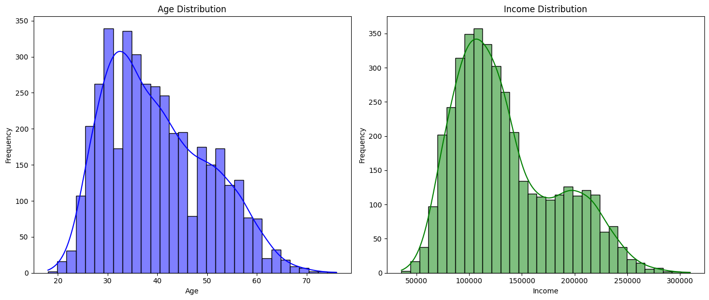
    


- From the age distribution plot, we can see that the the customer base is predominatly middle aged, i.e., between the age of 20-50

- From the income distribution, we can see that the income range of the customer base is largely between 50K - 200K


```python
# Visualsing the categorical variables
categorical_vars = ['Gender', 'Marital Status', 'Education', 'Settlement Size', 'Occupation']

fig, axes = plt.subplots(nrows=2, ncols=3, figsize=(18, 10))

# Flatten the axes array for easier iteration
axes = axes.flatten()

# Loop through the categorical variables and create a count plot for each
for i, var in enumerate(categorical_vars):
    sns.countplot(data=data, x=var, ax=axes[i])
    axes[i].set_title(f'Distribution of {var.capitalize()}', fontsize=16)
    axes[i].set_xlabel(f'{var.capitalize()}', fontsize=14)
    axes[i].set_ylabel('Count', fontsize=14)
    axes[i].tick_params(axis='x', rotation=45)

# Remove any unused subplots
for j in range(len(categorical_vars), len(axes)):
    fig.delaxes(axes[j])

plt.tight_layout()
plt.show()
```


    
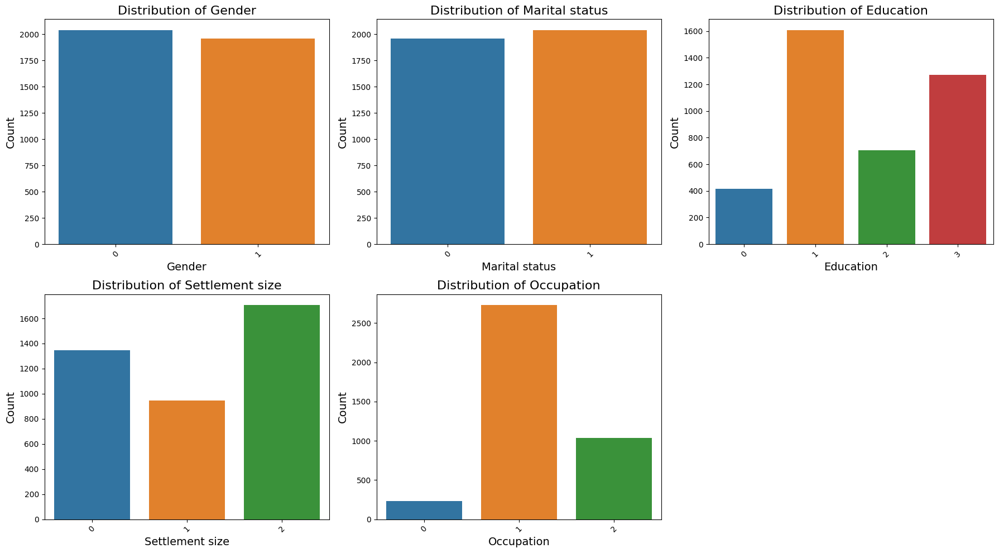
    


### Gender

- Balanced Distribution: Nearly equal number of male and female customers.

### Marital Status
- More Married Customers: Higher proportion of married individuals.

### Education
- Well-Educated Base: Most customers have high school or bachelor’s degrees.

### Settlement Size
- Urban/Suburban Majority: Customers mainly reside in medium to large settlements.

### Occupation
- Diverse Occupations: Significant numbers in professional and clerical roles.


```python
# Correlation matrix
plt.figure(figsize=(5, 4))
sns.heatmap(data.corr(), annot=True, fmt=".2f", cmap='coolwarm')
plt.title('Correlation Matrix')
plt.show()
```


    
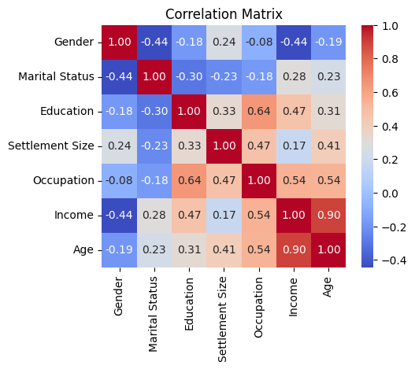
    


### Age and Income
- Moderate Positive Correlation: Older customers tend to have higher incomes.

### Education and Income
- Weak Positive Correlation: Higher education slightly correlates with higher income.


### Occupation and Income
- Moderate Positive Correlation: Professional roles generally have higher incomes.

### Age and Marital Status
- Moderate Positive Correlation: Older customers are more likely to be married.

### Education and Occupation
- Weak Positive Correlation: Higher education slightly correlates with professional occupations.


```python
# pairplot of all the variables
sns.pairplot(data)
plt.title('Pair Plot of All Variables')
plt.show()
```


    
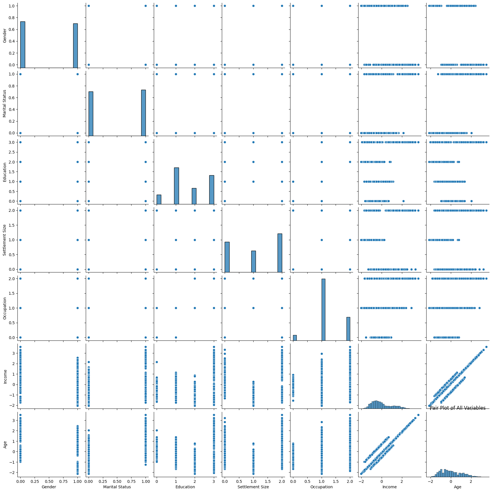
    


# Customer Segmentation 


```python
# Standardising the numeric variables
from sklearn.preprocessing import StandardScaler

numeric_vars = ['Age', 'Income']

scaler = StandardScaler()

data[numeric_vars] = scaler.fit_transform(data[numeric_vars])

print("Standardized Data:")
data.head()
```

    Standardized Data:


<div>
<style scoped>
    .dataframe tbody tr th:only-of-type {
        vertical-align: middle;
    }

    .dataframe tbody tr th {
        vertical-align: top;
    }

    .dataframe thead th {
        text-align: right;
    }
</style>
<table border="1" class="dataframe">
  <thead>
    <tr style="text-align: right;">
      <th></th>
      <th>Gender</th>
      <th>Marital Status</th>
      <th>Education</th>
      <th>Settlement Size</th>
      <th>Occupation</th>
      <th>Income</th>
      <th>Age</th>
    </tr>
  </thead>
  <tbody>
    <tr>
      <th>0</th>
      <td>0</td>
      <td>0</td>
      <td>3</td>
      <td>2</td>
      <td>2</td>
      <td>1.056251</td>
      <td>0.979092</td>
    </tr>
    <tr>
      <th>1</th>
      <td>0</td>
      <td>1</td>
      <td>1</td>
      <td>0</td>
      <td>1</td>
      <td>-0.403396</td>
      <td>-0.968623</td>
    </tr>
    <tr>
      <th>2</th>
      <td>0</td>
      <td>1</td>
      <td>1</td>
      <td>0</td>
      <td>0</td>
      <td>-0.032266</td>
      <td>-0.579080</td>
    </tr>
    <tr>
      <th>3</th>
      <td>0</td>
      <td>1</td>
      <td>3</td>
      <td>2</td>
      <td>2</td>
      <td>1.552052</td>
      <td>1.466021</td>
    </tr>
    <tr>
      <th>4</th>
      <td>1</td>
      <td>1</td>
      <td>1</td>
      <td>2</td>
      <td>1</td>
      <td>-0.324781</td>
      <td>0.394778</td>
    </tr>
  </tbody>
</table>
</div>


```python
import warnings
warnings.filterwarnings('ignore')
```

## Estumating the number of Clusters

### 1. Elbow Method


```python

from sklearn.cluster import KMeans
from sklearn.metrics import silhouette_score, silhouette_samples

#Extract the numeric data for clustering
X = data[numeric_vars]

# Elbow Method to determine the optimal number of clusters
inertia = []
K = range(1, 11)

for k in K:
    kmeans = KMeans(n_clusters=k, random_state=42)
    kmeans.fit(X)
    inertia.append(kmeans.inertia_)

# Plotting the Elbow Method graph
plt.figure(figsize=(8, 4))
plt.plot(K, inertia, 'bo-', markersize=8)
plt.xlabel('Number of clusters (k)')
plt.ylabel('Inertia')
plt.title('Elbow Method for Optimal k')
plt.grid(True)
plt.show()
```


    
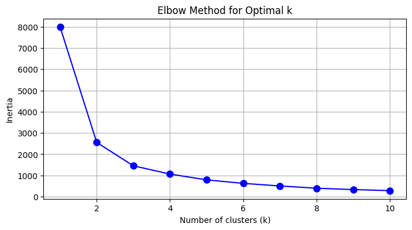
    


### 2. Silhouette Analysis


```python
# Silhouette Analysis to determine the optimal number of clusters
for n_clusters in [2, 3, 4]:
    fig, ax1 = plt.subplots(1, 1)
    fig.set_size_inches(6, 3)
    
    # Initialize the clusterer with n_clusters value and a random generator seed
    kmeans = KMeans(n_clusters=n_clusters, random_state=42)
    cluster_labels = kmeans.fit_predict(X)
    
    # The silhouette_score gives the average value for all the samples
    silhouette_avg = silhouette_score(X, cluster_labels)
    print(f"For n_clusters = {n_clusters}, the average silhouette_score is {silhouette_avg:.3f}")
    
    # Compute the silhouette scores for each sample
    sample_silhouette_values = silhouette_samples(X, cluster_labels)
    
    y_lower = 10
    for i in range(n_clusters):
        # Aggregate the silhouette scores for samples belonging to cluster i
        ith_cluster_silhouette_values = sample_silhouette_values[cluster_labels == i]
        ith_cluster_silhouette_values.sort()
        
        size_cluster_i = ith_cluster_silhouette_values.shape[0]
        y_upper = y_lower + size_cluster_i

        color = plt.cm.nipy_spectral(float(i) / n_clusters)
        ax1.fill_betweenx(np.arange(y_lower, y_upper), 0, ith_cluster_silhouette_values,
                          facecolor=color, edgecolor=color, alpha=0.7)

        ax1.text(-0.05, y_lower + 0.5 * size_cluster_i, str(i))
        y_lower = y_upper + 10  # 10 for the 0 samples separation

    ax1.set_title(f"The silhouette plot for the various clusters (n_clusters = {n_clusters})")
    ax1.set_xlabel("The silhouette coefficient values")
    ax1.set_ylabel("Cluster label")

    # The vertical line for average silhouette score of all the values
    ax1.axvline(x=silhouette_avg, color="red", linestyle="--")
    ax1.set_yticks([])  # Clear the y-axis labels / ticks
    ax1.set_xticks(np.arange(-0.1, 1.1, 0.2))
    
    plt.show()
```

    For n_clusters = 2, the average silhouette_score is 0.600


    
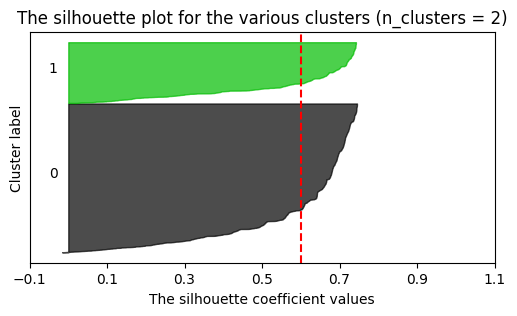
    


    For n_clusters = 3, the average silhouette_score is 0.478


    
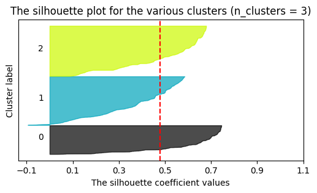
    


    For n_clusters = 4, the average silhouette_score is 0.432


    
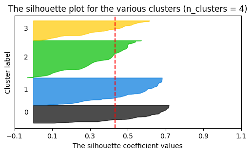
    


- After Silhouette Analysis and Elbow Method, we can see that the optimal number of clusters is 3

### Estimating Clusters with K-means++ and Agglomerative Clustering


```python
from sklearn.cluster import KMeans, AgglomerativeClustering
from sklearn.metrics import silhouette_score, silhouette_samples

# Assuming the optimal number of clusters is 3 
optimal_clusters = 3

# K-means++ clustering
kmeans = KMeans(n_clusters=optimal_clusters, init='k-means++', random_state=42)
kmeans_labels = kmeans.fit_predict(X)

# Agglomerative Clustering
agg_clustering = AgglomerativeClustering(n_clusters=optimal_clusters)
agg_labels = agg_clustering.fit_predict(X)

# Calculate average silhouette scores for both methods
kmeans_silhouette_avg = silhouette_score(X, kmeans_labels)
agg_silhouette_avg = silhouette_score(X, agg_labels)

print(f"K-means++ average silhouette score: {kmeans_silhouette_avg:.3f}")
print(f"Agglomerative Clustering average silhouette score: {agg_silhouette_avg:.3f}")

# Plot the Silhouette Analysis for both clustering methods
def plot_silhouette(X, cluster_labels, title):
    fig, ax1 = plt.subplots(1, 1)
    fig.set_size_inches(6, 3)
    
    # The silhouette_score gives the average value for all the samples
    silhouette_avg = silhouette_score(X, cluster_labels)
    
    # Compute the silhouette scores for each sample
    sample_silhouette_values = silhouette_samples(X, cluster_labels)
    
    y_lower = 10
    for i in range(optimal_clusters):
        # Aggregate the silhouette scores for samples belonging to cluster i
        ith_cluster_silhouette_values = sample_silhouette_values[cluster_labels == i]
        ith_cluster_silhouette_values.sort()
        
        size_cluster_i = ith_cluster_silhouette_values.shape[0]
        y_upper = y_lower + size_cluster_i

        color = plt.cm.nipy_spectral(float(i) / optimal_clusters)
        ax1.fill_betweenx(np.arange(y_lower, y_upper), 0, ith_cluster_silhouette_values,
                          facecolor=color, edgecolor=color, alpha=0.7)

        ax1.text(-0.05, y_lower + 0.5 * size_cluster_i, str(i))
        y_lower = y_upper + 10  # 10 for the 0 samples separation

    ax1.set_title(title)
    ax1.set_xlabel("The silhouette coefficient values")
    ax1.set_ylabel("Cluster label")

    # The vertical line for average silhouette score of all the values
    ax1.axvline(x=silhouette_avg, color="red", linestyle="--")
    ax1.set_yticks([])  # Clear the y-axis labels / ticks
    ax1.set_xticks(np.arange(-0.1, 1.1, 0.2))
    
    plt.show()

# Plot silhouettes for both clustering methods
plot_silhouette(X, kmeans_labels, "Silhouette plot for K-means++")
plot_silhouette(X, agg_labels, "Silhouette plot for Agglomerative Clustering")

```

    K-means++ average silhouette score: 0.478
    Agglomerative Clustering average silhouette score: 0.473


    
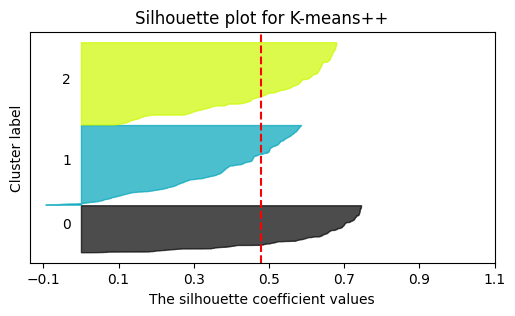
    


    
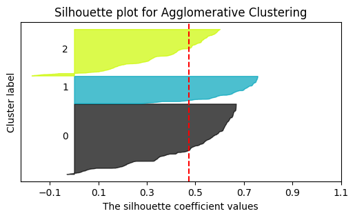
    


- We can see that K-means++ silhouette score is higher than that of the agglomerative Clustering, i.e., K-means++ clustering is a better method to use in this case.

### Cluster Centres and Customer Counts


```python
# K-means++ clustering
kmeans = KMeans(n_clusters=optimal_clusters, init='k-means++', random_state=42)
kmeans_labels = kmeans.fit_predict(X)

# Agglomerative Clustering
agg_clustering = AgglomerativeClustering(n_clusters=optimal_clusters)
agg_labels = agg_clustering.fit_predict(X)

# Creating a DataFrame to store the cluster labels
data['kmeans_cluster'] = kmeans_labels
data['agg_cluster'] = agg_labels

# Calculate the cluster centers for K-means++
kmeans_centers = scaler.inverse_transform(kmeans.cluster_centers_)  # Inverse transform to original scale
kmeans_centers_df = pd.DataFrame(kmeans_centers, columns=numeric_vars)
kmeans_centers_df['customer_count'] = data['kmeans_cluster'].value_counts().sort_index().values

# Calculate the cluster centers for Agglomerative Clustering (mean of each cluster)
agg_centers = data.groupby('agg_cluster')[numeric_vars].mean().values
agg_centers = scaler.inverse_transform(agg_centers)  # Inverse transform to original scale
agg_centers_df = pd.DataFrame(agg_centers, columns=numeric_vars)
agg_centers_df['customer_count'] = data['agg_cluster'].value_counts().sort_index().values

# Display the cluster centers and customer counts for K-means++
print("K-means++ Cluster Centers and Customer Counts:")
print(kmeans_centers_df)

print()

# Display the cluster centers and customer counts for Agglomerative Clustering
print("Agglomerative Clustering Cluster Centers and Customer Counts:")
print(agg_centers_df)
```

    K-means++ Cluster Centers and Customer Counts:
            Age    Income  customer_count
    0  1.456767  1.541675             900
    1  0.098584 -0.056682            1525
    2 -0.932204 -0.831148            1575
    
    Agglomerative Clustering Cluster Centers and Customer Counts:
            Age    Income  customer_count
    0 -0.815075 -0.737893            1949
    1  1.568270  1.665516             761
    2  0.306300  0.132322            1290


### Interpreting the Clusters


```python
# Interpret clusters based on the centers and customer attributes
def interpret_clusters(data, cluster_labels, cluster_centers, clustering_name):
    for cluster in range(optimal_clusters):
        cluster_data = data[cluster_labels == cluster]
        cluster_profile = {
            'age_mean': cluster_data['Age'].mean(),
            'income_mean': cluster_data['Income'].mean(),
            'gender_distribution': cluster_data['Gender'].value_counts(normalize=True).to_dict(),
            'marital_status_distribution': cluster_data['Marital Status'].value_counts(normalize=True).to_dict(),
            'education_distribution': cluster_data['Education'].value_counts(normalize=True).to_dict(),
            'settlement_size_distribution': cluster_data['Settlement Size'].value_counts(normalize=True).to_dict(),
            'occupation_distribution': cluster_data['Occupation'].value_counts(normalize=True).to_dict(),
        }
        print(f"\n{clustering_name} - Cluster {cluster + 1} Profile:")
        print(f"Customer Count: {len(cluster_data)}")
        print(f"Cluster Center (Age, Income): ({cluster_centers[cluster][0]:.2f}, {cluster_centers[cluster][1]:.2f})")
        print(f"Age Mean: {cluster_profile['age_mean']:.2f}")
        print(f"Income Mean: {cluster_profile['income_mean']:.2f}")
        print(f"Gender Distribution: {cluster_profile['gender_distribution']}")
        print(f"Marital Status Distribution: {cluster_profile['marital_status_distribution']}")
        print(f"Education Distribution: {cluster_profile['education_distribution']}")
        print(f"Settlement Size Distribution: {cluster_profile['settlement_size_distribution']}")
        print(f"Occupation Distribution: {cluster_profile['occupation_distribution']}")

# Interpret K-means++ clusters
interpret_clusters(data, data['kmeans_cluster'], kmeans_centers, "K-means++")

# Interpret Agglomerative Clustering clusters
interpret_clusters(data, data['agg_cluster'], agg_centers, "Agglomerative Clustering")
```

    
    K-means++ - Cluster 1 Profile:
    Customer Count: 900
    Cluster Center (Age, Income): (1.46, 1.54)
    Age Mean: 1.46
    Income Mean: 1.55
    Gender Distribution: {0: 0.7566666666666667, 1: 0.24333333333333335}
    Marital Status Distribution: {0: 0.5088888888888888, 1: 0.4911111111111111}
    Education Distribution: {3: 0.97, 1: 0.02, 0: 0.008888888888888889, 2: 0.0011111111111111111}
    Settlement Size Distribution: {2: 0.8733333333333333, 0: 0.12666666666666668}
    Occupation Distribution: {2: 0.8611111111111112, 1: 0.1388888888888889}
    
    K-means++ - Cluster 2 Profile:
    Customer Count: 1525
    Cluster Center (Age, Income): (0.10, -0.06)
    Age Mean: 0.10
    Income Mean: -0.05
    Gender Distribution: {1: 0.5659016393442623, 0: 0.4340983606557377}
    Marital Status Distribution: {1: 0.7160655737704918, 0: 0.2839344262295082}
    Education Distribution: {1: 0.6773770491803278, 0: 0.2039344262295082, 3: 0.08524590163934426, 2: 0.03344262295081967}
    Settlement Size Distribution: {0: 0.5239344262295081, 2: 0.4275409836065574, 1: 0.04852459016393443}
    Occupation Distribution: {1: 0.8354098360655737, 0: 0.09245901639344262, 2: 0.07213114754098361}
    
    K-means++ - Cluster 3 Profile:
    Customer Count: 1575
    Cluster Center (Age, Income): (-0.93, -0.83)
    Age Mean: -0.93
    Income Mean: -0.83
    Gender Distribution: {1: 0.5561904761904762, 0: 0.4438095238095238}
    Marital Status Distribution: {0: 0.6774603174603174, 1: 0.3225396825396825}
    Education Distribution: {2: 0.4158730158730159, 1: 0.35428571428571426, 3: 0.16952380952380952, 0: 0.06031746031746032}
    Settlement Size Distribution: {1: 0.5536507936507936, 0: 0.27555555555555555, 2: 0.1707936507936508}
    Occupation Distribution: {1: 0.8457142857142858, 2: 0.09587301587301587, 0: 0.058412698412698416}
    
    Agglomerative Clustering - Cluster 1 Profile:
    Customer Count: 1949
    Cluster Center (Age, Income): (-0.82, -0.74)
    Age Mean: -0.82
    Income Mean: -0.74
    Gender Distribution: {1: 0.5269368907131863, 0: 0.4730631092868138}
    Marital Status Distribution: {0: 0.581836839404823, 1: 0.418163160595177}
    Education Distribution: {1: 0.42945100051308366, 2: 0.34684453565931245, 3: 0.1431503335043612, 0: 0.08055413032324268}
    Settlement Size Distribution: {1: 0.4628014366341714, 0: 0.319138019497178, 2: 0.2180605438686506}
    Occupation Distribution: {1: 0.8547973319651103, 2: 0.08004104669061057, 0: 0.06516162134427912}
    
    Agglomerative Clustering - Cluster 2 Profile:
    Customer Count: 761
    Cluster Center (Age, Income): (1.57, 1.67)
    Age Mean: 1.57
    Income Mean: 1.67
    Gender Distribution: {0: 0.885676741130092, 1: 0.11432325886990802}
    Marital Status Distribution: {1: 0.5650459921156373, 0: 0.43495400788436267}
    Education Distribution: {3: 0.9986859395532195, 0: 0.001314060446780552}
    Settlement Size Distribution: {2: 0.8961892247043364, 0: 0.1038107752956636}
    Occupation Distribution: {2: 0.8817345597897503, 1: 0.11826544021024968}
    
    Agglomerative Clustering - Cluster 3 Profile:
    Customer Count: 1290
    Cluster Center (Age, Income): (0.31, 0.13)
    Age Mean: 0.31
    Income Mean: 0.13
    Gender Distribution: {1: 0.6542635658914728, 0: 0.3457364341085271}
    Marital Status Distribution: {1: 0.6178294573643411, 0: 0.3821705426356589}
    Education Distribution: {1: 0.5984496124031008, 0: 0.19844961240310077, 3: 0.17906976744186046, 2: 0.024031007751937984}
    Settlement Size Distribution: {0: 0.5007751937984496, 2: 0.46511627906976744, 1: 0.034108527131782945}
    Occupation Distribution: {1: 0.7558139534883721, 2: 0.162015503875969, 0: 0.08217054263565891}


### Comparing the Customer Segments


```python
# Cross-tabulation to compare clusters
cross_tab = pd.crosstab(data['kmeans_cluster'], data['agg_cluster'], rownames=['K-means++ Clusters'], colnames=['Agglomerative Clusters'])
print("Cross-tabulation of K-means++ and Agglomerative Clustering:")
print(cross_tab)
```

    Cross-tabulation of K-means++ and Agglomerative Clustering:
    Agglomerative Clusters     0    1     2
    K-means++ Clusters                     
    0                          0  761   139
    1                        374    0  1151
    2                       1575    0     0


#### Scatterplot to visualize the clusters


```python
# Plotting the clusters for K-means++ and Agglomerative Clustering
plt.figure(figsize=(12, 6))

# K-means++ clusters
plt.subplot(1, 2, 1)
sns.scatterplot(x=data['Age'], y=data['Income'], hue=data['kmeans_cluster'], palette='Set1')
plt.title('K-means++ Clusters')
plt.xlabel('Age')
plt.ylabel('Income')

# Agglomerative Clustering clusters
plt.subplot(1, 2, 2)
sns.scatterplot(x=data['Age'], y=data['Income'], hue=data['agg_cluster'], palette='Set2')
plt.title('Agglomerative Clustering Clusters')
plt.xlabel('Age')
plt.ylabel('Income')

plt.tight_layout()
plt.show()
```


    
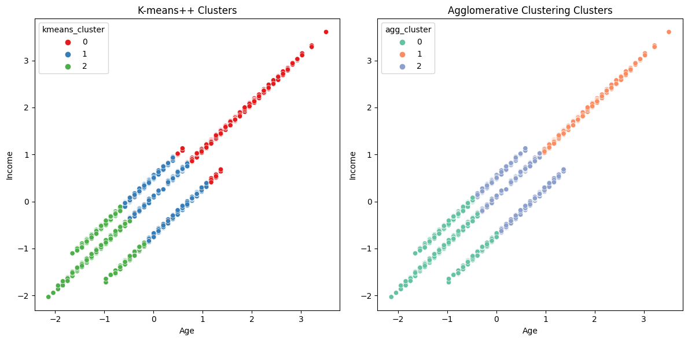
    


- There is some overlap between the clusters identified by K-means++ and Agglomerative Clustering.
- This indicates that while there are some distinct differences between the cluster assignments, there is also overlap. For instance, K-means++ Cluster 2 and Agglomerative Cluster 0 have a significant overlap where all customers in K-means++ Cluster 2 are in Agglomerative Cluster 0. Conversely, K-means++ Cluster 0 and Agglomerative Cluster 1 have a significant overlap.


# Recommendations

### K-means++ Cluster Profiles and Marketing strategies

1. __Cluster 0: Young Low-Income Customers__

Cluster Center (Age, Income): (~30, $55,000)
<br>Profile:
- Predominantly young customers.
- Lower income levels.
- Likely to be early in their careers or students.
<br> <br> __Marketing Strategies:__
- Discounts and Promotions: Offer discounts on essential items and budget-friendly products.
- Digital Marketing: Utilize social media and online advertising to reach tech-savvy young customers.
- Bundles and Value Packs: Create product bundles and value packs that provide better value for money.

2. __Cluster 1: Middle-Aged High-Income Customers__

Cluster Center (Age, Income): (~45, $75,000)
<br> Profile:
- Middle-aged customers.
- Higher income levels.
- Likely to be established in their careers, possibly with families.
<br> <br> __Marketing Strategies:__
- Premium Products: Promote premium and high-quality products, including organic and gourmet food items.
- Convenience Services: Offer services such as home delivery, personal shopping assistants, and subscription services for regular deliveries.
- Family-Oriented Campaigns: Create campaigns that cater to family needs, including bulk purchases and family packs.
- Health and Wellness: Emphasize health and wellness products, including supplements and fitness-related items.

3. __Cluster 2: Older High-Income Customers__

Cluster Center (Age, Income): (~60, $90,000)
<br>Profile:
- Older customers.
- High income levels.
- Likely to be retired or nearing retirement with significant disposable income.
<br> <br> __Marketing Strategies:__
- Luxury Items: Highlight luxury and specialty items, including fine wines, gourmet foods, and high-end household products.
- Health and Wellness: Focus on health and wellness products tailored to older adults, such as vitamins, supplements, and health care products.
- Personalized Services: Offer personalized services, including personalized shopping experiences, senior discounts, and dedicated customer service.
- Convenience Services: Offer services such as home delivery, personal shopping assistants, and subscription services for regular deliveries.


### Additional Actionable Marketing Strategies
- Email Marketing: Use email campaigns to reach specific customer segments with personalized offers and updates.
- Customer Segmentation: Leverage the cluster data to segment your email lists and target specific groups with tailored messages.
- Content Marketing: Create content that resonates with each customer segment, such as blog posts, videos, and social media content that address their interests and needs.
- Analytics and Feedback: Use customer feedback and analytics to continuously refine marketing strategies and ensure they are effectively targeting each segment.
- Cross-Selling and Up-Selling: Implement cross-selling and up-selling techniques by recommending complementary or higher-end products based on customer purchasing patterns.


# Conclusion

This report aimed to segment the customer base of a supermarket using data collected through the loyalty card program. The dataset included key demographic and socio-economic variables such as age, gender, income, marital status, education, settlement size, and occupation for 4,000 customers. The purpose was to identify distinct customer segments to tailor marketing strategies more effectively.

__Methodology__
<br>To determine the optimal number of clusters, we employed the Elbow Method and Silhouette Analysis, which suggested three clusters. We then used K-means++ and Agglomerative Clustering techniques to segment the customers. The clusters were profiled based on their demographic and socio-economic characteristics.

__Findings__
<br>The analysis identified three key customer segments:

1. Young Low-Income Customers: Predominantly young individuals with lower income levels, likely early in their careers or students.

2. Middle-Aged High-Income Customers: Middle-aged customers with higher income levels, likely established in their careers and possibly with families.

3. Older High-Income Customers: Older individuals with significant disposable income, possibly retired or nearing retirement.

The comparison between K-means++ and Agglomerative Clustering showed some overlap in customer segments, validating the robustness of our segmentation approach.

__Strategic Implications__
<br>The insights from this segmentation analysis provide a foundation for targeted marketing strategies:

- Tailored Promotions: Develop specific marketing campaigns for each segment, such as budget-friendly promotions for young customers and premium product highlights for older, high-income customers.
- Enhanced Customer Experience: Implement loyalty programs, personalized services, and community engagement activities to enhance customer satisfaction and loyalty.
- Product Development: Align product offerings with the preferences of each customer segment, ensuring a diverse range of products that cater to the needs of all identified segments.

__Future Directions__
<br>Moving forward, the Supermarket should continue to leverage data analytics to refine and adapt marketing strategies. Regularly updating the segmentation analysis will ensure that the strategies remain relevant and effective in addressing the evolving preferences of the customers. Additionally, integrating more data sources, such as online shopping behavior and social media interactions, can provide a more comprehensive view of customer behavior and further enhance our marketing efforts.

By implementing these targeted strategies, we can better cater to the diverse needs of the customers, improve customer satisfaction, and drive business growth.

### Word Count : 
